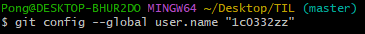
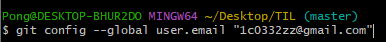
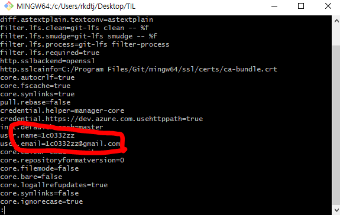

# Git 기본적인 순서 & 명렁어

## 1. 환경설정 하기

* Step 1 : 유저이름 설정

  ```git config --global user.name "name"```

  

* Step 2 : 이메일 설정

  ```git config --global user.email "email"```

  

* Step 3 : 정보 확인

  ```git config --list```

  

## 2. Github에 처음 코드 업로드하기

1. 초기화

   ```git init```

   

2. 추가할 파일 더하기

   ```git add .``` OR ```git add 파일명 ```

   

3. 상태 확인

   ```git status```

   

4.  버전만들기 (히스토리 필수)

   ```git commit -m "test"```

   

5. GitHub Repository랑 내 로컬이랑 연결

   ```git remote add origin https://github.com/GitHubUsername/Repositoryname.git```

   

6. GitHub로 올리기

   ```git push origin master```

## 3. GitHub에 계속 업데이트 하는법

1. 추가할 파일 더하기

   ```git add .``` OR ```git add 파일명 ```

   

2. 상태 확인

   ```git status```

   

3.  버전만들기 (히스토리 필수)

   ```git commit -m "test"```

   

4. GitHub로 올리기

   ```git push origin master```


* TIL에 계속 업로드 할 때, 이 스텝만 계속 반복하면 됨.