Git Flow

git을 활용하여 협업하는 흐름으로 branch를 활용하는 전략을 의미

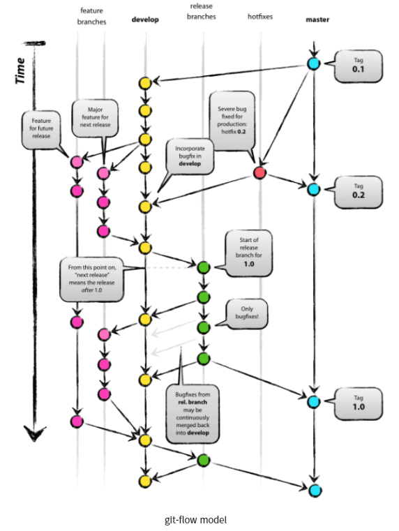

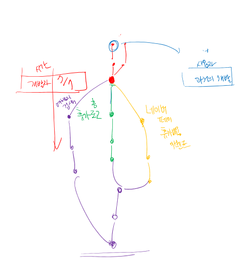

### Git Flow

| branch                       | 주요 특징                                                    | 예시                                         |
| ---------------------------- | ------------------------------------------------------------ | -------------------------------------------- |
| master(main)                 | *배포 가능한 상태의 코드                                     | LOL클라이언트 라이브 버전(9.23.298.3143)     |
| develop(main)                | *feature branch로 나뉘어지거나, 발생된 버그 수정 등 개발 진행 *개발 이후 release branch로 갈라짐. | 다음 패치를 위한 개발(9.24)                  |
| feature branches(supporting) | *기능별 개발 브랜치(topic branch) *기능이 반영되거나 드랍되는 경우 브랜치 삭제 | 개발시 기능별 예)신규챔피언, 드래곤 업데이트 |
| release branches(supporting) | *개발 완료 이후 QA/Test등을 통해 얻어진 다음 배포 전 minor bug fix 등 반영 | 9.24a, 92.24b 등                             |
| hotfixes(supporing)          | *긴급하게 반영 해야하는 bug *release branch는 다음 버전을 위한 것이라면, hotfix branch는 현재 버전을 위한 것 | 긴급 패치를 위한 작업                        |

Git Flow는 정해진 답이 있는것은 아니다.

Github, gitlab flow등의 각 서비스별 제안되는 흐름이 있으며,

변형되어 각자의 프로젝트/회사에서 활용 되고 있다.

간단하게 브랜치를 활용하는 명령어를 알아보고,

프로젝트에 활용할 수 있는 간단한 버전의브랜치 전략을 배워보자!

### Branch basic commands

1. 브랜치 생성

   `$ git branch {branch name}`

2. 브랜치 이동

   `$ git checkout {branch name}`

3. 브랜치 생성 및 이동

   `$git checkout -b {branch name}`

4. 브랜치 목록

   `$git branch`

5. 브랜치 삭제

   `$git branch -d {branch name}`

   

### Branch merge

각 branch에서 작업을 한 이후 이력을 합치기 위해서는 일반적으로 merge명령어를 사용한다.

병합을 진행할 때, 만약 서로 다른 이력(commit)에서 동일한 파일을 수정한 경우 충돌이 발생할 수 있다.

이 경우에는 반드시 직접 수정을 진행 해야 한다.

충돌이 발생한 것은 오류가 발생한 것이 아니라 이력이 변경되는 과정에서 반드시 발생할 수 있는 것이다.

### branch merge - fast-forward

* 기존 master 브랜치에 변경사항이 없어 단순히 앞으로 이동

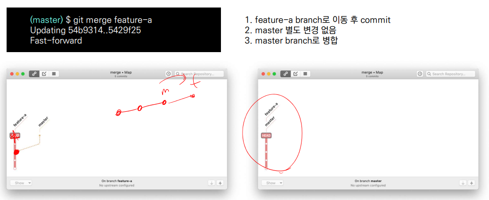

### Branch merge - merge commit

* 기존 master브랜치에 변경사항이 있어 병합 커밋 발생

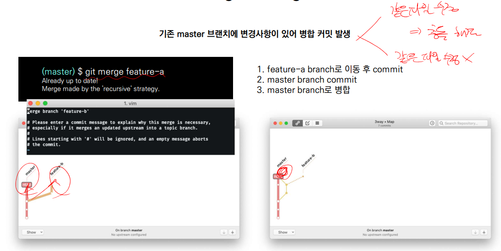

### Github Flow 기본 원칙

1. master branch는 반드시 배포 가능한 상태여야 한다.
2. feature branch는 각 기능의 의도를 알 수 있도록 작성한다.
3. Commit message는 매우 중요하며, 명확하게 작성한다.
4.  Pull Request를 통해 협업을 진행한다.
5. 변경사항을 반영하고 싶다면, master branch에 병합한다.

### Feature Branch Workflow Shared repository model

Shared repository model (저장소의 소유권이 있는 경우)

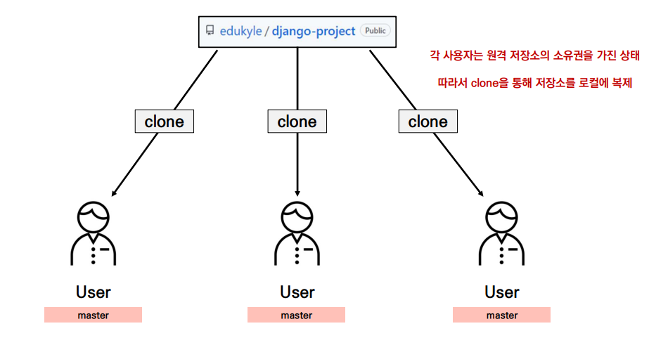

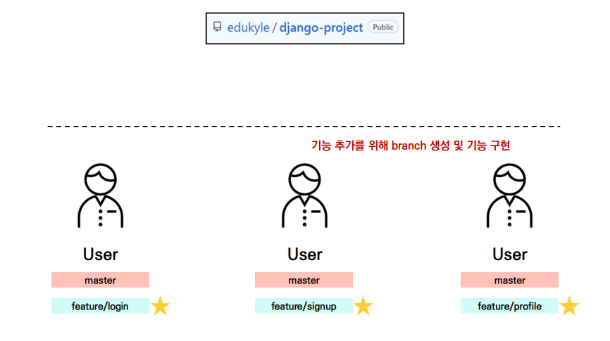

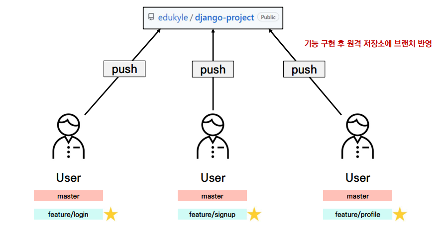

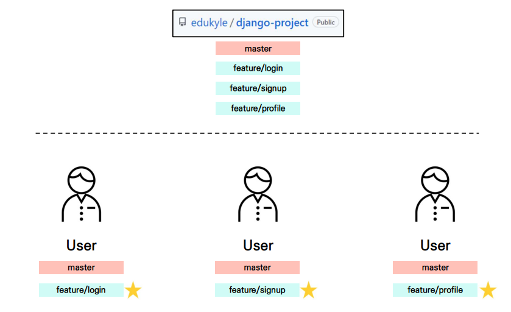

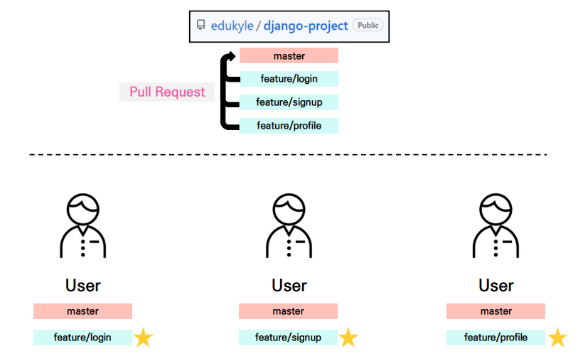

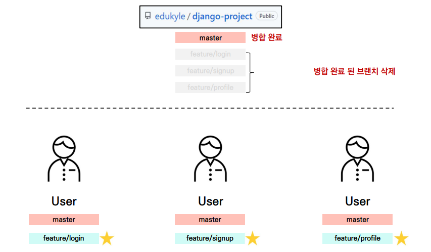

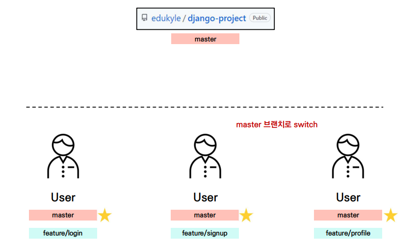

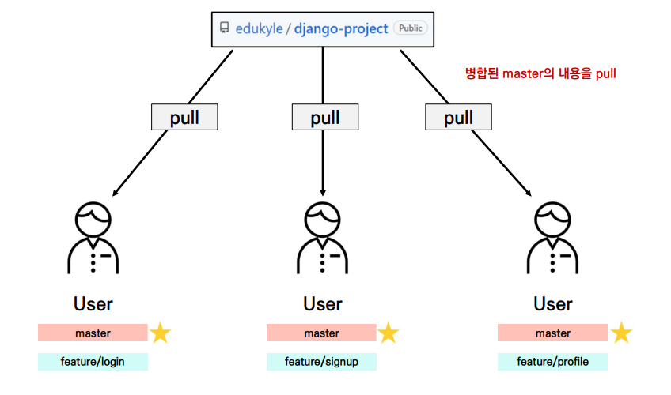

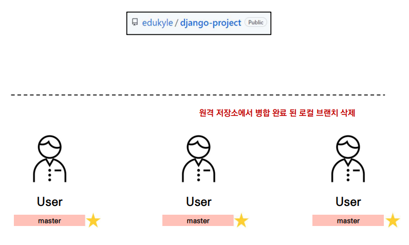

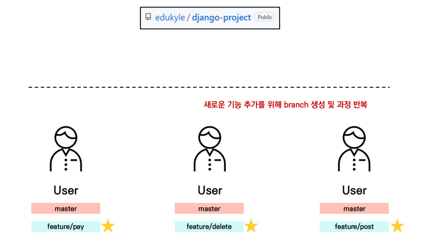

### Forking Workflow 

Fork & Pull model(저장소의 소유권이 없는 경우)

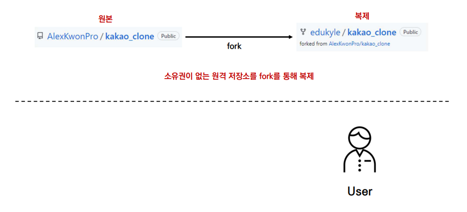

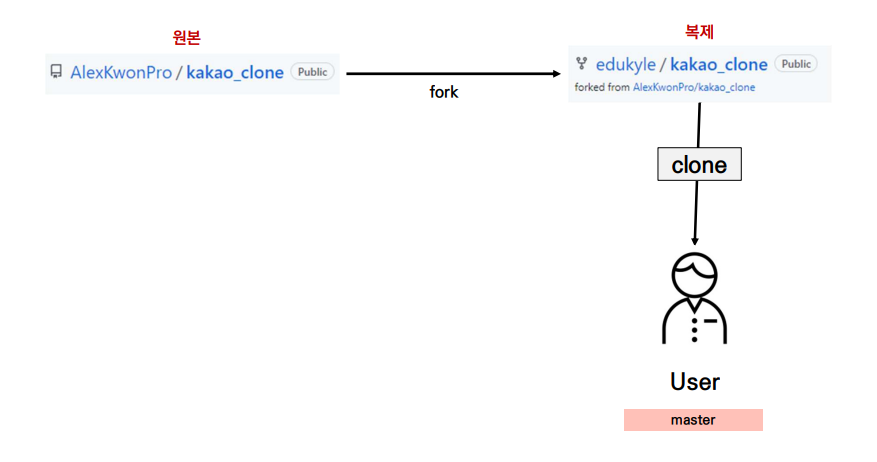

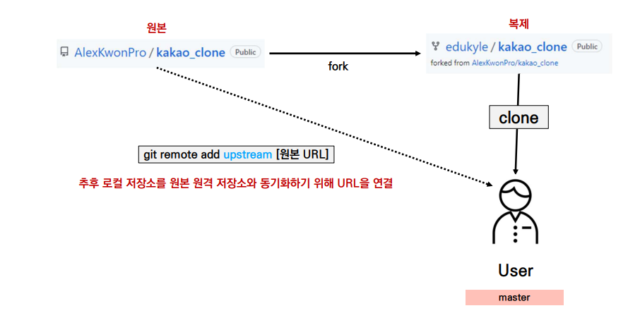

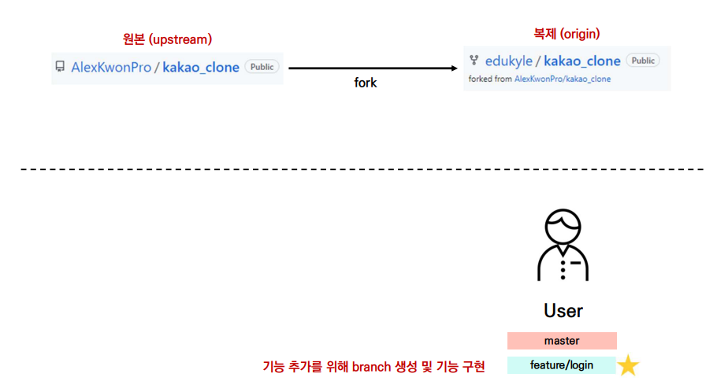

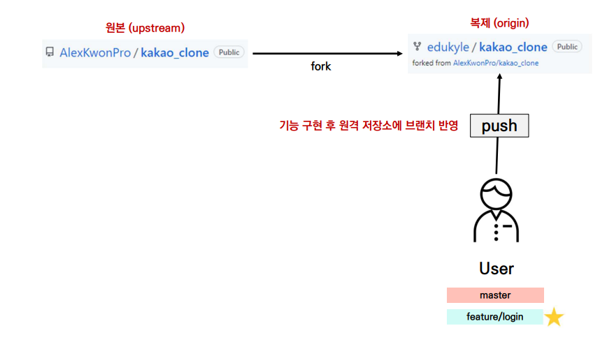

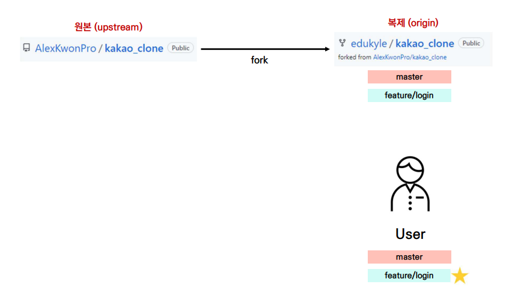

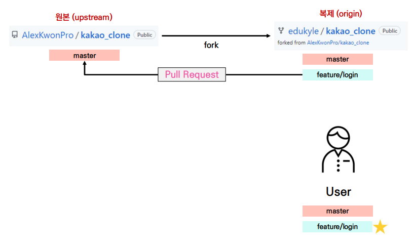

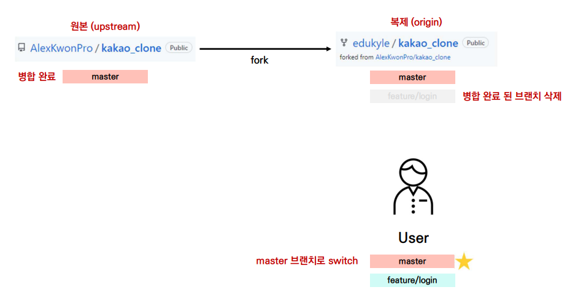

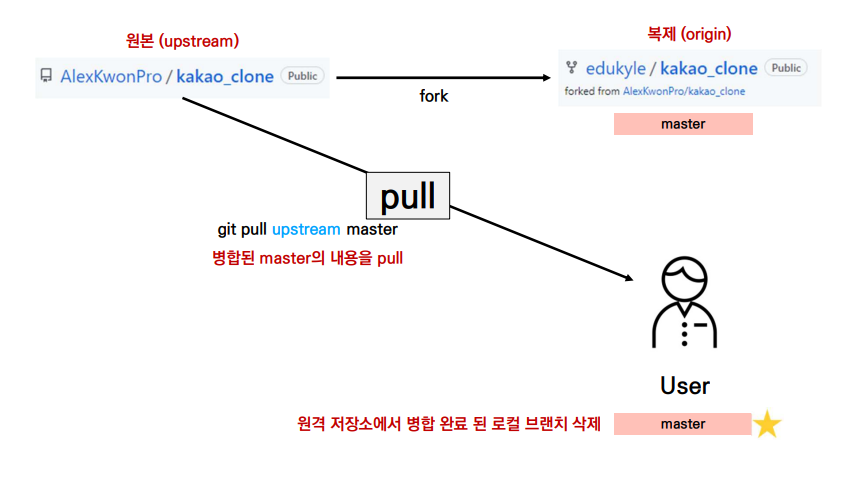

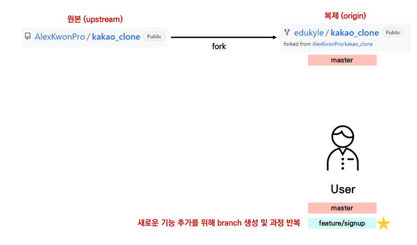

