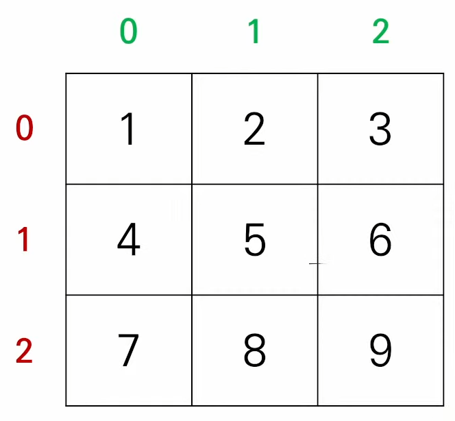

# 2차원 리스트

이차원 리스트는 리스트를 원소로 가지는 리스트다.

```python
matrix = [[1, 2, 3],[4, 5, 6],[7, 8, 9]]

# 보기 좋게 변경하면 행렬(matrix)의 형태가 나온다
matrix = [
   [1, 2, 3],
   [4, 5, 6],
   [7, 8, 9]
]
```




```python
# n * m의 행렬을 이차원 리스트 만들기

# 반복문으로 만들기
for _ in range(n):
    matrix.append([0] * m)

# 리스트 컴프리 헨션
matrix = [[0] * m for _ in range(n)]

# 둘은 같다.

# 리스트 곱셉연산을 표시하면 결과는 같지만 출력방식이 다름. 
matrix = [[0] * n] * m
matrix[0][0] = 1 
# 하게 되면 0에 0번째가 1이 되는게 아니라, 0번째에 모두 1이된다.
```

