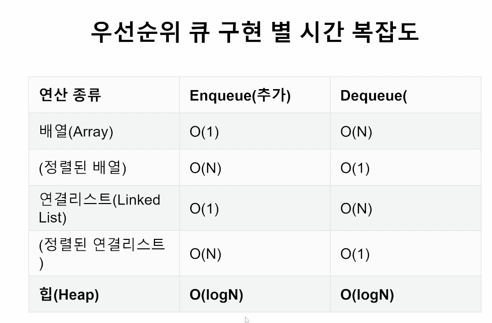

# Heap

우선순위 큐는 우선순위(중요도, 크기, 등 순서 이외의 기준)을 기준으로 가장 우선순위가 높은 데이터가 가장 먼저 나가는 방식

### 우선순위 큐

* 순서가 아닌 우선순위를 기준으로 가져올 요소를 결정(dequeue)하는 큐

1. 가중치가 있는 데이터
2. 작업 스케줄링
3. 네트워크

* 우선순위 큐를 구현하는 방법

1. 배열(Array)
2. 연결 리스트(Linked List)
3. 힙(Heap)

### 힙(Heap)의 특징

* 최대값 또는 최소값을 빠르게 찾아내도록 만들어진 데이터구조

* 완전 이진 트리의 형태로 느슨한 정렬 상태로 지속적으로 유지 유지 한다.

* 힙 트리에서는 중복 값을 허용한다.

### 힙은 언제 사용해야 할까?

1. 데이터가 지속적으로 정렬되야 하는 경우
2. 데이터에 삽입/삭제가 빈번할 때

### 파이썬의 heapq 모듈

* Minheap(최소 힙)으로 구현되어 있음(가장 작은 값이 먼저 옴)

* 삽입,삭제,수정,조회 연산의 속도가 리스트보다 빠르다.

* (배열, 연결리스트, 힙으로 구현 가능)

