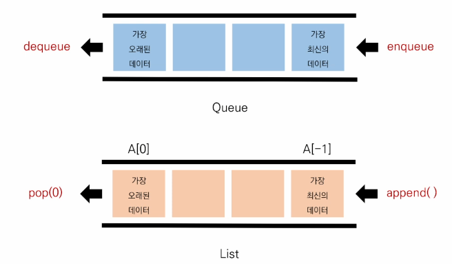

# 스택(Stack)

* Stack은 쌓는다는 의미로써, 마치 접시를 쌓고 빼듯이 데이터를 한쪽에서만 넣고 빼는 자료구조

## 스텍을 왜 써야할까?

* 데이터 구조를 배우는 이유: 왜 만들어졌고, 언제 써야 하는지 알기 위해

* Stack이 필요한 이유 == Stack의 Use Case

1. 뒤집기, 되돌리기, 되돌아가기
   * ex) 인터넷 뒤로가기, 탐색기 뒤로가기, Ctrl + z
2. 마무리 되지 않은 일을 임시 저장
   * 괄호 매칭, 함수 호출(재귀 호출), 백트래킹, DFS(깊이 우선 탐색)

# 큐 (Queue)

Queue는 한 쪽 끝에서 데이터를 넣고, 다른 한 쪽에서만 데이터를 뺄 수 있는 자료구조

가장 먼저 들어온 데이터가 가장 먼저 나가므로 FIFO(first-in First-out, 선입선출)방식

