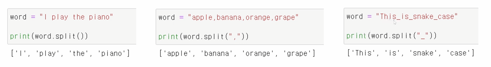
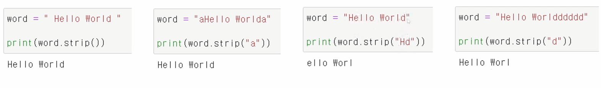
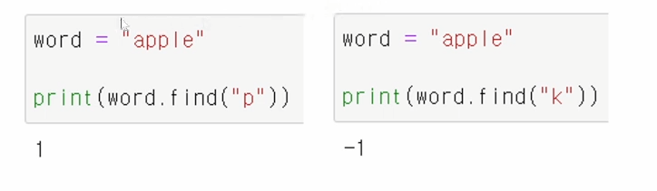
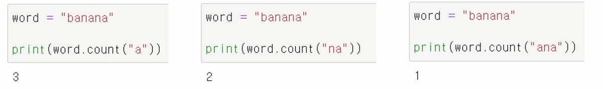
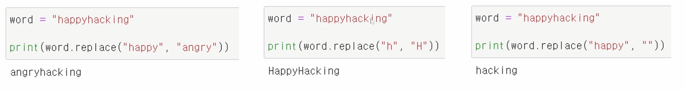
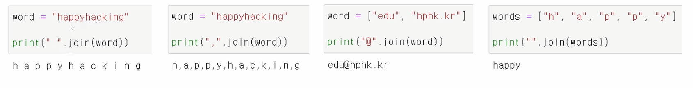
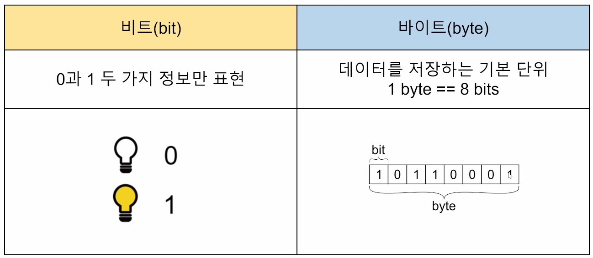
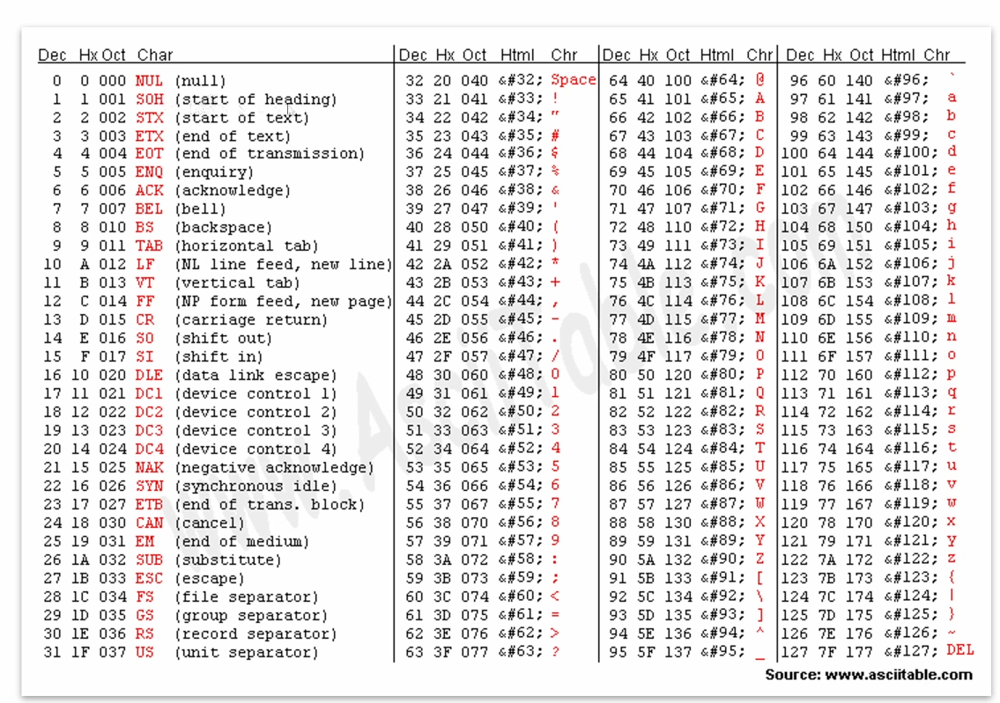
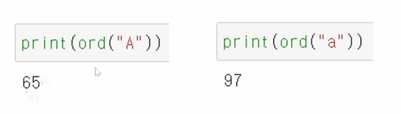
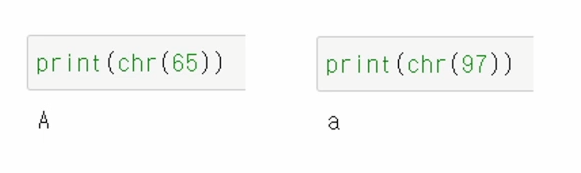

# 문자열

1. 문자열 슬라이싱

2. 문자열 메서드

3. 아스키(ASCII) 코드

* 문자열은 immutable(변경 불가능한) 자료형
  * 시퀀스형 자료형

### 문자열의 슬라이싱

## 문자열 메서드

* .split()
  * 문자열을 일정 기준으로 나누어 리스트로 반환
  * 괄호안에 아무것도 넣지 않으면 자동으로 공백을 기준으로 설정

* .strip()
  * 문자열의 양쪽 끝에 있는 특정 문자를 모두 제거한 새로운 문자열 반환
  * 괄호안에 아무것도 넣지 않으면 자동으로 공백을 제거 문자로 설정
  * 제거할 문자를 여러 개 넣으면 해당하는 모든 문자들을 제거
  * 원본은 변하지 않는다.

* .find()
  * 특정 문자가 처음으로 나타나는 위치(인덱스)를 반환
  * 찾는 문자가 없다면 -1을 반환

* .index()
  * 특정 문자가 처음으로 나타나는 위치(인덱스)를 반환
  * 찾는 문자가 없다면 **오류** 발생
* .count()
  * 문자열에서 특정 문자가 몇 개인지 반환
  * 문자 뿐만 아니라, 문자열의 개수도 확인 가능

* .replace(기존 문자, 새로운 문자)
  * 문자열에서 기존 문자를 새로운 문자로 수정한 새로운 문자열 반환
  * 특정 문자를 빈 문자열("")로 수정하여 마치 해당 문자를 삭제한 것 같은 효과 가능

* 삽입할 문자.join(iterable)
  * iterable의 각각 원소 사이에 특정 문자를 삽입한 새로운 문자열 반환
  * 공백 출력, 콤마 출력 등 원하는 출력 형태를 위해 사용

## 아스키(ASCII) 코드

컴퓨터는 숫자만 이해할 수 있다!

ASCII(American Standard Code for Information Internet)

알파벳을 표현하는 대표 인코딩 방식

각 문자를 표현하는데 1byte(8bits)사용

* 1bit : 통신 에러 검출용
* 7bit : 문자 정보 저장(총 128개)

1. chr()
   * 문자를 아스키코드로 변환하는 내장 함수

2. ord()
   * 아스키코드를 문자로 변환하는 내장 함수

