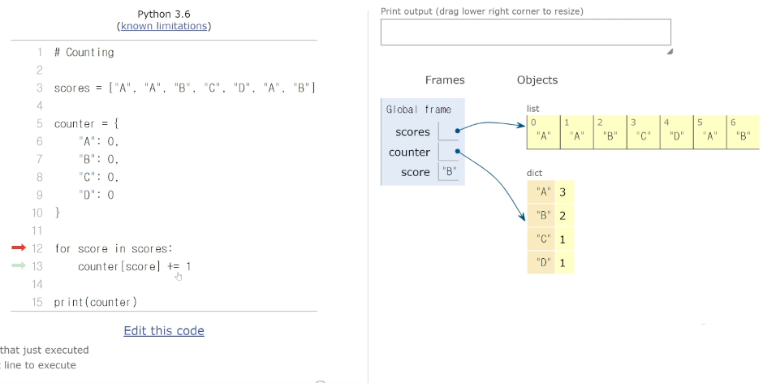
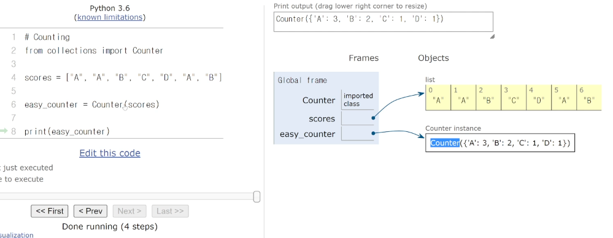

# 딕셔너리

## 해시 테이블

* 파이썬에는 딕셔너리 자료 구조가 내장 되어 있다.
* Key는 immutalble(변경 불가능)
* Non-sequence & Key - Value

#### 파이썬의 딕셔너리 특징

* 해시 함수와 해시 테이블을 이용하기 때문에, 삽입, 삭제 수정, 조회 연산의 속도가 리스트보다 빠르다.

* Hash Function을 이용

#### 딕셔너리는 언제 사용해야할까?

1. 리스트를 사용하기 힘든 경우
2. 데이터에 대한 빠른 접근 탐색이 필요한 경우
3. ( 현실 세계의 대부분의 데이터를 다룰 경우)

#### 딕셔너리 연산과 리스트 연산의 비교

|      |      |      |
| ---- | ---- | ---- |
|      |      |      |
|      |      |      |
|      |      |      |
|      |      |      |
|      |      |      |
|      |      |      |
|      |      |      |


## 딕셔너리 기본 문법

#### 기본적인 딕셔너리 사용법(선언)

변수 = {key1:value1, key2:value2 ...}

```python
a = {
    "name" : "kyle"
}
```

#### 기본적인 딕셔너리 사용법(삽입/수정)

내부에 해당 key가 없으면 삽입, 있으면 수정

```python
```

#### 딕셔너리로 카운터 하는 법



#### 더 쉬운 카운팅하는법..




## 딕셔너리 메서드

1. .keys()
2. .values()
3. .items()
