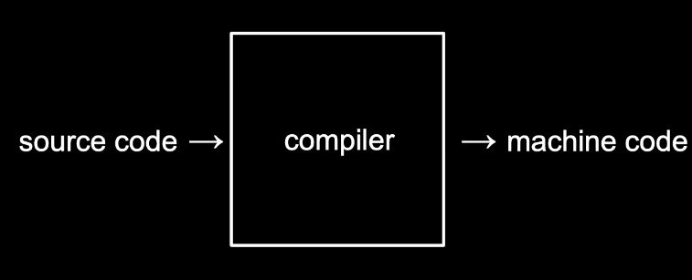

# C언어

## 기초

```c
#include <stdio.h>

int main(void)
{
    printf("hello, world\n");
}
```

### **int main(void)**

> 시작한다의 의미
>
> 앞으로 우리가 작성할 코드 모두는 이 **int main(void) { }**의 중괄호 사이에 작성하게 될 것 입니다.

### **printf(“hello, world\n”)**

> 프린트 기능, 항상 **세미콜론(;)**
>
> **\n** 줄바꿈 기호

터미널창의 명령어 프롬프트에서 “$” 기호 옆에우리가 원하는 명령어를 입력하면 됩니다.

clang hello.c 라는 명령어는 “clang” 이라는 컴파일러로 “hello.c”라는 코드를 컴파일하라는 의미입니다. 


### **컴파일러**

> 우리가 직접 작성한 코드는 **“소스 코드”** 라고 불립니다. 이를 2진수로 작성된 “머신 코드”로 변환해야 컴퓨터가 이해할 수 있습니다. 이런 작업을 컴파일러라는 프로그램이 수행해줍니다.



그 결과 **a.out** 이라는 파일이 생성됩니다.

**./a. out** 이라는 명령어를 실행하면 컴퓨터가 현재 디렉토리에 있는 a.out이라는 프로그램을 실행하게 해줍니다.
(**.**/a. out에서 제일 앞에 있는 **.**은 지금 있는 현재 폴더를 나타냅니다.)

