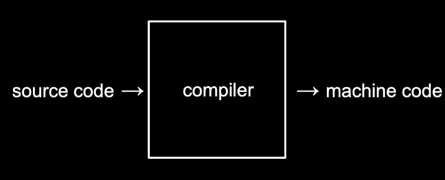
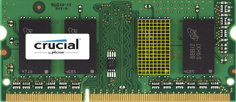
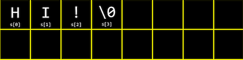
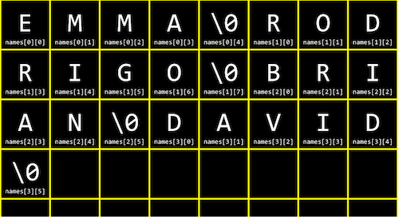

# C언어

## 기초

```c
#include <stdio.h>

int main(void)
{
    printf("hello, world\n");
}
```

### **int main(void)**

> 시작한다의 의미
>
> 앞으로 우리가 작성할 코드 모두는 이 **int main(void) { }**의 중괄호 사이에 작성하게 될 것 입니다.

### **printf(“hello, world\n”)**

> 프린트 기능, 항상 **세미콜론(;)**
>
> **\n** 줄바꿈 기호

터미널창의 명령어 프롬프트에서 “$” 기호 옆에우리가 원하는 명령어를 입력하면 됩니다.

clang hello.c 라는 명령어는 “clang” 이라는 컴파일러로 “hello.c”라는 코드를 컴파일하라는 의미입니다. 


### **컴파일러**

> 우리가 직접 작성한 코드는 **“소스 코드”** 라고 불립니다. 이를 2진수로 작성된 “머신 코드”로 변환해야 컴퓨터가 이해할 수 있습니다. 이런 작업을 컴파일러라는 프로그램이 수행해줍니다.



그 결과 **a.out** 이라는 파일이 생성됩니다.

**./a. out** 이라는 명령어를 실행하면 컴퓨터가 현재 디렉토리에 있는 a.out이라는 프로그램을 실행하게 해줍니다.
(**./a. out에서 제일 앞에 있는 **. 은 지금 있는 현재 폴더를 나타냅니다.)


## 문자열

> String은 단어나 구절, 문장을 부르는 말, 
>
> string은 **형식지정자**

* **데이터의 종류를 아주 정확하게 명시해줘야 합니다**.
* **get_string 함수가 사용자의 이름을 반환하면 그 이름을 anwser이라는 변수에 저장**하는 것입니다.

```c
#include <stdio.h>

int main(void)
{
    string answer = get_string("what's your name?\n");
    printf("hello, %s\n", answer);
}
```

```bash
$ clang -o string string.c -lcs50
# 여기서 -o string 은 string.c 를 string.out 이라는 머신코드로 저장하도록 하는 명령어
# -lcs50은 “link”라는 의미를 지닌 -l 이라는 인자에 우리가 추가로 포함한 “cs50” 파일을 합친 것

# 아래 make 명령어를 통해 간단하게 컴파일을 수행할 수도 있습니다.
$make string

```

## 조건문과 루프

* C는 오래된 언어라 저장하고자 하는 변수의 종류를 꼭 설정

```c
// int 는 변수가 정수(integer)라는 것을 알려주는 것이고, counter는 변수의 이름, 0은 그 값에 0을 저장(초기화);
int counter = 0;

// 셋다 같은 뜻이므로 더욱 간결하게!
counter = counter + 1;
counter += 1;
counter++;
```

### 조건문

```c
// if ( ) 의 괄호 안에는 검사하고자 하는 조건이 들어가고, { } 안에는 조건을 만족할 때 수행하고자 하는 작업
if (x < y)
{
	printf("x is less than y\n");    
}
// 조건이 True면 "x is less than y\n"을 출력

// 아래는 첫 번째 x < y 조건이 False, 즉 x가 y보다 작지 않을 경우에는 "x is not less than y"를 출력
if (x < y)
{
	printf("x is less than y\n");    
}
else
{
    printf("x is not less than y\n");
}


if (x < y)
{
	printf("x is less than y\n") ;   
}
else if (x > y)
{
    printf("x is not less than y\n");
}
// else if (x == y)는 사용할 필요가 없음
else
{
    printf("x is equal to y\n");
}

// 효율적으로 코딩을 하는지, 혹은 얼마나 적은 메모리나 CPU를 사용해서 수행하는지는 정말 중요
```

* 보통 조건과 같은 것들의 끝에는 세미콜론을 붙이지 않습니다.

### 루프

```c
// while 의 경우 아래 코드와 같이 while ( )의 괄호 안에 조건을 넣고 { } 안에 수행할 작업을 포함
while (true)
{
    printf("hello, word\n");
}	// 무한반복

// 만약 특정 횟수만큼 작업을 수행하고 싶으면?
int i = 0;
while (i < 50)
{
    printf("hello, word\n");
    i++;
}	

// for 를 사용하면 for ()안에 각각 (변수 초기화; 변수 조건; 변수 증가) 에 해당하는 코드를 넣어서 간단하게 표현
for (int i = 0; i < 50; i++)
{
    priintf("hello, world\n")
}

```

## 자료형, 형식 지정자, 연산자

### **데이터 타입**

- bool: 불리언 표현, (예) True, False, 1, 0, yes, no
- char: 문자 하나 (예) 'a', 'Z', '?'
- string: 문자열
- int: 특정 크기 또는 특정 비트까지의 정수 (예) 5, 28, -3, 0
  - int는 대략 40억까지 셀 수 있기 때문에 40억게 이상의 데이터를 가진 일부 거대 기업과 같은 상황이 아닌 일반 사용자들은 대부분 정수에 int를 사용합니다.
- long: 더 큰 크기의 정수
- float: 부동소수점을 갖는 실수 (예) 3.14, 0.0, -28.56
- double: 부동소수점을 포함한 더 큰 실수


#### [참조] **CS50 라이브러리 내의 get 함수**

CS50 라이브러리는 위와 같은 데이터 타입을 입력값으로 받을 수 있는 아래와 같은 함수들을 포함합니다.

- get_char
- get_double
- get_float
- get_int
- get_long
- get_string

### **형식 지정자**

printf 함수에서는 각 데이터 타입을 위한 형식 지정자를 사용할 수 있습니다.

- **%c** : char
- **%f** : float, double
- **%i** : int
- **%li** : long
- **%s** : string

### **기타 연산자 및 주석**

그 외에도 아래 목록과 같이 다양한 수학 연산자, 논리 연산자, 주석 등이 기호로 정의되어 있습니다.

- +: 더하기
- -: 빼기
- *: 곱하기
- /: 나누기
- %: 나머지
- &&: 그리고
- ||: 또는
- //: 주석


```c
#include <cs50.h>
#include <stdio.h>

# include <cs50.h>
# include <stdio.h>

int main(void)
{
    float price = get_float("What's the price?\n");
    printf("Your total is %f\n", price*1.0625);
}
// 현재와 같이 출력하면
// 100 입력시, Your total is 106.250000이 출력

int main(void)
{
    float price = get_float("What's the price?\n");
    printf("Your total is %.2f \n", price*1.0625);
}
// %f에서 f앞에 '.원하는 자리수'를 넣어 %.2f로 소수점 2번째 자리까지 나오게 할 수 있습니다
// 변경후 출력하면, Your total is 106.25

// 홀짝 코드
int main(void)
{
    int n = get_int("n: ");

    if (n % 2 == 0)
    {
        printf("even\n");
    }
    else
    {
        printf("odd\n")
    }
}
```

## **사용자 정의 함수**

```c
#include <stdio.h>

void cough(void)
{
    printf("cough\n")
}

int main(void)
{
    for (int i = 0; i < 3; i++)
    {
        cough();
    }
}
```

* void를 입력하고 **원하는 함수명**(cough)을 적은 뒤 괄호 안에 void를 적어줍니다.
* printf로 cough를 출력하는 코드를 작성
* 함수의 이름을 cough라고 정했습니다.
* int main(void)의 안에 cough(함수명)를 사용

```c
#include <stdio.h>

void cough(void);

int main(void)
{
    for (int i = 0; i < 3; i++)
    {
        cough();
    }
}

void cough(void)
{
    printf("cough\n");
}


// -------------
// 3번 출력
void cough(int n);

int main(void)
{
    cough(3);
}

void cough(int n)
{
    for (int i = 0; i < n; i++)
    {
        printf("cough\n");
    }
}
```

* void cough(void);를 맨 위로 올리면 
* cough함수를 전부 본 적은 없어도 이름은 본적이 있으니 main 함수에 나올 때까지 코드를 계속 읽도록 하는 것

```c
#include <cs50.h>
#include <stdio.h>

int get_positive_int(void);

int main(void)
{
    int i = get_positive_int();
    printf("%i\n", i);
}

int get_positive_int(void)
{
    int n;
    do
    {
        n = get_int("Positive Integer: ");
    }
    while (n < 1);
    return n;
}
```

* get_positive_int 함수는 CS50라이브러리(cs50.h)에 없는 함수

* **int get_positive_int(void) 에서 int는 void가 아니고 int**가 됩니다.

  함수 왼쪽에 있는 **단어**는 **출력의 종류**를 의미 합니다.

  **int get_positive_int(void)** 괄호 안의 **(void)**는 **입력의 종류**

  * 만약 입출력이 없다면 void

*  **int n;** 은 변수 지정 아무것도 없는 값

* do-while

  * 불리언 표현 while(n<1); 이 참일때 다음을 수행
  * n이 1보다 작다면 계속해서 질문을 반복하는 것
  * 하지만 do-while은 do에서 무조건 한 번은 먼저 수행

```c
#include <cs50.h>
#include <stdio.h>

int main(void)
{
    int n;

    do
    {
        n = get_int("Size: ");
    }
    while (n < 1);

    for (int i = 0; i < n; i++)
    {
        for (int j = 0; j < n; j++)
        {
            printf("#");
        }
        printf("\n");
    }
}
```

* 먼저 int n; 으로 정수 값을 갖는 변수 n을 정의
* do{ …}while()을 이용해서 while( )의 조건이 만족할때 까지 get_int 함수로 사용자가 입력값을 받아 n에 저장
* do{ }while()을 사용하면 조건과 상관없이 최소한 한 번은 { }안의 내용을 실행
*  for 루프를 두 번 중첩해서 돌면서 “#”을 출력
* 첫 번째 루프에서는 변수 i를 기준으로 n번 반복하고, 그 안의 내부 루프에서는 변수 j를 기준으로 n번 반복
* 내부 루프에서는 “#”을 출력하고, 내부 루프가 끝날 때마다 줄바꿈을 수행
* 최종적으로는 가로가 n개, 세로가 n개인 “#”이 출력

## **부동 소수점 부정확성**

```c
// 실수 x, y를 인자로 받아 x 나누기 y
#include <cs50.h>
#include <stdio.h>

int main(void)
{
    // 사용자에게 x 값 받기
    float x = get_float("x: ");

    // 사용자에게 y 값 받기
    float y = get_float("y: ");

    // 나눗셈 후 출력
    printf("x / y = %.50f\n", x / y);
}
```

```bash
# 나눈 결과를 소수점 50자리까지 출력하기로 하고, x에 1을, y에 10을 입력하면 아래와 같은 결과
x: 1
y: 10
x / y = 0.10000000149011611938476562500000000000000000000000
```

>정확한 결과는 0.1이 되어야 하지만, float 에서 저장 가능한 비트 수가 유한하기 때문에 다소 부정확한 결과를 내게 되는 것

### **정수 오버플로우**

```c
// 비슷한 오류로, 1부터 시작하여 2를 계속해서 곱하여 출력프로그램
#include <stdio.h>
#include <unistd.h>

int main(void)
{
    for (int i = 1; ; i *= 2)
    {
        printf("%i\n", i);
        sleep(1);
    }
}
```

```bash
# 변수 i를 int로 저장하기 때문에, 2를 계속 곱하다가 int 타입이 저장할 수 있는 수를 넘은 이후에는 아래와 같은 에러와 함께  0이 출력될 것
...
1073741824
overflow.c:6:25: runtime error: signed integer overflow: 1073741824 * 2 cannot be represented in type 'int'
-2147483648
0
0
...
```

>정수를 계속 키우는 프로그램에서 10억을 넘기자 앞으로 넘어갈 1의 자리가 없어진 것입니다.
>
>int에서는 32개의 비트가 다였기 때문입니다.

## 컴파일링

- 전처리
- 컴파일링
- 어셈블링
- 링킹

### **전처리(Precompile)**

> 첫 번째 단계는 **전처리**인데, 전처리기에 의해 수행됩니다. # 으로 시작되는 C 소스 코드는 전처리기에게 **실질적인 컴파일이 이루어지기 전에 무언가를 실행**

*  \#include는 전처리기에게 다른 파일의 내용을 포함시키라고 알려줍니다. 프로그램의 소스 코드에 #include 와 같은 줄을 포함하면, 전처리기는 새로운 파일을 생성하는데 이 파일은 여전히 C 소스 코드 형태이며 stdio.h 파일의 내용이 #include 부분에 포함됩니다.

### **컴파일(Compile)**

> **컴파일러**라고 불리는 프로그램은 **C 코드를 어셈블리어라는 저수준 프로그래밍 언어로 컴파일**

* 전처리기가 전처리한 소스 코드를 생성하고 나면 그 다음 단계는 **컴파일**
* **어셈블리**는 C보다 연산의 종류가 훨씬 적지만, 여러 연산들이 함께 사용되면 C에서 할 수 있는 모든 것들을 수행할 수 있습니다.
* C 코드를 어셈블리 코드로 변환시켜줌으로써 컴파일러는 컴퓨터가 이해할 수 있는 언어와 최대한 가까운 프로그램으로 만들어 줍니다.
* 컴파일이라는 용어는 소스 코드에서 오브젝트 코드로 변환하는 전체 과정을 통틀어 일컫기도 하지만, 구체적으로 전처리한 소스 코드를 어셈블리 코드로 변환시키는 단계를 말하기도 합니다.

### **어셈블(Assemble)**

> **어셈블리 코드를 오브젝트 코드로 변환**

* 소스 코드가 어셈블리 코드로 변환되면, 다음 단계인 **어셈블** 단계
* 컴퓨터의 중앙처리장치가 프로그램을 어떻게 수행해야 하는지 알 수 있는 명령어 형태인 **연속된 0과 1들로 바꿔주는 작업**
* 변환작업은 **어셈블러**라는 프로그램이 수행합니다. 소스 코드에서 오브젝트 코드로 컴파일 되어야 할 파일이 딱 한 개라면, 컴파일 작업은 여기서 끝이 납니다. 
  * 그렇지 않은 경우에는 링크라 불리는 단계가 추가됩니다.

### **링크(Link)**

>**여러 개의 파일로 이루어져 있어 하나의 오브젝트 파일로 합쳐져야 한다면** **링크**라는 컴파일의 마지막 단계

* 링커는 여러 개의 다른 오브젝트 코드 파일을 실행 가능한 하나의 오브젝트 코드 파일로 합쳐줍니다.
* 컴파일을 하는 동안에 CS50 라이브러리를 링크하면 오브젝트 코드는 GetInt()나 GetString() 같은 함수를 어떻게 실행할 지 알 수 있게 됩니다.


## **버그와 디버깅**

> **버그(bug)**는 **코드에 들어있는 오류**
>
> **디버깅(debugging)**은 **코드에 있는 버그를 식별하고 고치는 과정**

### **메모리**

>컴퓨터 안에는 아래 사진과 같은 **RAM** 이라고 하는 물리적 칩이 메모리 역할을 합니다.
>
>쉽게 생각하면 아래 사진에서 여러 개의 노란색 사각형이 메모리를 의미하고, 작은 사각형 하나가 **1바이트**를 의미한다고 볼 수 있습니다.



C에는 아래와 같은 여러 자료형이 있고, 각각의 자료형은 서로 다른 크기의 메모리를 차지합니다.

- bool: 불리언, 1바이트
- char: 문자, 1바이트
- int: 정수, 4바이트
- float: 실수, 4바이트
- long: (더 큰) 정수, 8바이트
- double: (더 큰) 실수, 8바이트
- string: 문자열, ?바이트

## 배열

```c
// 세 개의 점수를 저장하고 그 평균을 출력하는 프로그램
#include <cs50.h>
#include <stdio.h>

int main(void)
{
    // Scores
    int score1 = 72;
    int score2 = 73;
    int score3 = 33;

    // Print average
    printf("Average: %i\n", (score1 + score2 + score3) / 3);
}
// 만약 점수의 개수가 더 많아진다면 이 프로그램은 많은 부분을 수정해줘야 합니다.
// 이 때 활용할 수 있는 것이 배열의 개념입니다.
// 아래와 같이 변경
#include <cs50.h>
#include <stdio.h>

int main(void)
{
    // Scores
    int scores[3];
    scores[0] = 72;
    scores[1] = 73;
    scores[2] = 33;

    // Print average
    printf("Average: %i\n", (scores[0] + scores[1] + scores[2]) / 3);
}
```

* **int scores[3];** 이라는 코드는 int 자료형을 가지는 크기 3의 배열을 scores 라는 이름으로 생성하겠다는 의미
* 배열의 인덱스는 0부터 시작하기 때문에, scores의 인덱스는 0, 1, 2 세 개
* 이 인덱스를 변수명 뒤 대괄호 [ ] 사이에 입력하여 배열의 원하는 위치에 원하는 값을 저장하고 불러올 수 있습니다.
* 하지만 여전히 복사 붙혀넣기를 한다.

### **전역 변수**

```c
#include <cs50.h>
#include <stdio.h>

const int N = 3;

int main(void)
{
    // 점수 배열 선언 및 값 저장
    int scores[N];
    scores[0] = 72;
    scores[1] = 73;
    scores[2] = 33;

    // 평균 점수 출력
    printf("Average: %i\n", (scores[0] + scores[1] + scores[2]) / N);
}
```

> N이 고정된 값(상수)이라면 그 값을 선언할 때 const를 앞에 붙여서 전역 변수, 즉 코드 전반에 거쳐 바뀌지 않는 값임을 지정
>
> 관례적으로 이런 전역 변수의 이름은 대문자로 표기

### **배열의 동적 선언 및 저장**

```c
#include <cs50.h>
#include <stdio.h>

float average(int length, int array[]);

int main(void)
{
    // 사용자로부터 점수의 갯수 입력
    int n = get_int("Scores:  ");

    // 점수 배열 선언 및 사용자로부터 값 입력
    int scores[n];
    for (int i = 0; i < n; i++)
    {
        scores[i] = get_int("Score %i: ", i + 1);
    }

    // 평균 출력
    printf("Average: %.1f\n", average(n, scores));
}

//평균을 계산하는 함수
float average(int length, int array[])
{
    int sum = 0;
    for (int i = 0; i < length; i++)
    {
        sum += array[i];
    }
    return (float) sum / (float) length;
}
```

* 배열의 크기를 사용자에게 직접 입력 받고, 배열의 크기만큼 루프를 돌면서 각 인덱스에 해당하는 값을 역시 사용자에게 동적으로 입력 받아 저장
*  average 라는 함수를 따로 선언하여 평균을 구함
* average 함수는 length 와 array[], 즉 배열의 길이와 배열을 입력으로 받음
* 함수 안에서는 배열의 길이만큼 루프를 돌면서 값의 합을 구하고 최종적으로 평균값을 반환

## 문자열과 배열

* 문자열(string) 자료형의 데이터는 사실 문자(char) 자료형의 데이터들의 배열



* **string s = “HI!”;** 과 같이 문자열 s가 정의되어 있으면 여기서 가장 끝의 **‘\0’**은 문자열의 끝을 나타내는 널 종단 문자
  * 널문자 : 단순히 모든 비트가 0인 1바이트를 의미

```c
string names[4];

names[0] = "EMMA";
names[1] = "RODRIGO";
names[2] = "BRIAN";
names[3] = "DAVID";

printf("%s\n", names[0]);
printf("%c%c%c%c\n", names[0][0], names[0][1], names[0][2], names[0][3]);
```



### **문자열의 길이 및 탐색**

```c
#include <cs50.h>
#include <stdio.h>
#include <string.h>

int main(void)
{
    string s = get_string("Input: ");
    printf("Output:\n");
    // for (int i = 0; s[i] != ‘\0’; i++)
    for (int i = 0, n = strlen(s); i < n; i++)
    {
        printf("%c\n", s[i]);
    }
}
```

* **strlen**은 문자열의 길이를 알려주는 함수로, string.h 라이브러리 안에 포함

### **문자열 탐색 및 수정**

```c
#include <cs50.h>
#include <stdio.h>
#include <string.h>

int main(void)
{
    string s = get_string("Before: ");
    printf("After:  ");
    for (int i = 0, n = strlen(s); i < n; i++)
    {
        if (s[i] >= 'a' && s[i] <= 'z')
        {
            printf("%c", s[i] - 32);
        }
        else
        {
            printf("%c", s[i]);
        }
    }
    printf("\n");
}
```

* s의 길이만큼 for 루프를 돌면서, 각 인덱스에 해당하는 문자가 ‘a’보다 크고 ‘z’보다 작은지 검사
* 문자의 대소비교가 가능한 이유는 ASCII값, 즉 그 문자가 정의되는 ASCII 코드 상에서의 숫자값으로 비교할 수 있기 때문
* ASCII 값을 잘 살펴보면 각 알파벳의 소문자와 대문자는 32씩 차이

```c
// 동일한 작업을 수행하는 함수가 ctype 라이브러리에 toupper()
#include <cs50.h>
#include <ctype.h>
#include <stdio.h>
#include <string.h>

int main(void)
{
    string s = get_string("Before: ");
    printf("After:  ");
    for (int i = 0, n = strlen(s); i < n; i++)
    {
        printf("%c", toupper(s[i]));
    }
    printf("\n");
}
```

## 명령행 인자

```c
#include <cs50.h>
#include <stdio.h>

// 첫번째 변수 argc는 main 함수가 받게 될 입력의 개수
// argv[]는 그 입력이 포함되어 있는 배열
// argv[]는 string 배열
int main(int argc, string argv[])
{
    if (argc == 2)
    {
        printf("hello, %s\n", argv[1]);
    }
    else
    {
        printf("hello, world\n");
    }
}
```

* **argv[0]**는 기본적으로 **프로그램의 이름**으로 저장
* “arg.c”라는 이름으로 저장하고 컴파일 한 후 **“./argc”**로 실행해보면 “hello, world”라는 값이 출력
  * **“./argc David”**로 실행해보면 “hello, David”라는 값이 출력
  * 명령행 인자에 David라는 값이 추가로 입력되었고, 따라서 argc 는 2, argv[1] 은 “David”가 되기 때문
