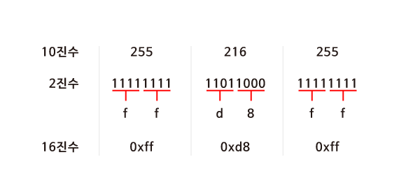
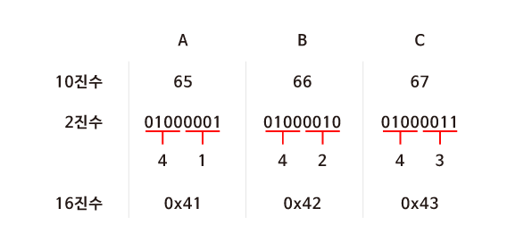
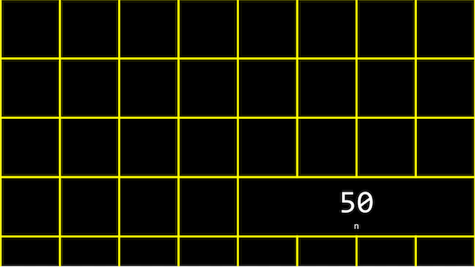
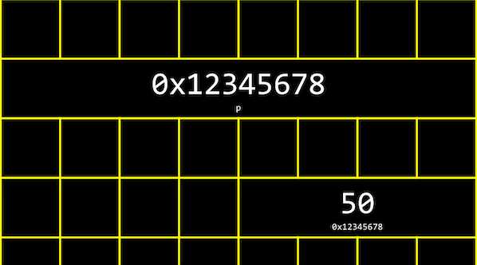
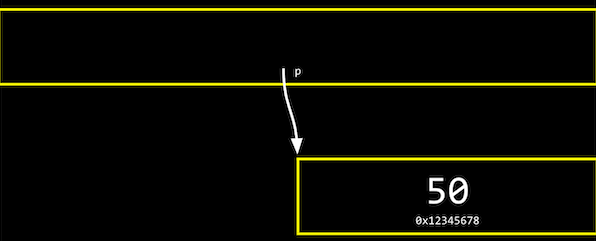
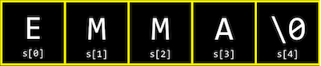
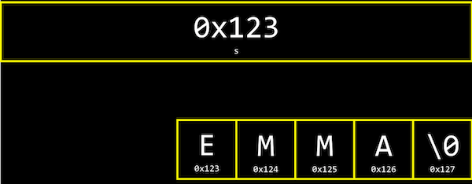

# 메모리

### **16진수**

> 컴퓨터과학에서는 숫자를 10진수나 2진수 대신 **16****진수****(Hexadecimal)**로 표현하는 경우가 많습니다.
>
> JPG 이미지 파일은 항상 255 216 255 로 시작되고 이것은 10진수입니다. 하지만 실제 컴퓨터 내에서는 10진수를 사용하지 않습니다. 컴퓨터는 0과 1만을 이해할 수 있기 때문입니다.



>**2^4**이 **16**이기 때문에 **4bits**씩 두 덩어리로 나누어 보면 0000 부터 1111까지는 16진수로 표현할 수 있다는 것을 알 수 있습니다.

### **16진수의 유용성**

> ASCII 코드에 의해 “A, B, C”는 10진수로 65, 66, 67에 해당합니다. 컴퓨터는 10진수를 이해할 수 없으므로 2진수로 표현해보면 "01000001 01000010 01000011＂이 됩니다.
>
> * 하지만 16진수로 표현하면 2진수로 표현했을 때 보다 훨씬 간단해집니다. 또한 컴퓨터는 8개의 비트가 모인 바이트 단위로 정보를 표현합니다. **2개의 16진수는 1byte의 2진수로 변환**되기 때문에 정보를 표현하기 매우 유용합니다.




## **메모리 주소**

* 정수형 변수 n에 50이라는 값을 저장하고 출력
*  n 이라는 값은 **int** 타입이므로, 아래 그림과 같이 우리 컴퓨터의 메모리 어딘가에 **4바이트** 만큼의 자리를 차지하며 저장되어 있을 것입니다.



* C에서는 변수의 **메모리상 주소**를 받기 위해 **‘&’**이라는 연산자를 사용

```c
#include <stdio.h>

int main(void)
{
    int n = 50;
    printf("%p\n", &n);
}

// ‘0x7ffe00b3adbc’
// 이는 변수 n의 16진법으로 표현된 메모리의 주소
```

* 반대로 **‘\*’**를 사용하면 그 메모리 주소에 있는 **실제 값**

```c
#include <stdio.h>

int main(void)
{
    int n = 50;
    printf("%i\n", *&n);
}

// 50
//  n의 주소를 얻고, 또 다시 그 주소에 해당하는 값을 얻어와 출력
```

---

## 포인터

> 메모리의 주소값을 저장하는 변수

### *p

*  ‘*’ 연산자는 어떤 메모리 주소에 있는 값을 받아오게 해줌
* '*' 연산자를 이용해서 **포인터 역할을 하는 변수**를 선언

```c
#include <stdio.h>

int main(void)
{
   int n = 50;
   int *p = &n;
   printf("%p\n", p);
   printf("%i\n", *p);
}
```

* 정수형 변수 n에는 50이라는 값이 저장
* ***p**라는 **포인터 변수**에 &n 이라는 값, 즉 **변수 n의 주소**를 저장
* int *p 에서 p앞의 *는 이 변수가 포인터라는 의미이고, int 는 이 포인터가 int 타입의 변수를 가리킨다는 의미
* 첫 번째 printf문과 같이 포인터 p의 값, 즉 변수 **n의 주소를 출력**
* 두 번째 printft문과 같이 포인터 **p가 가리키는 변수의 값**, 즉 변수 n의 값을 출력



* 실제 컴퓨터 메모리에서 변수 p는 아래와 같이 저장
* 하지만 아래 그림과 같이 실제로 p의 값, 즉 n의 주소값을 생각하지 않고, 추상적으로 단지 **p가 n을 가리키고 있다는 것**



---

## 문자열

> 문자열은 **문자의 배열**이고, s[0], s[1], s[2], … 와 같이 하나의 문자가 배열의 한 부분
>
> 가장 마지막의 **\0**은 0으로 이루어진 바이트로, **문자열의 끝**을 표시하는 약속



* **변수 s**는 결국 이러한 **문자열을 가리키는 포인터**
  * 문자열의 가장 첫번째 문자, 즉 주소 0x123에 있는 s[0]



```c
#include <stdio.h>

int main(void)
{
    char *s = "EMMA";
    printf("%s\n", s);
    // EMMA
    printf("%p\n", &s[0]);
    // E
}
```

* 2번 코드의 char *s에서 s라는 변수는 문자에 대한 포인터가 되고, “EMMA”라는 문자열의 가장 첫 번째 값을 저장
* s라는 문자열의 첫 번째 문자에 해당하는 주소값,
* &s[0]는 “E”의 주소값을, &s[1]은 “M”의 주소값을, &s[2]은 “M”의 주소값을, &s[3]은 “A”의 주소값을 의미
* 문자열은 첫번째 문자를 시작으로 메모리상에서 바로 옆에 저장
* 가장 첫 번째 문자에 해당하는 **주소값을 하나씩 증가시키면** 바로 옆에 있는 문자의 값을 출력할 수 있는 것

```c
#include <stdio.h>

int main(void)
{
    char *s = "EMMA";
    printf("%c\n", *s);
    // E
    printf("%c\n", *(s+1));
    // M
    printf("%c\n", *(s+2));
    // M
    printf("%c\n", *(s+3));
    // A
}
```

* 문자열을 비교할 때도 아래 코드와 같이 문자열이 저장된 변수를 바로 비교하게 되면 그 변수가 저장되어 있는 **주소가 다르기 때문에** 다르다는 결과가 나옴

