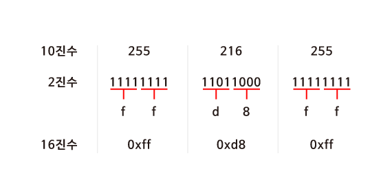
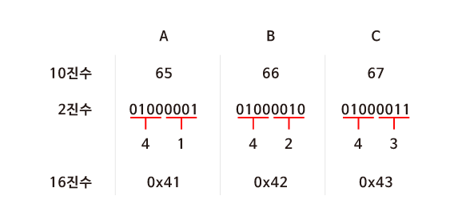
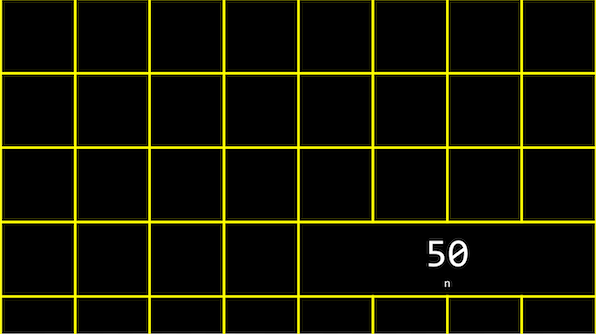
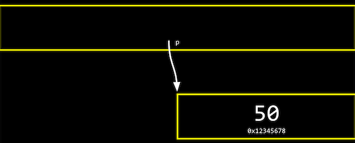
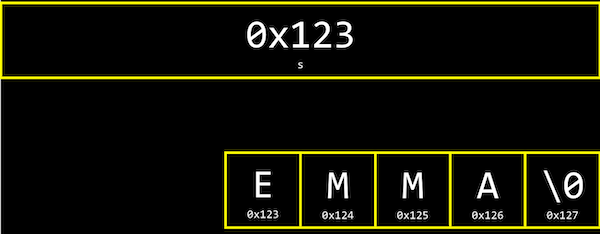
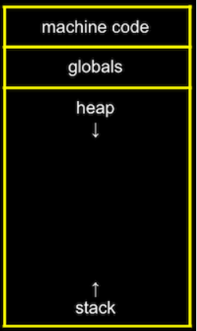
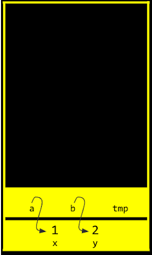

# 메모리

### **16진수**

> 컴퓨터과학에서는 숫자를 10진수나 2진수 대신 **16****진수****(Hexadecimal)**로 표현하는 경우가 많습니다.
>
> JPG 이미지 파일은 항상 255 216 255 로 시작되고 이것은 10진수입니다. 하지만 실제 컴퓨터 내에서는 10진수를 사용하지 않습니다. 컴퓨터는 0과 1만을 이해할 수 있기 때문입니다.



>**2^4**이 **16**이기 때문에 **4bits**씩 두 덩어리로 나누어 보면 0000 부터 1111까지는 16진수로 표현할 수 있다는 것을 알 수 있습니다.

### **16진수의 유용성**

> ASCII 코드에 의해 “A, B, C”는 10진수로 65, 66, 67에 해당합니다. 컴퓨터는 10진수를 이해할 수 없으므로 2진수로 표현해보면 "01000001 01000010 01000011＂이 됩니다.
>
> * 하지만 16진수로 표현하면 2진수로 표현했을 때 보다 훨씬 간단해집니다. 또한 컴퓨터는 8개의 비트가 모인 바이트 단위로 정보를 표현합니다. **2개의 16진수는 1byte의 2진수로 변환**되기 때문에 정보를 표현하기 매우 유용합니다.




## **메모리 주소**

* 정수형 변수 n에 50이라는 값을 저장하고 출력
*  n 이라는 값은 **int** 타입이므로, 아래 그림과 같이 우리 컴퓨터의 메모리 어딘가에 **4바이트** 만큼의 자리를 차지하며 저장되어 있을 것입니다.



* C에서는 변수의 **메모리상 주소**를 받기 위해 **‘&’**이라는 연산자를 사용

```c
#include <stdio.h>

int main(void)
{
    int n = 50;
    printf("%p\n", &n);
}

// ‘0x7ffe00b3adbc’
// 이는 변수 n의 16진법으로 표현된 메모리의 주소
```

* 반대로 **‘\*’**를 사용하면 그 메모리 주소에 있는 **실제 값**

```c
#include <stdio.h>

int main(void)
{
    int n = 50;
    printf("%i\n", *&n);
}

// 50
//  n의 주소를 얻고, 또 다시 그 주소에 해당하는 값을 얻어와 출력
```

---

## 포인터

> 메모리의 주소값을 저장하는 변수

### *p

*  ‘*’ 연산자는 어떤 메모리 주소에 있는 값을 받아오게 해줌
* '*' 연산자를 이용해서 **포인터 역할을 하는 변수**를 선언

```c
#include <stdio.h>

int main(void)
{
   int n = 50;
   int *p = &n;
   printf("%p\n", p);
   printf("%i\n", *p);
}
```

* 정수형 변수 n에는 50이라는 값이 저장
* ***p**라는 **포인터 변수**에 &n 이라는 값, 즉 **변수 n의 주소**를 저장
* int *p 에서 p앞의 *는 이 변수가 포인터라는 의미이고, int 는 이 포인터가 int 타입의 변수를 가리킨다는 의미
* 첫 번째 printf문과 같이 포인터 p의 값, 즉 변수 **n의 주소를 출력**
* 두 번째 printft문과 같이 포인터 **p가 가리키는 변수의 값**, 즉 변수 n의 값을 출력


* 실제 컴퓨터 메모리에서 변수 p는 아래와 같이 저장
* 하지만 아래 그림과 같이 실제로 p의 값, 즉 n의 주소값을 생각하지 않고, 추상적으로 단지 **p가 n을 가리키고 있다는 것**



---

## 문자열

> 문자열은 **문자의 배열**이고, s[0], s[1], s[2], … 와 같이 하나의 문자가 배열의 한 부분
>
> 가장 마지막의 **\0**은 0으로 이루어진 바이트로, **문자열의 끝**을 표시하는 약속


* **변수 s**는 결국 이러한 **문자열을 가리키는 포인터**
  * 문자열의 가장 첫번째 문자, 즉 주소 0x123에 있는 s[0]



```c
#include <stdio.h>

int main(void)
{
    char *s = "EMMA";
    printf("%s\n", s);
    // EMMA
    printf("%p\n", &s[0]);
    // E
}
```

* 2번 코드의 char *s에서 s라는 변수는 문자에 대한 포인터가 되고, “EMMA”라는 문자열의 가장 첫 번째 값을 저장
* s라는 문자열의 첫 번째 문자에 해당하는 주소값,
* &s[0]는 “E”의 주소값을, &s[1]은 “M”의 주소값을, &s[2]은 “M”의 주소값을, &s[3]은 “A”의 주소값을 의미
* 문자열은 첫번째 문자를 시작으로 메모리상에서 바로 옆에 저장
* 가장 첫 번째 문자에 해당하는 **주소값을 하나씩 증가시키면** 바로 옆에 있는 문자의 값을 출력할 수 있는 것

```c
#include <stdio.h>

int main(void)
{
    char *s = "EMMA";
    printf("%c\n", *s);
    // E
    printf("%c\n", *(s+1));
    // M
    printf("%c\n", *(s+2));
    // M
    printf("%c\n", *(s+3));
    // A
}
```

* 문자열을 비교할 때도 아래 코드와 같이 문자열이 저장된 변수를 바로 비교하게 되면 그 변수가 저장되어 있는 **주소가 다르기 때문에** 다르다는 결과가 나옴

---

## 문자열 복사


```c
// 문자열을 복사하기 위해 아래 코드를 실행
#include <cs50.h>
#include <ctype.h>
#include <stdio.h>

int main(void)
{
    string s = get_string("s: ");
    string t = s;

    t[0] = toupper(t[0]);

    printf("s: %s\n", s);
    printf("t: %s\n", t);
}
//  “emma”를 주게 된다면, 단순한 예상과는 다르게 
// s: EMMA
// t: Emma
```

* 그 이유는 **s**라는 변수에는 “emma”라는 문자열이 아닌 그 문자열이 있는 **메모리의 주소가 저장**되기 때문
* t도 s와 동일한 주소를 가리키고 있고, t를 통한 수정은 s에도 그대로 반영

```c
// 메모리 할당 함수를 사용
#include <cs50.h>
#include <ctype.h>
#include <stdio.h>
#include <string.h>

int main(void)
{
    char *s = get_string("s: ");
    char *t = malloc(strlen(s) + 1);

    for (int i = 0, n = strlen(s); i < n + 1; i++)
    {
        t[i] = s[i];
    }

    t[0] = toupper(t[0]);

    printf("s: %s\n", s);
    printf("t: %s\n", t);
}
// s : “emma” 
// t : “Emma”
```

* **malloc**이라는 함수를 이용해서 t를 정의
* malloc 이라는 함수는 정해진 크기 만큼 메모리를 할당하는 함수
* s 문자열의 길이에 **널 종단 문자(\0)**에 해당하는 **1**을 더한 만큼 메모리를 할당
* 루프를 돌면서 s 문자열 배열에 있는 문자 하나 하나를 t 배열에 복사

> malloc 함수를 이용하여 메모리를 할당한 후에는 **free**라는 함수를 이용하여 메모리를 해제해줘야 합니다.
>
> 그렇지 않은 경우 메모리에 저장한 값은 **쓰레기 값**으로 남게 되어 메모리 용량의 낭비가 발생하게 되기 때문
>
> 이러한 현상을 **‘메모리 누수’**

* **valgrind** 라는 프로그램을 사용하면 우리가 작성한 코드에서 메모리와 관련된 문제가 있는지를 쉽게 확인할 수 있습니다.

```bash
help50 valgrind ./filename
# filename 파일에 대한 valgrind의 검사 내용을 쉽게 확인
```

```c
#include <stdlib.h>

void f(void)
{
    int *x = malloc(10 * sizeof(int));
    // x[10] = 0;
    x[9] = 0;
    free(x);
}

int main(void)
{
    f();
    return 0;
}
```

* f 함수를 살펴보면 먼저 포인터 x에는 int형의 사이즈(4바이트)에 10배에 해당하는 크기의 메모리, 즉 40바이트를 할당
* x의 10번째 값으로 0을 할당
* main 함수에서 f를 실행하게 되는데, 이 코드를 **valgrind** 로 검사해보면 버퍼 오버플로우와 메모리 누수 두 가지 에러를 확인
* **버퍼 오버플로우**는 x[10] = 0; 코드로 인해 발생
* 10개의 int형의 배열을 만들었는데 배열의 인덱스가 0부터 시작한다는 점을 감안하면 인덱스 10은 11번째 인덱스에 접근하겠다는 의미이고, 이는 정의되지 않은 것이기 때문에 버퍼 오버플로우가 발생
* **메모리 누수**는 x라는 포인터를 통해 할당한 메모리를 해제하기 위해 **free(x)** 라는 코드를 추가해줌으로써 해결

## 메모리 교환, 스택, 힙

> 메모리 안에는 데이터 저장되는 구역이 나뉘어져 있습니다.

* **머신 코드 영역**
  * 우리 프로그램이 실행될 때 그 프로그램이 컴파일된 바이너리가 저장

* **글로벌 영역**
  * 프로그램 안에서 저장된 전역 변수가 저장
* **힙 영역**
  * malloc으로 할당된 메모리의 데이터가 저장
  * **malloc 에 의해 메모리가 더 할당될수록**, 점점 사용하는 메모리의 범위가 아래로 늘어남
* **스택**
  * 프로그램 내의 함수와 관련된 것들이 저장
  * **함수가 더 많이 호출 될수록** 사용하는 메모리의 범위가 점점 위로 늘어남

> 제한된 메모리 용량 하에서는 기존의 값을 침범하는 상황 발생
>
> **힙 오버플로우** 또는 **스택 오버플로우**



```c
#include <stdio.h>

void swap(int *a, int *b);

int main(void)
{
    int x = 1;
    int y = 2;

    printf("x is %i, y is %i\n", x, y);
    // & = 주소를 전달
    swap(&x, &y);
    printf("x is %i, y is %i\n", x, y);
}

void swap(int *a, int *b)
{
    // * = 정수를 가리키는 포인터
    // tmp를 *a가 가리키는 주소로 가라고 명령하면 그곳엔 x가 있고 값은 1이다.
    int tmp = *a;
    // 마찬가지로 *b의 주소로 가라고 하고 그곳엔 y가 있고 값은 2다.
    // *a의 주소에 *b가 가리키는 주소를 저장시킨다
    *a = *b;
    *b = tmp;
}
// malloc을 쓰지 않았으니 free할 필요 없음
```



## 파일 쓰기

### **scanf**

> 사용자로부터 형식 지정자에 해당되는 값을 입력받아 저장하는 함수.

```c
// int
#include <stdio.h>

int main(void)
{
    // int x를 정의한 후에
    int x;
    printf("x: ");
    // scanf에 s가 아닌 &s로 그 주소를 입력
    scanf("%i", &x);
    printf("x: %i\n", x);
}
```

* scanf 함수의 변수가 실제로 스택 영역 안에 s가 저장된 주소로 찾아가서 사용자가 입력한 값을 저장하도록 하기 위함

```c
// char
#include <stdio.h>

int main(void)
{
    char s[5];
    printf("s: ");
    // scanf에 그대로 s를 입력
    scanf("%s", s);
    printf("s: %s\n", s);
}
```

*  s를 크기가 5인 문자열, 즉 크기가 5인 char 자료형의 배열로 정의하였기 때문
* **clang** 컴파일러는 문자 배열의 이름을 포인터처럼 다룹니다. 즉 scanf에 s라는 배열의 첫 바이트 주소를 넘겨주는 것

### 입력을 받아 저장하기

```c
#include <cs50.h>
#include <stdio.h>
#include <string.h>

int main(void)
{
    FILE *file = fopen("phonebook.csv", "a");
    char *name = get_string("Name: ");
    char *number = get_string("Number: ");
    fprintf(file, "%s,%s\n", name, number);
    fclose(file);
}
```

* **fopen**이라는 함수를 이용하면 파일을 FILE이라는 자료형으로 불러옴
* fopen 함수의 첫번째 인자는 파일의 이름, 두번째 인자는 모드로 r은 읽기, w는 쓰기, a는 덧붙이기를 의미
* 사용자에게 name과 number라는 문자열을 입력 받고, 이를 **fprintf** 함수를 이용하여 printf에서처럼 파일에 직접 내용을 출력
* 작업이 끝난 후에는 **fclose**함수로 파일에 대한 작업을 종료
