# 자료구조

### 배열의 크기 조정하기

> **새로운 공간에 큰 크기의 메모리를 다시 할당**하고 기존 배열의 값들을 하나씩 옮겨야 함
>
> 이런 작업은 **O(n)**, 즉 배열의 크기 n만큼의 실행 시간이 소요될 것

```c
#include <stdio.h>
#include <stdlib.h>

int main(void)
{
    int *list = malloc(3 * sizeof(int));
    if (list == NULL)
    {
        return 1;
    }

    list[0] = 1;
    list[1] = 2;
    list[2] = 3;

    // tmp 포인터에 메모리를 할당하고 list의 값 복사
    int *tmp = realloc(list, 4 * sizeof(int));
    if (tmp == NULL)
    {
        return 1;
    }

    // list가 tmp와 같은 곳을 가리키도록 지정
    list = tmp;

    // 새로운 list의 네 번째 값 저장
    list[3] = 4;

    // list의 값 확인
    for (int i = 0; i < 4; i++)
    {
        printf("%i\n", list[i]);
    }

    //list 의 메모리 초기화
    free(list);
}
```

### struct

* 구조체
* C언어에서 자신만의 구조를 만들 수 있는 키워드
* ex ) 이름과 전화번호 두 개의 값을 가진 자료 종류를 만들 수 있음
  * 비트맵이나 비트맵 헤더 등과 관련된 문제에서도 사용

### .

* 구조체의 속성값에 접근할 때 사용
* 픽셀을 조작할 때 사용

### *

* 메모리 덩어리로 접근할 수 있는 역참조 연산자
* 포인터를 이용해서 화살표 사용!

---

## 연결 리스트

> 각 값이 메모리상의 여러 군데 나뉘어져 있다고 하더라도 바로 다음 값의 **메모리 주소**만 기억하고 있다면 여전히 값을 연이어서 읽어들일 수 있다.

* 아래 그림과 같이 크기가 3인 연결 리스트는 각 인덱스의 메모리 주소에서 **자신의 값**과 함께 **바로 다음 값의 주소(포인터)**를 저장

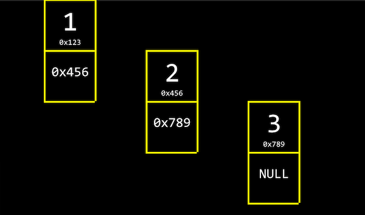

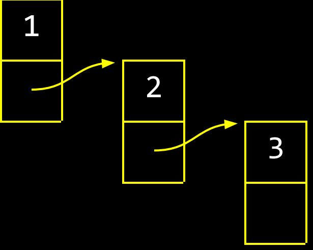

* 연결 리스트의 가장 첫 번째 값인 1은 2의 메모리 주소를, 2는 3의 메모리 주소를 함께 저장
* 3은 다음 값이 없기 때문에 NULL (\0, 즉 0으로 채워진 값을 의미합니다)을 다음 값의 주소로 저장

**데이터 구조**는 우리가 컴퓨터 메모리를 더 효율적으로 관리하기 위해 새로 정의하는 구조체

```c
typedef struct node
{
    int number;
    struct node *next;
}
node;
```

* node 라는 이름의 구조체는 number 와 *next 두 개의 필드가 함께 정의
* number는 **각 node가 가지는 값**
* *next 는 **다음 node를 가리키는 포인터**
* typedef struct 대신에 typedef struct node 라고 ‘node’를 함께 명시해 주는 것은, 구조체 안에서 node를 사용하기 위함


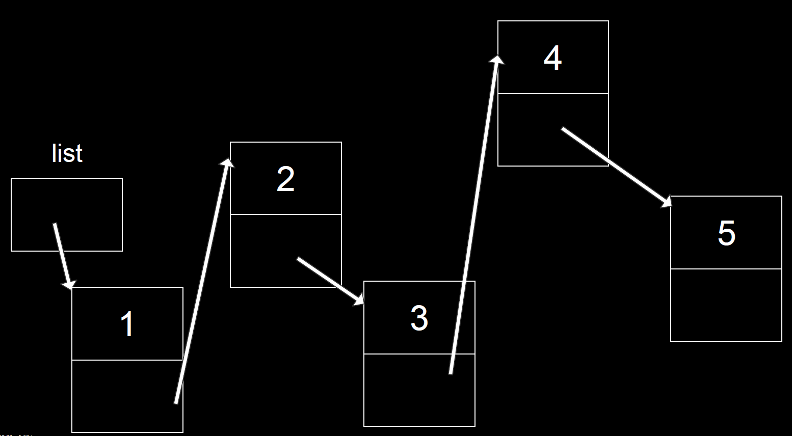

## 코드

1. 구조체 정의 (node)

```c
#include <stdio.h>
#include <stdlib.h>

typedef struct node
{
    int number;
    struct node *next;
} node;
```

2. node의 주소가 들어가는 list라는 변수 지정

```c
#include <stdio.h>
#include <stdlib.h>

typedef struct node
{
    int number;
    struct node *next;
} node;

int main(void)
{
    // list라는 이름의 node 포인터를 정의합니다. 
    // 연결 리스트의 가장 첫 번째 node를 가리킬 것입니다.
    // 이 포인터는 현재 아무 것도 가리키고 있지 않기 때문에 NULL 로 초기화합니다.
    node *list = NULL;
```


3. node를 위한 메모리를 할당 후 변수에 저장 **(malloc)**

```c
#include <stdio.h>
#include <stdlib.h>

typedef struct node
{
    int number;
    struct node *next;
} node;

int main(void)
{
    node *list = NULL;

    // 새로운 node를 위해 메모리를 할당하고 포인터 *n으로 가리킵니다.
    node *n = malloc(sizeof(node));
    // 안정성을 위한 것
    if (n == NULL)
    {
        return 1;
    }
```

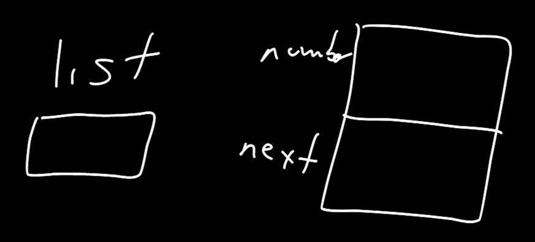

4. 구조체에 값을 지정

```c
#include <stdio.h>
#include <stdlib.h>

typedef struct node
{
    int number;
    struct node *next;
} node;

int main(void)
{
    node *list = NULL;
    
    node *n = malloc(sizeof(node));
    if (n == NULL)
    {
        return 1;
    }
    // n의 number 필드에 1의 값을 저장합니다. “n->number”는 “(*n).numer”와 동일한 의미입니다.
    // 즉, n이 가리키는 node의 number 필드를 의미하는 것입니다.
    // 간단하게 화살표 표시 ‘->’로 쓸 수 있습니다. n의 number의 값을 1로 저장합니다.
    n->number = 1;

    // n 다음에 정의된 node가 없으므로 NULL로 초기화합니다.
    n->next = NULL;

```

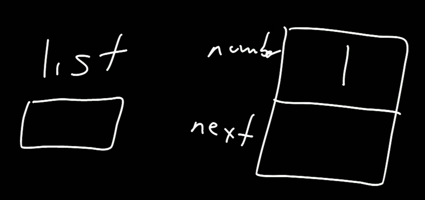

5. list포인터를 n포인터로 변환

```c
#include <stdio.h>
#include <stdlib.h>

typedef struct node
{
    int number;
    struct node *next;
} node;

int main(void)
{
    node *list = NULL;
    
    node *n = malloc(sizeof(node));
    if (n == NULL)
    {
        return 1;
    }

    n->number = 1;
    n->next = NULL;
    
    // 이제 첫번째 node를 정의했기 떄문에 list 포인터를 n 포인터로 바꿔 줍니다.
    list = n;

```

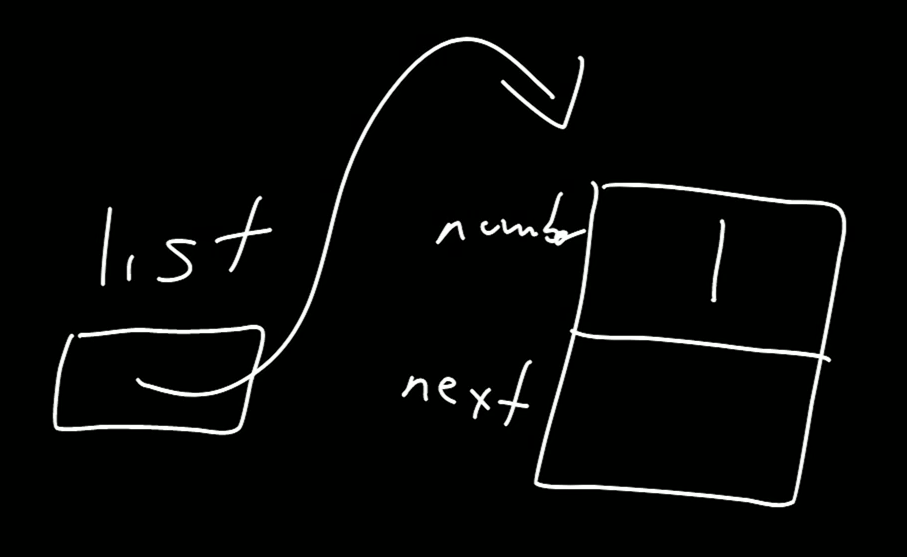

6. 다음 리스트를 연결

```c
#include <stdio.h>
#include <stdlib.h>

typedef struct node
{
    int number;
    struct node *next;
} node;

int main(void)
{
    node *list = NULL;
    
    node *n = malloc(sizeof(node));
    if (n == NULL)
    {
        return 1;
    }

    n->number = 1;
    n->next = NULL;

    list = n;
    
    // 이제 list에 다른 node를 더 연결하기 위해 n에 새로운 메모리를 다시 할당합니다.
    n = malloc(sizeof(node));
    if (n == NULL)
    {
        return 1;
    }
```

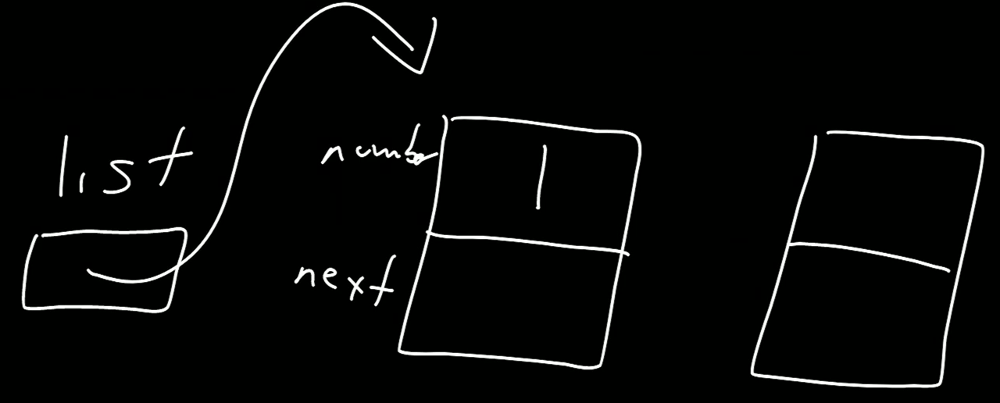

7. 다시 값을 지정

```c
#include <stdio.h>
#include <stdlib.h>

typedef struct node
{
    int number;
    struct node *next;
} node;

int main(void)
{
    node *list = NULL;
    
    node *n = malloc(sizeof(node));
    if (n == NULL)
    {
        return 1;
    }

    n->number = 1;
    n->next = NULL;

    list = n;
    
    n = malloc(sizeof(node));
    if (n == NULL)
    {
        return 1;
    }
    // n의 number와 next의 값을 각각 저장합니다.
    n->number = 2;
    n->next = NULL;
```

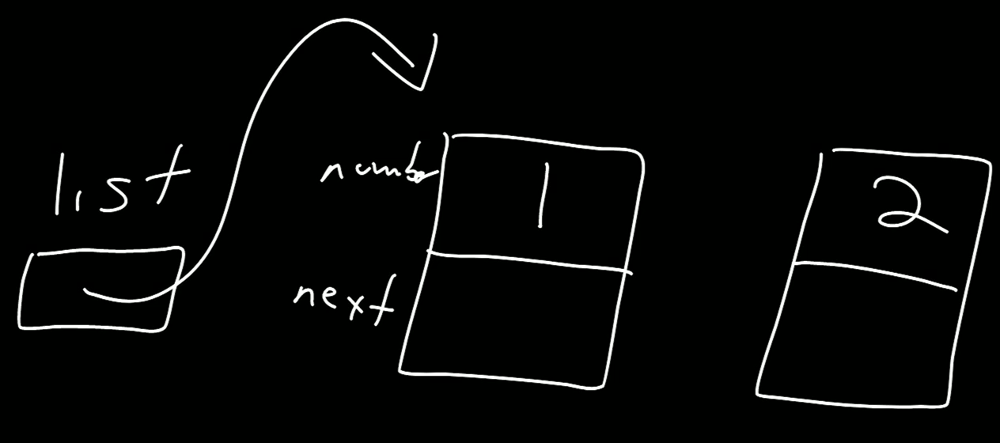

8. 다음 node를 포인터로 지정

```c
#include <stdio.h>
#include <stdlib.h>

typedef struct node
{
    int number;
    struct node *next;
} node;

int main(void)
{
    node *list = NULL;
    
    node *n = malloc(sizeof(node));
    if (n == NULL)
    {
        return 1;
    }

    n->number = 1;
    n->next = NULL;

    list = n;
    
    n = malloc(sizeof(node));
    if (n == NULL)
    {
        return 1;
    }

    n->number = 2;
    n->next = NULL;    
    
    // list가 가리키는 것은 첫 번째 node입니다.
    //이 node의 다음 node를 n 포인터로 지정합니다.
    list->next = n;
```

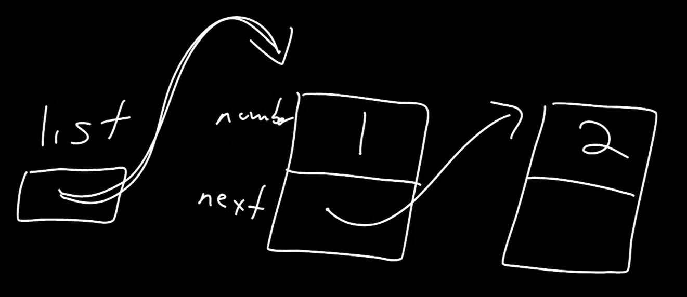

9. 3까지 다시 한번 지정

```c
#include <stdio.h>
#include <stdlib.h>

typedef struct node
{
    int number;
    struct node *next;
} node;

int main(void)
{
    node *list = NULL;
    
    node *n = malloc(sizeof(node));
    if (n == NULL)
    {
        return 1;
    }

    n->number = 1;
    n->next = NULL;

    list = n;
    
    n = malloc(sizeof(node));
    if (n == NULL)
    {
        return 1;
    }

    n->number = 2;
    n->next = NULL;    
    
    list->next = n;
    
    // 다시 한 번 n 포인터에 새로운 메모리를 할당하고 number과 next의 값을 저장합니다.
    n = malloc(sizeof(node));
    if (n == NULL)
    {
        return 1;
    }

    n->number = 3;
    n->next = NULL;
```

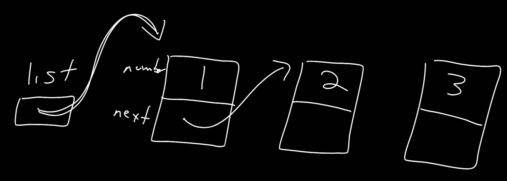

10. 다시 node를 연결

```c
#include <stdio.h>
#include <stdlib.h>

typedef struct node
{
    int number;
    struct node *next;
} node;

int main(void)
{
    node *list = NULL;
    
    node *n = malloc(sizeof(node));
    if (n == NULL)
    {
        return 1;
    }

    n->number = 1;
    n->next = NULL;

    list = n;
    
    n = malloc(sizeof(node));
    if (n == NULL)
    {
        return 1;
    }

    n->number = 2;
    n->next = NULL;    
    
    list->next = n;

    n = malloc(sizeof(node));
    if (n == NULL)
    {
        return 1;
    }

    n->number = 3;
    n->next = NULL;
    // 현재 list는 첫번째 node를 가리키고, 이는 두번째 node와 연결되어 있습니다.
    // 따라서 세 번째 node를 더 연결하기 위해 첫 번째 node (list)의
    // 다음 node(list->next)의 다음 node(list->next->next)를 n 포인터로 지정합니다.
    list->next->next = n;
```

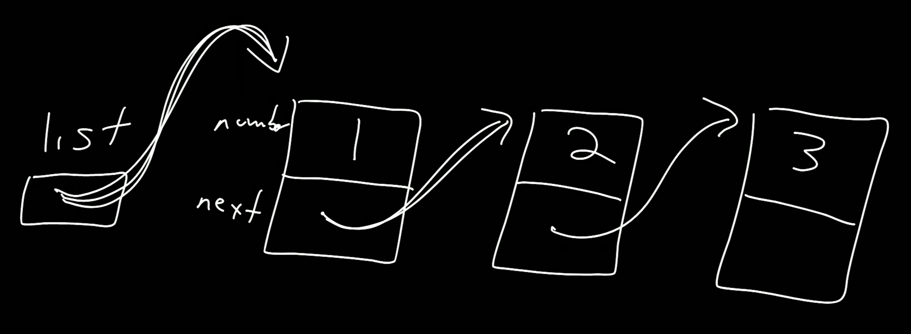

11. 반복문으로 출력 후 초기화

```c
#include <stdio.h>
#include <stdlib.h>

typedef struct node
{
    int number;
    struct node *next;
} node;

int main(void)
{
    node *list = NULL;
    
    node *n = malloc(sizeof(node));
    if (n == NULL)
    {
        return 1;
    }

    n->number = 1;
    n->next = NULL;

    list = n;
    
    n = malloc(sizeof(node));
    if (n == NULL)
    {
        return 1;
    }

    n->number = 2;
    n->next = NULL;    
    
    list->next = n;

    n = malloc(sizeof(node));
    if (n == NULL)
    {
        return 1;
    }

    n->number = 3;
    n->next = NULL;

    list->next->next = n;
    // 이제 list에 연결된 node를 처음부터 방문하면서 각 number 값을 출력합니다.
    // 마지막 node의 next에는 NULL이 저장되어 있을 것이기 때문에 이 것이 for 루프의 종료 조건이 됩니다.
    for (node *tmp = list; tmp != NULL; tmp = tmp->next)
    {
        printf("%i\n", tmp->number);
    }

    // 메모리를 해제해주기 위해 list에 연결된 node들을 처음부터 방문하면서 free 해줍니다.
    while (list != NULL)
    {
        node *tmp = list->next;
        free(list);
        list = tmp;
    }
}
```

## 트리

> 트리는 연결리스트를 기반으로 한 새로운 데이터 구조
>
> 가장 높은 층에서 트리가 시작되는 노드를 ‘**루트**’
>
> 루트 노드는 다음 층의 노드들을 가리키고 있고, 이를 ‘**자식 노드**’

### **이진 검색 트리**

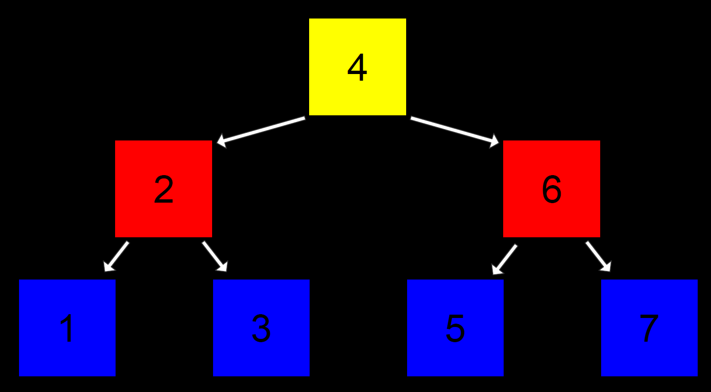

> 하나의 노드는 두 개의 자식 노드를 가진다.
>
> 왼쪽 자식 노드는 자신의 값 보다 작고, 오른쪽 자식 노드는 자신의 값보다 크다
>
> 재귀적 함수
>
>  **O(log n)**

```c
//이진 검색 트리의 노드 구조체
typedef struct node
{
    // 노드의 값
    int number;

    // 왼쪽 자식 노드
    struct node *left;
 
   // 오른쪽 자식 노드
    struct node *right;
} node;

// 이진 검색 함수 (*tree는 이진 검색 트리를 가리키는 포인터)
bool search(node *tree)
{
    // 트리가 비어있는 경우 ‘false’를 반환하고 함수 종료
    if (tree == NULL)
    {
        return false;
    }
    // 현재 노드의 값이 50보다 크면 왼쪽 노드 검색
    else if (50 < tree->number)
    {
        return search(tree->left);
    }
    // 현재 노드의 값이 50보다 작으면 오른쪽 노드 검색
    else if (50 > tree->number)
    {
        return search(tree->right);
    }
    // 위 모든 조건이 만족하지 않으면 노드의 값이 50이므로 ‘true’ 반환
    else {
        return true;
    }
}
```

## 해쉬 테이블

> **‘연결 리스트의 배열’**

* 각 값들은 **‘해시 함수’**라는 맞춤형 함수를 통해서 어떤 바구니에 담기는 지가 결정
* 각 바구니에 담기는 값들은 그 바구니에서 새롭게 정의되는 연결 리스트로 이어짐
* 이와 같이 연결 리스트가 담긴 바구니가 여러개 있는 것이 ‘연결 리스트의 배열’, 즉 ‘해시 테이블’이 된다

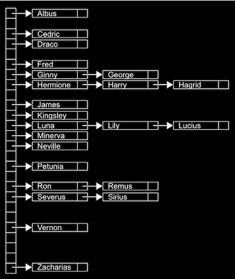

* 최악의 상황에는 단 하나의 바구니에 모든 값들이 담겨서 **O(n)**
* 일반적으로는 최대한 많은 바구니를 만드는 해시 함수를 사용하기 때문에 거의 O(1)에 가깝다고 볼 수 있음

## 트라이(tries)

> **‘트라이’**는 기본적으로 ‘트리’ 형태의 자료 구조
>
> **각 노드가 ‘배열’**로 이루어져 있음

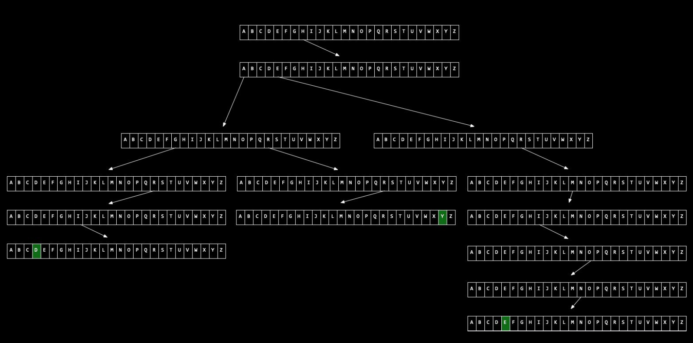

* 트라이에서 값을 검색하는데 걸리는 시간은 **‘문자열의 길이’**에 의해 한정
* 일반적인 영어 이름의 길이를 **n**이라고 했을 때, 검색 시간은 **O(n)**이 되지만, 대부분의 이름은 그리 크지 않은 **상수값**(예, 20자 이내)이기 때문에 **O(1)**이나 마찬가지라고 볼 수 있다.

## **큐**

> 값이 아래로 쌓이는 구조
>
> 값을 넣고 뺄 때 **‘선입 선출’** 또는 **‘FIFO’**라는 방식을 따르게 됩니다. 가장 먼저 들어온 값이 가장 먼저 나가는 것
>
> **배열**이나 **연결 리스트**를 통해 구현 가능

## **스택**

> 값이 위로 쌓이는 구조
>
> 값을 넣고 뺄 때 **‘후입 선출’** 또는 **‘LIFO’**라는 방식을 따르게 됩니다. 가장 나중에 들어온 값이 가장 먼저 나가는 것
>
> **배열**이나 **연결 리스트**를 통해 구현 가능

## 딕셔너리

> **‘키’**와 **‘값’**이라는 요소로 이루어져 있다.
>
> ‘키’에 해당하는 ‘값’을 저장하고 읽어오는 것이죠. 마치 대학교에서 ‘학번’에 따라서 ‘학생’이 결정되는 것과 동일
>
> 일반적인 의미에서 **‘해시 테이블’**과 동일한 개념
