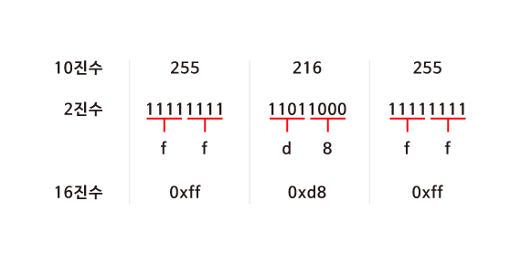
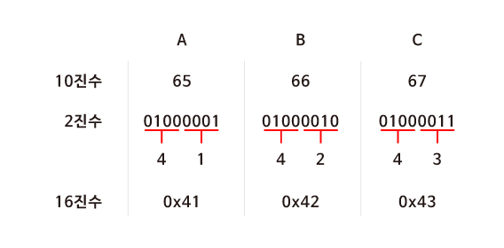

# 컴퓨터 과학

> 컴퓨터 과학은 문제 해결에 대한 학문

* 문제 해결은 **입력(input)**을 전달받아 **출력(output)**을 만들어 내는 과정

 

> 입력과 출력을 **표현**하기 위해선 우선 모두가 동의할 **약속(표준)**
>
> 컴퓨터 과학의 가장 첫 번째 개념은 어떻게 표현하는지에 대한 **표현 방법**

## 2진법

> 10진법 : **1x100 + 2x10 + 3x1 = 123**

> 2진법 : **2¹x1 + 1x1 = 3**

컴퓨터에는 굉장히 많은 스위치(트렌지스터, CPU에 포함)가 있고 **on/off 상태를 통해 0과 1을 표현**

### 비트

* 정보를 저장하고 연산을 수행하기 위해 컴퓨터는 **비트****(bit)**라는 측정 단위 사용
* **이진 숫자**라는 뜻을 가진 “binary digit”의 줄임말이며, **0****과** **1,** **두 가지 값만 가질 수 있는 측정 단위**

### 비트열

* **바이트****(byte)**는 **여덟 개의 비트가 모여 만들어진 것**
* 하나의 바이트에 여덟 개의 비트가 있고, 비트 하나는 0과 1로 표현될 수 있기 때문에 **2^8** **= 256** **개**의 서로 다른 바이트가 존재할 수 있다.
* 바이트가 모이면 더 큰 단위가 될 수 있다
  * 킬로바이트는 1,000 바이트
  * 메가바이트는 1,000 킬로바이트(100만 바이트)
  * 기가바이트는 1,000 메가바이트(10억 바이트)
  * 테라바이트는 1,000 기가바이트(1조 바이트)
  * 페타바이트와 엑사바이트 같은 더 큰 단위도 존재

## 문자의 표현

> 설명미국정보교환표준부호 **ASCII**(아스키코드/American Standard Code for Information Interchange)

*  **문자를 숫자로 표현** 할 수 있도록 정해진 **약속(표준)**
*  총 **128개의 부호**로 정의되어 있는데, 가령 알파벳 A는 10진수 기준으로 65, 알파벳 B는 66로 구성

* A를 2진법으로 표현하면?
  * 10진법 기준으로 65이므로,
  * **2^6x1** + **2^5x0** + **2^4x0** + **2^3x0** + **2^2x0** + **2x0** + **1x1 = (64+1)**
    * A를 2진법로 표현하면 **1000001**

>**Unicode**라는 표준에서는 더 많은 비트를 사용하여 더 다양한 다른 문자들도 표현가능 하도록 지원하고 있습니다. ASCII로는 문자들을 표현하기에 충분하지 않았기 때문

* **Unicode**는 😂(기쁨의 눈물) 이런 이모티콘 까지 표현할 수 있게 해주었습니다. 이 이모티콘은 10진법으로 128,514입니다. 2진법으로는 11111011000000010입니다.

### **그림, 영상, 음악의 표현**

### **픽셀**

* 우리가 스크린을 통해 보는 그림을 자세히 살펴 보면 수많은 작은 점들이 빨간색, 초록색, 파란색을 띄고 있습니다.
* 각각의 픽셀은 세 가지 색을 서로 다른 비율로 조합하여 특정한 색을 갖게 됩니다.
* 이 숫자들을 표현하는 방식을 **RGB(Red, Green, Blue)**
  * 노란색의 커다란 이미지는 72 73 33 으로 정의되는 무수히 많은 픽셀들의 RGB코드(숫자)로 표현할 수 있습니다.

> 퀴즈) CS50을 2진법으로 표현하면?
>
> C: 1000011
>
> S: 1010011
>
> 50: 110010

### **16진수**

> 컴퓨터과학에서는 숫자를 10진수나 2진수 대신 **16****진수****(Hexadecimal)**로 표현하는 경우가 많습니다.
>
> JPG 이미지 파일은 항상 255 216 255 로 시작되고 이것은 10진수입니다. 하지만 실제 컴퓨터 내에서는 10진수를 사용하지 않습니다. 컴퓨터는 0과 1만을 이해할 수 있기 때문입니다.

>**2^4**이 **16**이기 때문에 **4bits**씩 두 덩어리로 나누어 보면 0000 부터 1111까지는 16진수로 표현할 수 있다는 것을 알 수 있습니다.

### **16진수의 유용성**

> ASCII 코드에 의해 “A, B, C”는 10진수로 65, 66, 67에 해당합니다. 컴퓨터는 10진수를 이해할 수 없으므로 2진수로 표현해보면 "01000001 01000010 01000011＂이 됩니다.
>
> * 하지만 16진수로 표현하면 2진수로 표현했을 때 보다 훨씬 간단해집니다. 또한 컴퓨터는 8개의 비트가 모인 바이트 단위로 정보를 표현합니다. **2개의 16진수는 1byte의 2진수로 변환**되기 때문에 정보를 표현하기 매우 유용합니다.

