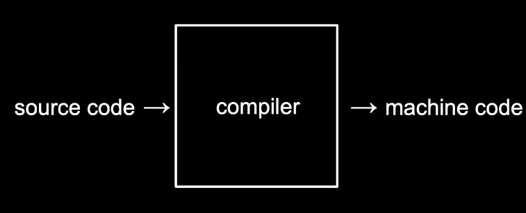

# C언어

## 기초

```c
#include <stdio.h>

int main(void)
{
    printf("hello, world\n");
}
```

### **int main(void)**

> 시작한다의 의미
>
> 앞으로 우리가 작성할 코드 모두는 이 **int main(void) { }**의 중괄호 사이에 작성하게 될 것 입니다.

### **printf(“hello, world\n”)**

> 프린트 기능, 항상 **세미콜론(;)**
>
> **\n** 줄바꿈 기호

터미널창의 명령어 프롬프트에서 “$” 기호 옆에우리가 원하는 명령어를 입력하면 됩니다.

clang hello.c 라는 명령어는 “clang” 이라는 컴파일러로 “hello.c”라는 코드를 컴파일하라는 의미입니다. 


### **컴파일러**

> 우리가 직접 작성한 코드는 **“소스 코드”** 라고 불립니다. 이를 2진수로 작성된 “머신 코드”로 변환해야 컴퓨터가 이해할 수 있습니다. 이런 작업을 컴파일러라는 프로그램이 수행해줍니다.



그 결과 **a.out** 이라는 파일이 생성됩니다.

**./a. out** 이라는 명령어를 실행하면 컴퓨터가 현재 디렉토리에 있는 a.out이라는 프로그램을 실행하게 해줍니다.
(**./a. out에서 제일 앞에 있는 **. 은 지금 있는 현재 폴더를 나타냅니다.)


## 문자열

> String은 단어나 구절, 문장을 부르는 말, 
>
> string은 **형식지정자**

* **데이터의 종류를 아주 정확하게 명시해줘야 합니다**.
* **get_string 함수가 사용자의 이름을 반환하면 그 이름을 anwser이라는 변수에 저장**하는 것입니다.

```c
#include <stdio.h>

int main(void)
{
    string answer = get_string("what's your name?\n");
    printf("hello, %s\n", answer);
}
```

```bash
$ clang -o string string.c -lcs50
# 여기서 -o string 은 string.c 를 string.out 이라는 머신코드로 저장하도록 하는 명령어
# -lcs50은 “link”라는 의미를 지닌 -l 이라는 인자에 우리가 추가로 포함한 “cs50” 파일을 합친 것

# 아래 make 명령어를 통해 간단하게 컴파일을 수행할 수도 있습니다.
$make string

```

