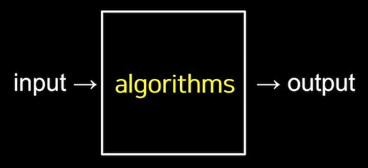
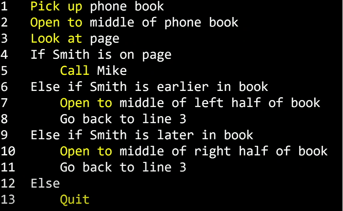
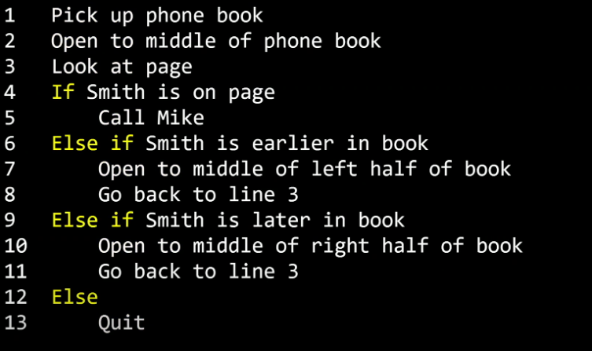
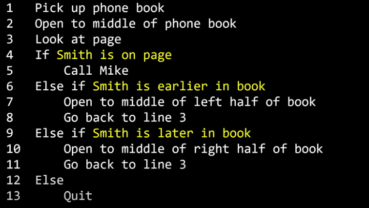
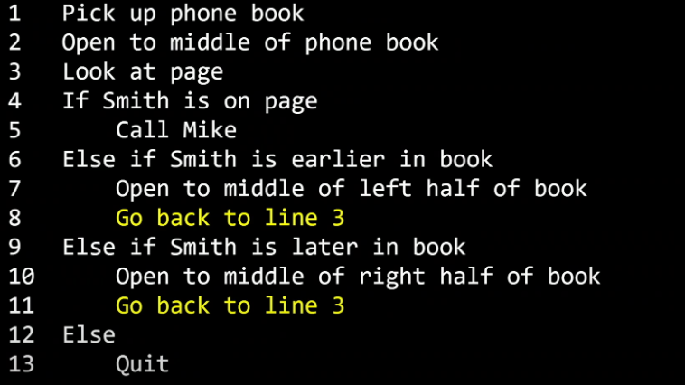

## 알고리즘

> **알고리즘**은 입력(input)에서 받은 자료를 출력(output)형태로 만드는 **처리 과정**을 뜻합니다.



* **알고리즘이란 입력값을 출력값의 형태로 바꾸기 위해 어떤 명령들이 수행되어야 하는지에 대한 규칙들의 순서적 나열**
* 같은 출력값이라도 알고리즘에 따라 출력을 하기까지의 시간이 다를 수 있습니다.
  * 일련의 순서적 규칙들을 어떻게 나열하는지에 따라 알고리즘의 종류가 달라집니다.

> 알고리즘의 평가할 때는 **정확성**도 중요하지만, **효율성**도 중요합니다.

```c
pick up phone book
open to middle of phone book
look at page
if smith is on page
    call mike
else if smith is earlier in book
    open to middle of left half of book
    go back to line 3
else if smuith is later in book
    open to middle of right half of book
    go back to line 3
else
    Quit
```

> 1. 전화번호부를 집어 든다
> 2. 전화번호부의 중간을 편다
> 3. 페이지를 본다
> 4. 만약 Mike Smith가 페이지에 있으면
> 5.   Mike Smith에게 전화한다.
> 6. 그렇지 않고 만약 Mike Smith가 앞 페이지에 있으면
> 7.   앞 페이지의 절반을 편다
> 8.   3번째 줄부터 다시 실행한다
> 9. 그렇지 않고 만약 Mike Smith가 뒷 페이지에 있으면
> 10.   뒷 페이지의 절반을 편다
> 11.   3번째 줄부터 다시 실행한다
> 12. 그러지 않으면
> 13.   그만둔다



> 노란색으로 강조된 부분들은 앞으로 **함수**(functions)로 불립니다.
> 함수는 컴퓨터에게 이 경우에는 사람에게 무엇을 할지 알려주는 동사와 같습니다.



>다음으로 노란색으로 강조된 부분들은 **조건**이라고 부를 것입니다.
>이 것은 여러 선택지 중 하나를 고르는 것입니다.



>앞서 말한 결정을 내리기 위한 질문이 필요합니다. 이것을 **불리언**(Boolean)이라고 합니다.
>답이 Yes(예) 또는 No(아니오) 혹은 True(참) 또는 False(거짓)으로 나오는 아니면 2진법에서 0또는 1로 나오는 질문을 뜻합니다.



>마지막으로 노란색으로 강조된 부분은 **루프**(loop)라고 합니다.
>이 것은 뭔가를 계속해서 반복하는 순환입니다.

#### 퀴즈

> 친구와 1부터 100까지 숫자 중 1가지 숫자를 맞추는 스무고개 게임을 하려고 합니다. 이 때 사용할 알고리즘을 의사코드로 표현하면 어떻게 될까요?

1. 숫자를 반으로 나눈다. => N / 2
2. 정답이면 반복문 탈출
3. 정답이 아니면 Up/Down 중 가까운 쪽으로 나눈 값을 또 반으로 나눈다.
4. 이것을 반복한다.

