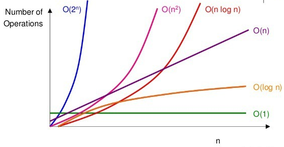
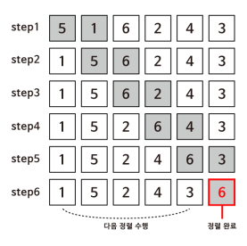
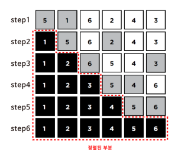

# 알고리즘

## 알고리즘 표기법

###  **Big O 표기법**

>O는 **“on the order of”**의 약자로, 쉽게 생각하면 **“~만큼의 정도로 커지는”** 것

O(n) 은 n만큼 커지는 것이므로 n이 늘어날수록 선형적으로 증가하게 됩니다. O(n/2)도 결국 n이 매우 커지면 1/2은 큰 의미가 없어지므로 O(n)

- O(n^2) - 버블 정렬, 선택 정렬
- O(n log n)
- O(n) - 선형 검색
- O(log n) - 이진 검색
- O(1)



### **Big** **Ω**

> 알고리즘 **실행 시간의 하한**을 나타내는 것

선형 검색에서는 n개의 항목이 있을때 최대 n번의 검색을 해야 하므로 상한이 O(n)이 되지만 운이 좋다면 한 번만에 검색을 끝낼수도 있으므로 하한은 Ω(1)

- Ω(n^2) - 선택 정렬
- Ω(n log n)
- Ω(n) - 버블 정렬
- Ω(log n)
- Ω(1) - 선형 검색, 이진 검색


## **선형 검색**

> **원하는** **원소가 발견될 때까지** **처음부터 마지막 자료까지 차례대로** **검색**

### **효율성 그리고 비효율성**

> **선형 검색 알고리즘**은 **정확하지만 아주 효율적이지 못한 방법**
>
> **자료가 정렬되어 있지 않거나 그 어떤 정보도 없어 하나씩 찾아야 하는 경우에 유용**

```c
// 의사코드
For i from 0 to n–1

    If i'th element is 50

        Return true

Return false
```

```c
#include <cs50.h>
#include <stdio.h>
#include <string.h>

// 구조체 정의
typedef struct
{
    string name;
    string number;
}
person;

int main(void)
{
    person people[4];

    people[0].name = "EMMA";
    people[0].number = "617–555–0100";
    people[1].name = "RODRIGO";
    people[1].number = "617–555–0101";
    people[2].name = "BRIAN";
    people[2].number = "617–555–0102";
    people[3].name = "DAVID";
    people[3].number = "617–555–0103";

    // EMMA 검색
    for (int i = 0; i < 4; i++)
    {
        if (strcmp(people[i].name, "EMMA") == 0)
        {
            printf("Found %s\n", people[i].number);
            return 0;
        }
    }
    printf("Not found\n");
    return 1;
}
```


## **버블 정렬**

> **두 개의 인접한 자료 값을 비교하면서 위치를 교환하는 방식으로 정렬**

* 정렬되지 않은 리스트를 탐색하는 것 보다 정렬한 뒤 탐색하는 것이 더 효율적
* 간단하지만 단 하나의 요소를 정렬하기 위해 너무 많이 교환하는 낭비가 발생할 수도 있습니다.
* 값을 오른쪽으로 옮김

**3 6 5 2 7 4 1 8** 이 값을 정렬 시켜 보면

1. **3 6** 5 2 7 4 1 8
2. 3 **6 5** 2 7 4 1 8 (교환)
3. 3 5 **6 2** 7 4 1 8 (교환)
4. 3 5 2 **6 7** 4 1 8 
5. 3 5 2 6 **7 4** 1 8 (교환)
6. 3 5 2 6 4 **7 1** 8 (교환)
7. 3 5 2 6 4 1 **7 8**
   * 이 과정을 끝까지 반복하면 최종적으로 아래와 같이 오름차순 정렬이 될 것
   * 1 2 4 3 5 6 7 8
   * 거품이(비교 및 교환이) 터지면서 위로 올라오는 (배열의 옆으로 이동하는) 방식이기 때문입니다.



```c
// 의사 코드
Repeat n–1 times

    For i from 0 to n–2

        If i'th and i+1'th elements out of order

            Swap them
    
// 안쪽 루프에서 만약 교환이 하나도 일어나지 않는다면 이미 정렬이 잘 되어 있는 상황일 것
// 따라서 바깥쪽 루프를 ‘교환이 일어나지 않을때’까지만 수행하도록 다음과 같이 수정
Repeat until no swaps

    For i from 0 to n–2

        If i'th and i+1'th elements out of order

            Swap them
```

* 중첩 루프를 돌아야 하고, n개의 값이 주어졌을 때 각 루프는 각각 n-1번, n-2번 반복
* (*n*−1)∗(*n*−2)=*n*2−3*n*+2 번의 비교 및 교환이 필요
* 가장 크기가 큰 요소는 n^2 이므로 위와 같은 코드로 작성한 버블 정렬 실행 시간의 상한은 **O(n^2)**입니다. 하한도 마찬가지로 **Ω****(n^2)** 입니다.

## **선택 정렬**

> 배열 안의 자료 중 가장 작은 수(혹은 가장 큰 수)를 찾아 첫 번째 위치(혹은 가장 마지막 위치)의 수와 교환해주는 방식의 정렬
>
> **선택** **정렬**은 **교환 횟수를** **최소화**하는 반면 각 자료를 비교하는 횟수는 증가

* 값을 왼쪽으로 옮김



```c
// 의사 코드
For i from 0 to n–1

    Find smallest item between i'th item and last item

    Swap smallest item with i'th item
```

* **두 번의 루프**를 돌아야 합니다.
* 바깥 루프에서는 숫자들을 처음부터 순서대로 방문하고, 안쪽 루프에서는 가장 작은 값을 찾아야 합니다.
* 따라서 소요 시간의 상한은 **O(n^2)**이 됩니다. 하한도 마찬가지로 **Ω****(n^2)** 입니다. 버블 정렬과 동일합니다. 

## **이진 검색**

> 만약 배열이 정렬되어 있다면, 배열 중간 인덱스부터 시작하여 찾고자 하는 값과 비교하며 그보다 작은(작은 값이 저장되어 있는) 인덱스 또는 큰 (큰 값이 저장되어 있는) 인덱스로 이동을 반복하면 됩니다.

```c
// 의사 코드
If no items

    Return false

If middle item is 50

    Return true

Else if 50 < middle item

    Search left half

Else if 50 > middle item

    Search right half
```

## 