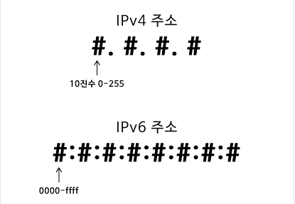
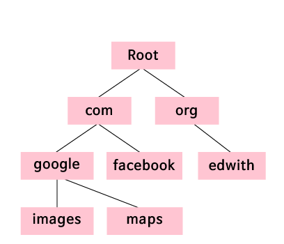
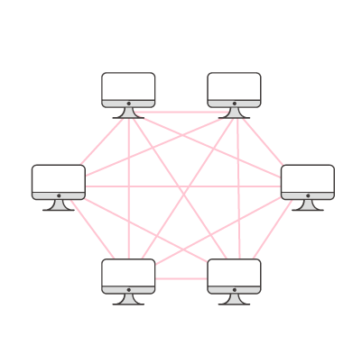
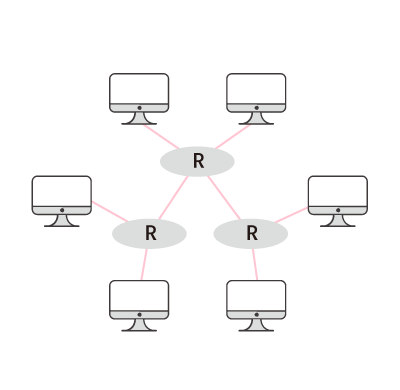
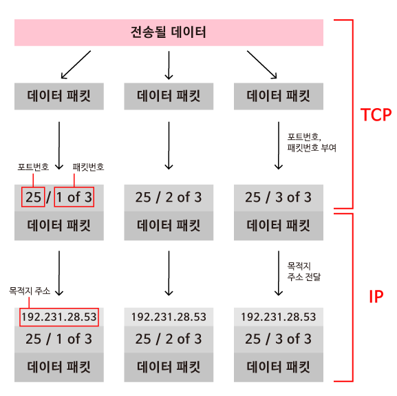
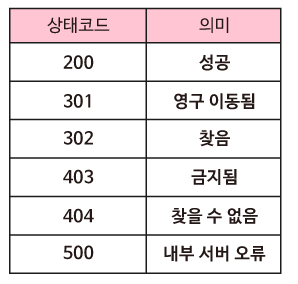

# 인터넷과 네트워크

## 인터넷 기초

### 인터넷

>**여러 통신망을 하나로 연결한다는 의미의 '인터 네트워크(inter-network)'라는 말에서 시작되었으며, 이제는 전 세계 컴퓨터들을 하나로 연결하는 거대한 컴퓨터 통신망**

* 인터넷이 동작할 수 있도록 많은 다양한 시스템들과 프로토콜(Protocol, 통신 규칙)들이 갖추어져 있습니다.

### **IP 주소**

> **인터넷 프로토콜**은 **인터넷의 정보들이 어떻게 전송되는지를 정의하기 위한 규칙**
>
> 프로토콜이란, 규칙들의 집합

* **IP 주소**는 인터넷 상의 장치들을 식별할 수 있게끔 해줍니다.
* **IP(인터넷 프로토콜)**은 여러 버전을 거쳐왔습니다. 가장 최근 버전은 **IPv6**로, 기존의 **IPv4** 프로토콜을 대체

### **IPv4 주소와 IPv6 주소**

#### **IPv4** 

> **마침표로 구분된 4개의 10진수로 표현**
>
>  **0부터 255까지의 10진수**입니다(**8bit공간**).

*  각 IPv4 주소는 32bit이며, 최대 2^32개의 주소가 존재할 수 있습니다. 이는 약 43억 개의 주소입니다.

#### **IPv6**

> **콜론으로 구분된 8개의 숫자로 구성**
>
> **16bit 숫자**를 **0000부터 fffff까지의 16진수로 표현**

* IPv6 주소는 16진수 앞에 오는 0들을 생략하고 **0이 연속으로 오게 되면 그것들을 생략하면서** ‘**::**’을 사용
  *  IP 주소 28aa:0000:0000:0000:0000:0000:0018:a5b2는 앞의 0들을 생략하고 연속으로 오는 0들을 ::으로 대체하여 28aa::18:a5b2로 축약
* **축약할 때 각 주소마다 ::은 하나만 있어야 합니다**.



### **로컬호스트(localhost)**

> IP 주소 **127.0.0.1**은 다른 장치에 연결하는 것이 아니라, **사용자가 현재 사용하고 있는 장치에 연결하는 주소**

### **사설  IP 주소**

> **사설 IP 주소**라고 알려진 어떤 주소들은 특정 로컬 네트워크 내에서 사용되도록 따로 떼어놓습니다.

* 로컬 네트워크에 있는 컴퓨터들은 사설 IP 주소를 이용하여 다른 컴퓨터와 통신할 수 있지만, 이 네트워크 밖에 있는 컴퓨터들이 접근할 수는 없습니다.
* 보통, 사설 IP 주소를 갖는 장치들은 **공인 IP 주소를 공유**
* 10.#.#.#, 172.16.#.# - 172.31.#.#, 192.168.#.# 의 형태를 같은 주소들은 사설 IP 주소로 쓰기 위해 따로 떼어놓은 것

### 인터넷에 연결하기

* 무선 장치(노트북이나 휴대폰)를 인터넷에 연결하기 위해서는, 먼저 **액세스 포인트(AP)**에 무선으로 연결해야 합니다.
  * [컴퓨터 네트워크](https://ko.wikipedia.org/wiki/컴퓨터_네트워크)에서 [와이파이](https://ko.wikipedia.org/wiki/와이파이)를 이용한 관련 표준을 이용하여 무선 장치들을 유선 장치에 연결할 수 있게 하는 장치 (무선 공유기)
* 액세스 포인트는 스위치에 연결되고, 스위치는 라우터에 연결되고, 라우터는 인터넷의 나머지 부분과 연결

#### **DHCP**(동적 호스트 구성 **프로토콜, Dynamic Host Configuration Protocol)**

> **컴퓨터에** **IP** **주소를 할당**

* 한 때, 네트워크 관리자가 각 컴퓨터에게 수작업으로 IP 주소를 할당해줘야 했습니다. 하지만 지금은 DHCP가 이 과정을 자동으로 해줍니다.

#### **URL(도메인 주소, Uniform Resource Locator)**

>  IP주소를 기억하는 대신 웹 페이지에 접속하기 위해 텍스트로 된 주소(예를 들어 google.com)를 웹 브라우저에 입력

* 방문하고자 하는 모든 웹사이트의 IP 주소를 인터넷을 사용하는 모든 사람들이 기억하기는 어려움

#### **DNS** (도메인 이름 시스템)

> URL을 받아서 IP주소로 변환해주는 일

* 사용자가 웹 브라우저에 URL을 치면, DNS 서버는 먼저 URL을 보고 어느 IP 주소를 나타내는 것인지 알아냄




### 라우터

> 라우터는 인터넷의 구성 요소로, **데이터를 다양한 네트워크로 보내줍니다**.

* 라우터는 보낸 데이터가 올바른 목적지에 잘 도착할 수 있도록 보장하기 위해서 특정 명령어 집합을 따릅니다.
* 인터넷에서 데이터를 쉽게 전송하도록 돕기 위해서 **라우터**가 사용

### **라우팅 모델**

> 네트워크상에 있는 모든 컴퓨터는 인터넷에 연결된 다른 모든 컴퓨터와 물리적으로 연결되어 있습니다.



* 한 컴퓨터에서 다른 컴퓨터로 정보를 보낼 때, 정보를 곧장 목적지로 보내기 때문에, 이 모델을 이용하면 전송 속도가 빠릅니다. 그러나 이러한 모델은 비현실적으로 많은 물리적 연결이 필요할 것입니다.
* 안터넷에 연결된 장치가 수백만, 수십억 개라면 서로 다른 모든 컴퓨터들을 연결한다는 것은 불가능에 가깝습니다.
* 대신에, 인터넷은 **라우터**를 씁니다. 라우터는 인터넷상의 장치들 사이에서 중재자 역할을 합니다.



* 이러한 방법으로 인터넷상의 모든 컴퓨터들은 다른 모든 컴퓨터들과 통신할 수 있습니다.
* 전송되는 데이터들은 '**패킷**'이라는 단위로 라우터를 통해 인터넷을 거쳐 보내집니다.
* 각 라우터는 목적지 컴퓨터와 연결되어 있는 라우터 중에 목적지에 가까운 라우터로 패킷을 보냅니다.

### **라우팅 테이블**

>**IP 주소의 앞 숫자들을 보고, 패킷을 어느 방향으로 보내야 할지를 판단**

라우터는 **각 데이터 패킷이 목적지 IP 주소에 따라 어디로 보내져야 하는지**를 알 수 있도록 만들어져 있습니다.


### **TCP와 IP**

>프로토콜에는 **TCP**로 알려진 **전송 제어 프로토콜(Transmission Control Protocol)**과 **IP**로 알려진 **인터넷 프로토콜(Internet Protocol)**입니다.

* 프로토콜 없이는 수신 장치가 정보를 받게끔 보장하거나 받은 정보로 무엇을 해야 할 지 보장해줄 수 없습니다. 

### **전송 제어 프로토콜**

> 한 컴퓨터가 다른 컴퓨터로 데이터를 보낼 때 커다란 하나의 패킷을 작은 패킷들로 나누어 **데이터를 순서 있는 패킷들로 분해**하는 일

* 패킷들이 같은 시간에, 같은 순서로 목적지에 도착한다는 보장이 없기 때문에 **TCP는 각 패킷에 대해 순서에 맞게 번호를 매깁니다**.
* 이러한 방법으로 수신 컴퓨터는 받은 **패킷들을 올바른 순서로 재조립**할 수 있게 됩니다.
*  **TCP는 데이터에 포트 번호를 할당**합니다. 이 **데이터가 어떤 유형의 인터넷 서비스에 사용되는지**를 나타내기 위해서 입니다.
  *  SMTP(이메일)는 25번 포트를 사용하지만 HTTP(일반 웹 검색)는 80번 포트를 사용합니다.

### **인터넷 프로토콜**

>**정보가 한 컴퓨터에서 다른 컴퓨터로 어떻게 전송되는지에 대한 규칙들을 모아놓은 것**

## 정리

1. 인터넷을 통해 데이터를 받기 위해서 우선 데이터가 더 작은 패킷들로 분해되어야 하고, 
2. TCP는 각 패킷에 포트 번호와 패킷 번호를 매깁니다. 
3. **IP가 패킷의 목적지를 알려주면 라우터들을 통해 데이터가 전송됩니다**. 
4. 라우터들은 패킷을 목적지로 보내줄 것입니다.



## **HTTP**(Hypertext Transfer Protocol)

> **웹 브라우저가 웹 서버와 대화하기 위한 프로토콜**

* 사용자가 웹 페이지를 방문하려 할 때, 그들의 웹 브라우저(클라이언트)는 웹 서버에 웹 페이지의 내용을 요청해야 합니다.
* 웹 서버는 그 요청에 응답하기 위해 요청을 해석하고, 요청된 페이지를 클라이언트에게 돌려보냅니다.
* HTTP는 이 과정을 용이하게 해주며, 요청을 보내고 받는 표준적인 방법을 정해줍니다.

### **GET과 POST 요청**

>사용자가 웹 브라우저에 URL을 입력해 웹 페이지를 요청하면, 웹 브라우저는 **GET** 요청이라는 특정한 유형의 HTTP 요청을
>보냅니다.

* GET 요청은 단어 GET으로 시작되고 GET 뒤에는 요청 **URI**를 써주는데, 이것은 사용자가 요청한 웹 페이지의 경로를 나타냅니다. 

```bash
GET / HTTP / 1.1
Host: www.google.com
```

* 1행의 GET 요청은 요청이 사용하고 있는 HTTP 프로토콜의 버전과 함께 끝납니다.
  *  HTTP 프로토콜 버전은 일반적으로 1.1입니다.
* 2행은 호스트를 명시합니다. 
  * 호스트는 사용자가 웹 페이지를 요청할 때의 도메인 이름입니다.

> 웹 브라우저는 **POST** 요청이라는 다른 유형의 HTTP 요청을 보낼 수 있습니다.

* POST요청은 **사용자가 온라인 폼에 데이터를**
  **입력하고 웹 서버로 데이터를 전송할 때 사용**됩니다.

### **상태코드**

> 서버는 클라이언트에게 요청의 결과를 나타내는 **상태 코드**를 함께 보내주면서 응답합니다.

```bash
HTTP / 1.1 200 OK
Content-Type: text/html
```

