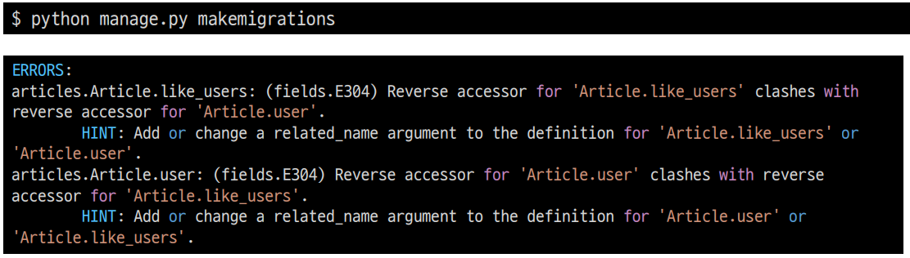
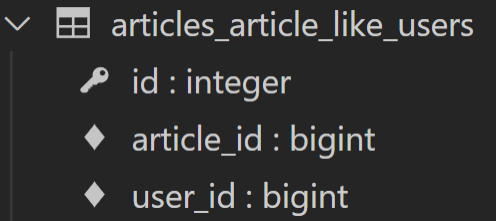
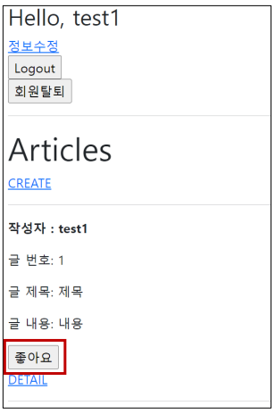
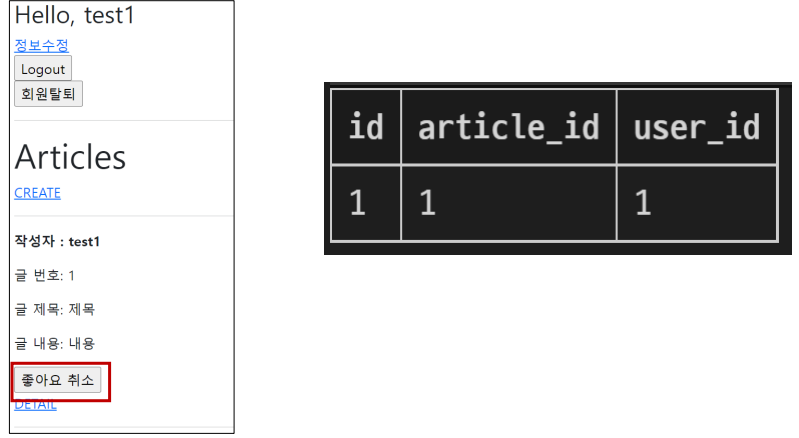

## Many to many relationship

* M:N 관계로 맺어진 두 테이블에는 변화가 없음
* Django의 ManyToManyField은 중개 테이블을 자동으로 생성함 
* Django의 ManyToManyField는 M:N 관계를 가진 모델 어디에 위치해도 상관 없음 
  * 대신 필드 작성 위치에 따라 참조와 역참조 방향을 주의할 것

### ManyToManyField

* ManyToManyField(to, **options) 
* 다대다 (M:N, many-to-many) 관계 설정 시 사용하는 모델 필드 
* 하나의 필수 위치인자(M:N 관계로 설정할 모델 클래스)가 필요 
* 모델 필드의 RelatedManager를 사용하여 관련 개체를 추가, 제거 또는 만들 수 있음 
  * add(), remove(), create(), clear() …

### 데이터베이스에서의 표현

* Django는 다대다 관계를 나타내는 중개 테이블을 만듦
* 테이블 이름은 ManyToManyField 이름과 이를 포함하는 모델의 테이블 이름을 조합하여 생성됨 
* ‘db_table’ arguments을 사용하여 중개 테이블의 이름을 변경할 수도 있음

### ManyToManyField’s Arguments

*  related_name 
   *  target model이 source model을 참조할 때 사용할 manager name 

   *  ForeignKey의 related_name과 동일

*  through 
   *  중개 테이블을 직접 작성하는 경우, through 옵션을 사용하여 중개 테이블을 나타내는 Django 모델을 지정 
   *  일반적으로 중개 테이블에 추가 데이터를 사용하는 다대다 관계와 연결하려는 경우(extra data with a many-to-many relationship)에 사용됨

*  symmetrical 
   *  기본 값 : True 
   *  ManyToManyField가 동일한 모델(on self)을 가리키는 정의에서만 사용
      *  True일 경우 
         *  _set 매니저를 추가 하지 않음 
         *  source 모델의 인스턴스가 target 모델의 인스턴스를 참조하면 자동으로 target 모델 인스턴스도 source 모델 인스턴스를 자동으로 참조하도록 함(대칭) 
         *  즉, 내가 당신의 친구라면 당신도 내 친구가 됨 

      *  대칭을 원하지 않는 경우 False로 설정 
      *  Follow 기능 구현에서 다시 확인할 예정


```python
# 예시
class Person(models.Model):
	friends = models.ManyToManyField('self')
	# friends = models.ManyToManyField('self', symmetrical=False)
```

### Related Manager

* N:1 혹은 M:N 관계에서 사용 가능한 문맥(context) 
* Django는 모델 간 N:1 혹은 M:N 관계가 설정되면 역참조시에 사용할 수 있는 manager를 생성 
  * 우리가 이전에 모델 생성 시 objects 라는 매니저를 통해 queryset api를 사용했던 것처럼 related manager를 통 해 queryset api를 사용할 수 있게 됨 
* 같은 이름의 메서드여도 각 관계(N:1, M:N)에 따라 다르게 사용 및 동작됨 
  * N:1에서는 target 모델 객체만 사용 가능 
  * M:N 관계에서는 관련된 두 객체에서 모두 사용 가능 
* 메서드 종류 
  * add(), remove(), create(), clear(), set() 등

### methods

* add() 
  * “지정된 객체를 관련 객체 집합에 추가” 
  * 이미 존재하는 관계에 사용하면 관계가 복제되지 않음 
  * 모델 인스턴스, 필드 값(PK)을 인자로 허용 
* remove() 
  * "관련 객체 집합에서 지정된 모델 개체를 제거" 
  * 내부적으로 QuerySet.delete()를 사용하여 관계가 삭제됨 
  * 모델 인스턴스, 필드 값(PK)을 인자로 허용

### 중개 테이블 필드 생성 규칙

* 소스(source model) 및 대상(target model) 모델이 다른 경우 
  * id 
  * <containing_model'>_id 
  * <other_model'>_id 
* ManyToManyField가 동일한 모델을 가리키는 경우 
  * id 
  * from__<model'>_id
  * to_<model'> _id

## M:N (Article-User)

### LIKE

#### 모델 관계 설정

1. ManyToManyField 작성

```python
# articles/models.py
class Article(models.Model):
    user = models.ForeignKey(settings.AUTH_USER_MODEL, on_delete=models.CASCADE)
    like_users = models.ManyToManyField(settings.AUTH_USER_MODEL)
    title = models.CharField(max_length=10)
    content = models.TextField()
    created_at = models.DateTimeField(auto_now_add=True)
    updated_at = models.DateTimeField(auto_now=True)
```

2. Migration 진행 후 에러 확인



3. like_users 필드 생성 시 자동으로 역참조에는 .article_set 매니저가 생성됨 
   * 그러나 이전 N:1(Article-User) 관계에서 이미 해당 매니저를 사용 중 
   * user.article_set.all() → 해당 유저가 작성한 모든 게시글 조회 
   * user가 작성한 글들(user.article_set)과 user가 좋아요를 누른 글(user.article_set)을 구분할 수 없게 됨 
   * user와 관계된 ForeignKey 혹은 ManyToManyField 중 하나에 related_name을 작성해야 함

4. ManyToManyField에 related_name 작성 후 Migration

```python
# articles/models.py
class Article(models.Model):
    user = models.ForeignKey(settings.AUTH_USER_MODEL, on_delete=models.CASCADE)
    like_users = models.ManyToManyField(settings.AUTH_USER_MODEL, related_name='like_articles')
    title = models.CharField(max_length=10)
    content = models.TextField()
    created_at = models.DateTimeField(auto_now_add=True)
    updated_at = models.DateTimeField(auto_now=True)	
```

```bash
$ python manage.py makemigrations
$ python manage.py migrate
```

5. 생성된 중개 테이블 확인



#### 정리

* article.user 
  * 게시글을 작성한 유저 - N:1 
* user.article_set 
  * 유저가 작성한 게시글(역참조) - N:1 
* article.like_users 
  * 게시글을 좋아요한 유저 - M:N 
* user.like_articles 
  * 유저가 좋아요한 게시글(역참조) - M:N

### 구현

1. url 및 view함수 작성

```python
# articles/urls.py
urlpatterns = [
    ...
    path('<int:article_pk>/likes/', views.likes, name='likes'),
]

# articles/views.py
def likes(request, article_pk):
    article = Article.objects.get(pk=article_pk)
    if article.like_users.filter(pk=request.user.pk).exists():
    # if request.user in article.like_users.all():
    	article.like_users.remove(request.user)
    else:
    	article.like_users.add(request.user)
    return redirect('articles:index')

# .exists()
# QuerySet에 결과가 포함되어 있으면 True를 반환하고 그렇지 않으면 False를 반환
# 특히 큰 QuerySet에 있는 특정 개체의 존재와 관련된 검색에 유용
```

2. index 템플릿에서 각 게시글에 좋아요 버튼 출력하기

```django
<!-- articles/index.html -->


…
    
    …
        <div>
            <form action="" method="POST">
                
                
                	<input type="submit" value="좋아요 취소">
                
                	<input type="submit" value="좋아요">
                
            </form>
        </div>
        <a href="">DETAIL</a>
        <hr>
    

```

3. 좋아요 버튼 출력 확인



4. 좋아요 버튼 클릭 후 좋아요 테이블 확인

