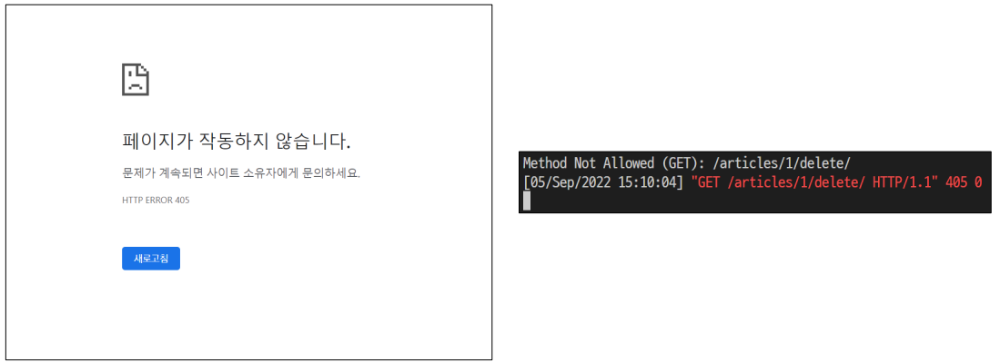

## View decorators & functions

### 데코레이터 (Decorator)

* 기존 함수를 수정하지 않고 기능을 추가해주는 wrapper 함수 
* Django는 HTTP 처리를 위해 view 함수에 적용 할 수 있는 데코레이터를 제공

```python
def hello(func):
    def wrapper():
        print('HIHI')
        func()
        print('HIHI')
    return wrapper

@hello
def bye():
    print('byebye')
    
bye()

# 출력
# HIHI
# byebye
# HIHI
```

* django.views.decorators.http의 데코레이터를 사용하여 요청 메서드를 기반으로 접근을 제한할 수 있음 
* 일치하지 않는 메서드 요청이라면 405 Method Not Allowed를 반환 
* 메서드 목록 
  1. require_http_methods() 
  2. require_POST() 
  3. require_safe()

### require_http_methods()

> View 함수가 특정한 요청 method만 허용하도록 하는 데코레이터

```python
# views.py
from django.views.decorators.http import require_http_methods

@require_http_methods(['GET', 'POST'])
def create(request):
	pass

@require_http_methods(['GET', 'POST'])
def update(request, pk):
	pass
```

### require_POST()

> View 함수가 POST 요청 method만 허용하도록 하는 데코레이터

```python
# views.py
from django.views.decorators.http import require_http_methods, require_POST

@require_POST
def delete(request, pk):
	article = Article.objects.get(pk=pk)
	article.delete()
	return redirect('articles:index')
```

* url로 delete 시도 후 서버 로그에서 405 http status code 확인 해보기

```bash
Method Not Allowed (GET): /articles/3/delete/
[04/Jan/2022 04:52:10] "GET /articles/3/delete/ HTTP/1.1" 405 0
```

### require_safe()

>require_GET이 있지만 Django에서는 require_safe를 사용하는 것을 권장

```python
# views.py
from django.views.decorators.http import require_http_methods, require_POST, require_safe

@require_safe
def index(request):
	...

@require_safe
def detail(request, pk):
	...
```


###  @login_require와 require_POST

* 상황 
  * 비로그인 상태로 detail 페이지에서 게시글 삭제 시도 
  * delete view 함수의 @login_required로 인해 로그인 페이지로 리다이렉트 
    * http://127.0.0.1:8000/accounts/login/?next=/articles/1/delete/ 
  * redirect로 이동한 로그인 페이지에서 로그인 진행 
    * redirect는 반드시 GET요청으로만 가능 
  * delete view 함수의 @require_POST로 인해 405 상태 코드를 받게 됨 
    * 405(Method Not Allowed) status code 확인
  * **@login_required는 GET 요청을 처리하는 View 함수 에서만 사용해야 함**
  * 로그인 성공 이후 GET method로 next 파라미터 주소에 리다이렉트



* POST method만 허용하는 delete 같은 함수는 내부에서는 is_authenticated 속성 값을 사용해서 처리

```python
# articles/views.py

@require_POST
def delete(request, pk):
    if request.user.is_authenticated:
        article = Article.objects.get(pk=pk)
        article.delete()
    return redirect('articles:index')
```

### Django Shortcut functions

* 아래의 함수를 활용하면, 해당하는 객체가 존재하지 없는 경우 404 상태코드를 반환 
  * get_object_or_404(klass, **args, **kwargs)
  * Calls get() on a given model manager, but it raises Http404 instead of the model’s DoesNotExist exception. 
* get_list_or_404(klass, *args, **kwargs)¶ 
  * Returns the result of filter() on a given model manager cast to a list, raising Http404 if the resulting list is empty