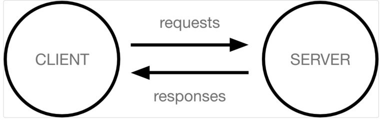
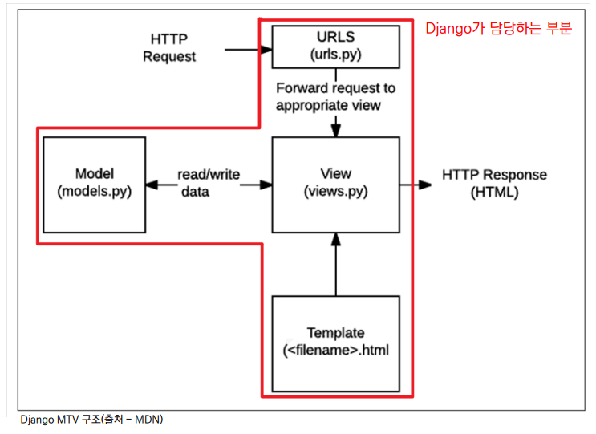

# 클라이언트와 서버

* 오늘날 우리가 사용하는 대부분의 웹 서비스는 클라이언트-서버 구조를 기반으로 동작 
* 클라이언트와 서버 역시 하나의 컴퓨터이며 이들이 어떻게 상호작용 하는지에 대한 간소화된 다이어그램은 다음과 같음

*  클라이언트 
  * 웹 사용자의 인터넷에 연결된 장치 (예를 들어 wi-fi에 연결된 컴퓨터 또는 모바일) 
  * Chrome 또는 Firefox와 같은 웹 브라우저 
  * 서비스를 요청하는 주체 
* 서버 
  * 웹 페이지, 사이트 또는 앱을 저장하는 컴퓨터 
  * 클라이언트가 웹 페이지에 접근하려고 할 때 서버에서 클라이언트 컴퓨터로 웹 페이지 데이터를 응답해 사용자의 웹 브라우저에 표시됨 
  * 요청에 대해 서비스를 응답하는 주체

* 상호작용 예시 
  * 예를 들어, 우리가 Google 홈페이지에 접속한다는 것은 무엇을 뜻하는지 알아보자 
  * 결론적으로 인터넷에 연결된 전세계 어딘가에 있는 구글 컴퓨터에게 ‘Google 홈페이지.html’ 파일을 달라고 요청하는 것 
  * 그러면 구글 컴퓨터는 우리의 요청을 받고 ‘Google 홈페이지.html’ 파일을 인터넷을 통해서 우리 컴퓨터에게 응답해줌 
  * 그렇게 전달받은 Google 홈페이지.html 파일을 웹 브라우저가 우리가 볼 수 있도록 해석해주는 것
  * 여기서 ‘Google 홈페이지.html’을 달라고 요청한 컴퓨터, 웹 브라우저를 클라이언트 라고 하고 ‘Google 홈페이지.html’ 파일을 제공한 컴퓨터, 프로그램을 서버라고 함 
  * 어떠한 자원(resource)를 달라고 요청(request)하는 쪽을 클라이언트라고 하고 자원을 제공해주는 쪽을 서버(server)라고 함

### 정리

* 우리가 사용하는 웹은 클라이언트-서버 구조로 이루어져 있음 
* 앞으로 우리가 배우는 것도 이 클라이언트-서버 구조를 만드는 방법을 배우는 것 
* 이 중에서 Django는 서버를 구현하는 웹 프레임워크

## Web browser와 Web page

### 웹 브라우저란?

* 웹에서 페이지를 찾아 보여주고, 사용자가 하이퍼링크를 통해 다른 페이지로 이동할 수 있도록 하는 프로그램 
* 웹 페이지 파일을 우리가 보는 화면으로 바꿔주는(렌더링, rendering) 프로그램
* 우리가 보고 있는 웹 페이지는 사실 HTML 문서 파일 하나 
* google 홈페이지를 예로 들면 우리는 구글 로고가 있는 예쁜 화면을 보지만, 사실 빼곡한 코드로 작성된 HTML 문서를 서버로 부터 전달받게 됨 
* 즉, 웹 페이지 코드를 받으면 우리가 보는 화면처럼 바꿔주는 것이 바로 웹 브라우저 
* HTML / CSS / JS 등의 코드를 읽어 실제 사람이 볼 수 있는 화면으로 만들어 줌

* 웹에 있는 문서 
  * 우리가 보는 화면 각각 한 장 한 장이 웹 페이지 
* 웹 페이지 종류 
  * 정적 웹 페이지 
  * 동적 웹 페이지

### 정적 웹 페이지

* Static Web page 
* 있는 그대로를 제공하는 것(served as-is)을 의미 
* 우리가 지금까지 작성한 웹 페이지이며 한 번 작성된 HTML 파일의 내용이 변하지 않고 모든 사용자에게 동일한 모습으로 전달되는 것 
  * == 서버에 미리 저장된 HTML 파일 그대로 전달된 웹 페이지 
  * == 같은 상황에서 모든 사용자에게 동일한 정보를 표시

### 동적 웹 페이지

* Dynamic Web page 
* 사용자의 요청에 따라 웹 페이지에 추가적인 수정이 되어 클라이언트에게 전달되는 웹 페이지 
* 웹 페이지의 내용을 바꿔주는 주체 == 서버 
  * 서버에서 동작하고 있는 프로그램이 웹 페이지를 변경해줌 이렇게 사용자의 요청을 받아서 적절한 응답을 만들어주는 프로그램을 쉽게 만들 수 있게 도와주는 프레임워크가 바로 우리가 배울 Django
* 다양한 서버 사이드 프로그래밍 언어(python, java, c++ 등) 사용 가능 파일을 처리하고 데이터베이스와의 상호작용이 이루어짐 
* 이 중에서 Python을 이용해서 개발할 수 있는 프레임워크인 Django를 학습하는 것

### MVC 소프트웨어 디자인 패턴

* MVC는 Model - View – Controller의 준말 데이터 및 논리 제어를 구현하는데 널리 사용되는 소프트웨어 디자인 패턴 
* 하나의 큰 프로그램을 세가지 역할로 구분한 개발 방법론
* Model : 데이터와 관련된 로직을 관리 
* View : 레이아웃과 화면을 처리 
* Controller : 명령을 model과 view 부분으로 연결

Django는 MVC 패턴을 기반으로 한 MTV 패턴을 사용 두 패턴은 서로 크게 다른 점은 없으며 일부 역할에 대해 부르는 이름이 다름

### MTV 디자인 패턴

* Model 
  * MVC 패턴에서 Model의 역할에 해당
  * 데이터와 관련된 로직을 관리 
  * 응용프로그램의 데이터 구조를 정의하고 데이터베이스의 기록을 관리

* Template 
  * 레이아웃과 화면을 처리
  * 화면상의 사용자 인터페이스 구조와 레이아웃을 정의 
  * MVC 패턴에서 View의 역할에 해당

* View 
  * Model & Template과 관련한 로직을 처리해서 응답을 반환 
  * 클라이언트의 요청에 대해 처리를 분기하는 역할 
  * 동작 예시 
    * 데이터가 필요하다면 model에 접근해서 데이터를 가져오고 가져온 데이터를 template로 보내 화면을 구성하고 구성된 화면을 응답으로 만들어 클라이언트에게 반환 
  * MVC 패턴에서 Controller의 역할에 해당

### 정리

* Django는 MTV 디자인 패턴을 가지고 있음 
  * Model : 데이터 관련 
  * Template : 화면 관련 
  * View : Model & Template 중간 처리 및 응답 반환

## 프로젝트 구조

* \__init__.py 
  * Python에게 이 디렉토리를 하나의 Python 패키지로 다루도록 지시 
  * 별도로 추가 코드를 작성하지 않음

* asgi.py 
  * Asynchronous Server Gateway Interface 
  * Django 애플리케이션이 비동기식 웹 서버와 연결 및 소통하는 것을 도움 
  * 추후 배포 시에 사용하며 지금은 수정하지 않음

* settings.py 
  * Django 프로젝트 설정을 관리

* urls.py 
  * 사이트의 url과 적절한 views의 연결을 지정

* wsgi.py 
  * Web Server Gateway Interface 
  * Django 애플리케이션이 웹서버와 연결 및 소통하는 것을 도움 
  * 추후 배포 시에 사용하며 지금은 수정하지 않음

* manage.py 
  * Django 프로젝트와 다양한 방법으로 상호작용 하는 커맨드라인 유틸리티

### 애플리케이션 구조

* admin.py 
  * 관리자용 페이지를 설정 하는 곳

* apps.py 
  * 앱의 정보가 작성된 곳 
  * 별도로 추가 코드를 작성하지 않음

* models.py 
  * 애플리케이션에서 사용하는 Model을 정의하는 곳 
  * MTV 패턴의 M에 해당

* tests.py 
  * 프로젝트의 테스트 코드를 작성하는 곳

* views.py 
  * view 함수들이 정의 되는 곳 
  * MTV 패턴의 V에 해당

* INSTALLED_APPS 
  * Django installation에 활성화 된 모든 앱을 지정하는 문자열 목록

## Project & Application

* Project 
  * “collection of apps” 
  * 프로젝트는 앱의 집합 
  * 프로젝트에는 여러 앱이 포함될 수 있음 
  * 앱은 여러 프로젝트에 있을 수 있음 
* Application 
* 앱은 실제 요청을 처리하고 페이지를 보여주는 등의 역할을 담당 
* 일반적으로 앱은 하나의 역할 및 기능 단위로 작성하는 것을 권장함