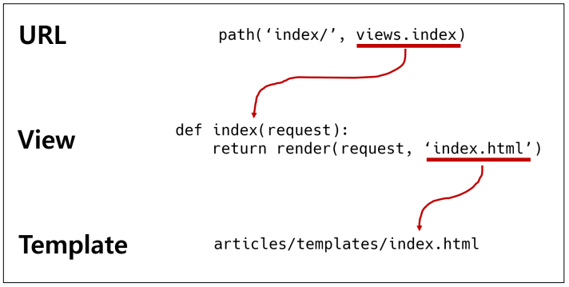

## 요청과 응답

URL → VIEW → TEMPLATE 순의 작성 순서로 코드를 작성해보고 데이터의 흐름을 이해하기

### Urls

* URL → VIEW → TEMPLATE
* 기초 과정을 작성해보고 데이터의 흐름을 이해하기

```python
# urls.py

from django.contrib import admin
from django.urls import path
from articles import views

urlpatterns = [
	path('admin/', admin.site.urls),
	path('index/', views.index),
]

```

### Views

* HTTP 요청을 수신하고 HTTP 응답을 반환하는 함수 작성
* Template에게 HTTP 응답 서식을 맡김

```python
# articles/views.py

def index(request):
	return render(request, 'index.html')
```

#### render()

* 주어진 템플릿을 주어진 컨텍스트 데이터와 결합하고 렌더링 된 텍스트와 함께 HttpResponse(응답) 객체를 반환하는 함수 
  * request 
    * 응답을 생성하는 데 사용되는 요청 객체 
  * template_name 
    * 템플릿의 전체 이름 또는 템플릿 이름의 경로 
  * context 
    * 템플릿에서 사용할 데이터 (딕녀너리 타입으로 작성)

```python
render(request, template_name, context)
```

### Templates

* 실제 내용을 보여주는데 사용되는 파일 
* 파일의 구조나 레이아웃을 정의 
* Template 파일의 기본 경로 
  * app 폴더 안의 templates 폴더 
  * app_name/templates/

```html
<!-- articles/templates/index.html -->

<!DOCTYPE html>
<html lang="en">
<head>
	<!-- 생략 -->
</head>
<body>
	<h1>만나서 반가워요!</h1>
</body>
</html>


<!-- 템플릿 폴더 이름은 반드시 templates라고 지정해야 함 -->
```

### 작성순서

* 앞으로 Django에서의 코드 작성은 URL → View → Template 순으로 작성
* “데이터의 흐름 순서”



#### [참고] 추가 설정

* LANGUAGE_CODE 
  * 모든 사용자에게 제공되는 번역을 결정 
  * 이 설정이 적용 되려면 USE_I18N이 활성화(True)되어 있어야 함 
  * http://www.i18nguy.com/unicode/language-identifiers.html

* TIME_ZONE 
  * 데이터베이스 연결의 시간대를 나타내는 문자열 지정 
  * USE_TZ가 True이고 이 옵션이 설정된 경우 데이터베이스에서 날짜 시간을 읽으면, UTC 대신 새로 설정한 시간대의 인식 날짜&시간이 반환 됨 
  * USE_TZ이 False인 상태로 이 값을 설정하는 것은 error가 발생하므로 주의 
  * https://en.wikipedia.org/wiki/List_of_tz_database_time_zones

* USE_I18N 
  * Django의 번역 시스템을 활성화해야 하는지 여부를 지정 
* USE_L10N 
  * 데이터의 지역화 된 형식(localized formatting)을 기본적으로 활성화할지 여부를 지정 
  * True일 경우, Django는 현재 locale의 형식을 사용하여 숫자와 날짜를 표시 
* USE_TZ 
  * datetimes가 기본적으로 시간대를 인식하는지 여부를 지정 
  * True일 경우 Django는 내부적으로 시간대 인식 날짜 / 시간을 사용

## Django Template

* “데이터 표현을 제어하는 도구이자 표현에 관련된 로직” 
* Django Template을 이용한 HTML 정적 부분과 동적 컨텐츠 삽입 
* Template System의 기본 목표를 숙지 
* Django Template System 
  * 데이터 표현을 제어하는 도구이자 표현에 관련된 로직을 담당

### Django Template Language (DTL)

* Django template에서 사용하는 built-in template system 
* 조건, 반복, 변수 치환, 필터 등의 기능을 제공 
  * Python처럼 일부 프로그래밍 구조(if, for 등)를 사용할 수 있지만 이것은 Python 코드로 실행되는 것이 아님 
  * Django 템플릿 시스템은 단순히 Python이 HTML에 포함 된 것이 아니니 주의 
  * 프로그래밍적 로직이 아니라 프레젠테이션을 표현하기 위한 것임을 명심할 것

### DTL Syntax

* Variable 
* Filters 
* Tags 
* Comments

#### Variable

```python
{{ variable }}
```

* 변수명은 영어, 숫자와 밑줄(_)의 조합으로 구성될 수 있으나 밑줄로는 시작 할 수 없음 
  * 공백이나 구두점 문자 또한 사용할 수 없음 
* dot(.)를 사용하여 변수 속성에 접근할 수 있음 
* render()의 세번째 인자로 {'key': value} 와 같이 딕셔너리 형태로 넘겨주며, 여기서 정의한 key에 해당하는 문자열이 template에서 사용 가능한 변수명이 됨

#### Filters

```python
{{ variable|filter }}
```

* 표시할 변수를 수정할 때 사용 
* 예시) {{ name | lower}}
  * name 변수를 모두 소문자로 출력 
* 60개의 built-in template filters를 제공 
* chained가 가능하며 일부 필터는 인자를 받기도 함 {{ name | truncatewords:30 }}

#### Tags

```html

```

* 출력 텍스트를 만들거나, 반복 또는 논리를 수행하여 제어 흐름을 만드는 등 변수보다 복잡한 일들을 수행 
* 일부 태그는 시작과 종료 태그가 필요  
* 약 24개의 built-in template tags를 제공

#### Comments

```html

 여러 줄
 주석

```


* Django template에서 라인의 주석을 표현하기 위해 사용 
* 한 줄 주석에만 사용할 수 있음 (줄 바꿈이 허용되지 않음) 
* 여러 줄 주석은 와  사이에 입력