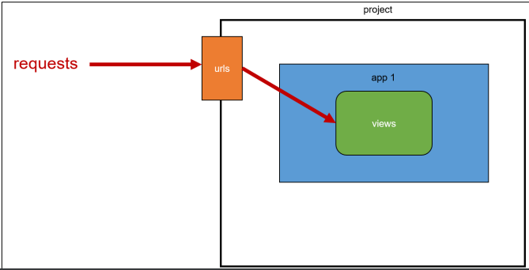
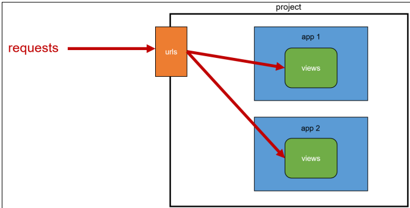
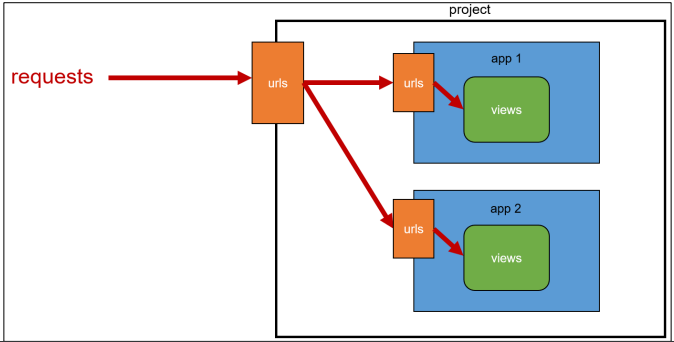

## App URL mapping

### App URL mapping

* 앱이 많아졌을 때 urls.py를 각 app에 매핑하는 방법을 이해하기 
* 두번째 app인 pages를 생성 및 등록 하고 진행 
* app의 view 함수가 많아지면서 사용하는 path() 또한 많아지고, app 또한 더 많이 작성되기 때문에 프로젝트의 urls.py에서 모두 관리하는 것은 프로젝트 유지보수에 좋지 않음
* 각 앱의 view 함수를 다른 이름으로 import할 수 있음 
* 이렇게도 가능하지만.. 더 좋은 방법을 생각해보자

```python
# firstpjt/urls.py
from articles import views as articles_views
from pages import views as pages_views

urlpatterns = [
    ...,
    path('pages-index', pages_views.index),
]
```

* 하나의 프로젝트의 여러 앱이 존재한다면, 각각의 앱 안에 urls.py을 만들고 프로젝트 urls.py에서 각 앱의 urls.py 파일로 URL 매핑을 위탁할 수 있음
* 각각의 app 폴더 안에 urls.py를 작성하고 다음과 같이 수정 진행

```python
# articles/urls.py
from django.urls import path
from . import views
urlpatterns = [
    path('index/', views.index),
    path('greeting/', views.greeting),
    path('dinner/', views.dinner),
    path('throw/', views.throw),
    path('catch/', views.catch),
    path('hello/<str:name>/', views.hello),
]

# pages/urls.py
from django.urls import path
urlpatterns = [
    
]
```

### Including other URLconfs

* urlpattern은 언제든지 다른 URLconf 모듈을 포함(include)할 수 있음
* ❖ include되는 앱의 url.py에 urlpatterns가 작성되어 있지 않다면 에러가 발생 예를 들어, pages 앱의 urlpatterns가 빈 리스트라도 작성되어 있어야 함

```python
# firstpjt/urls.py
from django.contrib import admin
from django.urls import path, include
urlpatterns = [
    path('admin/', admin.site.urls),
    path('articles/', include('articles.urls')),
    path('pages/', include('pages.urls')),
]
```

* 이제 메인 페이지의 주소는 이렇게 바뀌었음 
* http://127.0.0.1:8000/index/ → http://127.0.0.1:8000/articles/index/

### include()

* 다른 URLconf(app1/urls.py)들을 참조할 수 있도록 돕는 함수 
* 함수 include()를 만나게 되면 URL의 그 시점까지 일치하는 부분을 잘라내고, 남은 문자열 부분을 후속 처리를 위해 include된 URLconf로 전달

### URL 구조의 변화

* 앱의 URL을 project의 urls.py에서 관리



* 복수 개의 앱의 URL을 project의 urls.py에서 관리



* 각각의 앱에서 URL을 관리



## Namespace

* URL namespace를 사용하면 서로 다른 앱에서 동일한 URL 이름을 사용하는 경우에도 이름이 지정된 URL을 고유하게 사용 할 수 있음
* app_name attribute를 작성해 URL namespace를 설정

```python
# articles/urls.py
app_name = 'articles'
    urlpatterns = [
    ...,
]

# pages/urls.py
app_name = 'pages'
    urlpatterns = [
    ...,
]


# URL 태그의 변화

# 이렇게 변경

```

* app_name을 지정한 이후에는 url 태그에서 반드시 app_name:url_name 형태로만 사용해야 함. 그렇지 않으면 NoReverceMatch 에러가 발생
* “:” 연산자를 사용하여 지정 
  * 예를 들어, app_name이 articles이고 URL name이 index인 주소 참조는 articles:index가 됨


## Template namespace

### 2가지 문제 발생

1. articles app index 페이지에 작성한 두번째 앱 index로 이동하는 하이퍼 링크를 클 릭 시 현재 페이지로 다시 이동 
   * URL namespace 
2. pages app의 index url (http://127.0.0.1:8000/pages/index/)로 직접 이동해도 articles app의 index 페이지가 출력됨 
   * Template namespace

### 개요

* Django는 기본적으로 app_name/templates/ 경로에 있는 templates 파일들만 찾 을 수 있으며, settings.py의 INSTALLED_APPS에 작성한 app 순서로 template을 검색 후 렌더링 함 
* 바로 이 속성 값이 해당 경로를 활성화하고 있음

```python
# settings.py
TEMPLATES = [
    {
        ...,
        'APP_DIRS': True,
        ...
    },
]
```

### 디렉토리 생성을 통해 물리적인 이름공간 구분

* Django templates의 기본 경로에 app과 같은 이름의 폴더를 생성해 폴더 구조를 app_name/templates/app_name/ 형태로 변경 
* Django templates의 기본 경로 자체를 변경할 수는 없기 때문에 물리적으로 이름 공간을 만드는 것

```python
articles/
	templates/
		articles/
			index.html
			...
pages/
	templates/
		pages/
			index.html
			...
```

### 템플릿 경로 변경

* 폴더 구조 변경 후 변경된 경로로 해당하는 모든 부분을 수정하기

```python
# articles/views.py
return render(request, 'articles/index.html')

# pages/views.py
return render(request, 'pages/index.html')
```

### 반드시 Template namespace를 고려해야 할까?

* 만약 단일 앱으로만 이루어진 프로젝트라면 상관없음 
* 여러 앱이 되었을 때에도 템플릿 파일 이름이 겹치지 않게 하면 되지만, 앱이 많아지면 대부분은 같은 이름의 템플릿 파일이 존재하기 마련

## Naming URL patterns

### Naming URL patterns의 필요성

* 만약 “index/”의 문자열 주소를 “new-index/”로 바꿔야 한다고 가정
* 그렇다면 “index/” 주소를 사용했던 모든 곳을 찾아서 변경해야 하는 번거로움이 발생함

### Naming URL patterns

* 이제는 링크에 URL을 직접 작성하는 것이 아니라 “path()” 함수의 name 인자를 정의해서 사용 
* DTL의 Tag 중 하나인 URL 태그를 사용해서 “path()” 함수에 작성한 name을 사용할 수 있음 
* 이를 통해 URL 설정에 정의된 특정한 경로들의 의존성을 제거할 수 있음 
* Django는 URL에 이름을 지정하는 방법을 제공함으로써 view 함수와 템플릿에서 특정 주소를 쉽게 참조할 수 있도록 도움

```python
# articles/urls.py
urlpatterns = [
    path('index/', views.index, name='index'),
    path('greeting/', views.greeting, name='greeting'),
    path('dinner/', views.dinner, name='dinner'),
    path('throw/', views.throw, name='throw'),
    path('catch/', views.catch, name='catch'),
    path('hello/<str:name>/', views.hello, name='hello'),
]
```

#### Built-in tag – “url”

```django

```

* 주어진 URL 패턴 이름 및 선택적 매개 변수와 일치하는 절대 경로 주소를 반환 
* 템플릿에 URL을 하드 코딩하지 않고도 DRY 원칙을 위반하지 않으면서 링크를 출력하는 방법

