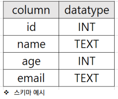
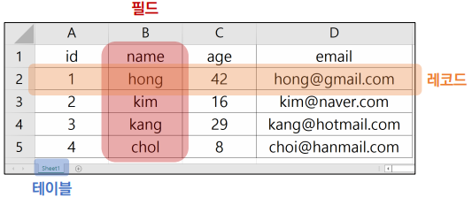
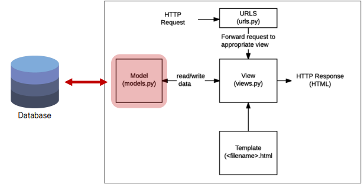
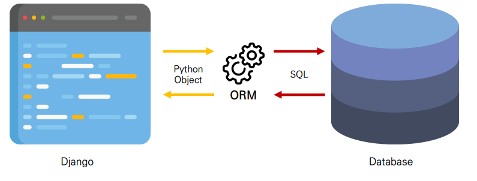
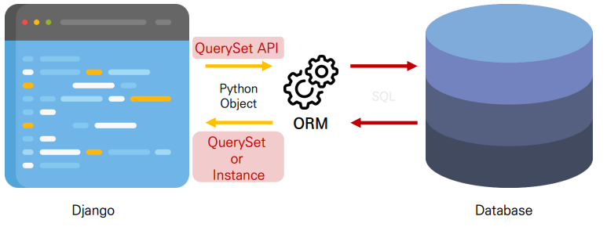
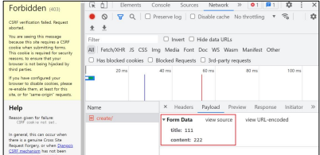
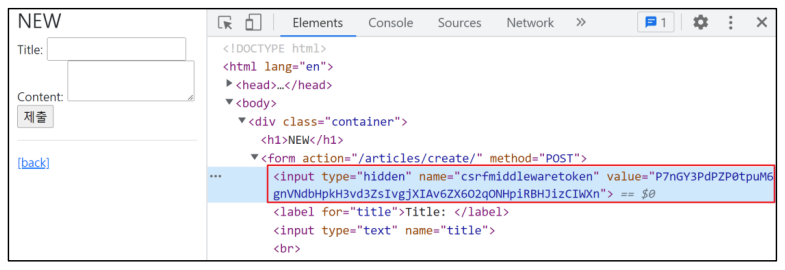

# Django Model

## Database

* 체계화된 데이터의 모임 
* 검색 및 구조화 같은 작업을 보다 쉽게 하기 위해 조직화된 데이터를 수집하는 저장 시스템 
* Database의 가장 기초적인 키워드에 대해 알아보고 자세한 내용은 추후 Database 시간에 다룰 예정

### Database 기본 구조

#### 스키마(Schema)

* 뼈대(Structure) 
* 데이터베이스에서 자료의 구조, 표현 방법, 관계 등을 정의한 구조



#### 테이블(Table)

* 필드와 레코드를 사용해 조직된 데이터 요소들의 집합
* 관계(Relation)라고도 부름

1. 필드(field) 
   * 속성, 컬럼(Column) 
2. 레코드(record)
   *  튜플, 행(Row)



#### 필드(field)

* 속성 혹은 컬럼(column)\
* 각 필드에는 고유한 데이터 형식이 지정됨 
  * INT, TEXT 등

#### 레코드(record)

* 튜플 혹은 행(row) 
* 테이블의 데이터는 레코드에 저장됨 
* 예를 들어 해당 예시는 4명의 고객정보가 저장되어 있으며, 레코드는 4개가 존재

#### PK (Primary Key)

* 기본 키 
* 각 레코드의 고유한 값 (식별자로 사용) 
* 기술적으로 다른 항목과 절대로 중복될 수 없는 단일 값(unique) 
* 데이터베이스 관리 및 테이블 간 관계 설정 시 주요하게 활용 됨

#### 쿼리(Query)

* 데이터를 조회하기 위한 명령어 
* 조건에 맞는 데이터를 추출하거나 조작하는 명령어 (주로 테이블형 자료구조에서) 
* "Query를 날린다." ➢ “데이터베이스를 조작한다.”

## Model

* Django는 Model을 통해 데이터에 접근하고 조작 
* 사용하는 데이터들의 필수적인 필드들과 동작들을 포함 
* 저장된 데이터베이스의 구조 (layout) 
* 일반적으로 각각의 모델은 하나의 데이터베이스 테이블에 매핑(mapping) 
  * 모델 클래스 1개 == 데이터베이스 테이블 1개



### Model 작성하기

```python
# 새 프로젝트(crud), 앱(articles) 작성 및 앱 등록
# settings.py
INSTALLED_APPS = [
    'articles',
    ...
]

# models.py 작성 => 모델 클래스를 작성하는 것은 데이터베이스 테이블의 스키마를 정의하는 것
# articles/models.py
class Article(models.Model):
    # models 모듈을 통해 어떠한 타입의 DB 필드(컬럼)을 정의할 것인지 정의
    title = models.CharField(max_length=10)
    content = models.TextField()
    

```

* Django는 모델 필드를 통해 테이블의 필드(컬럼)에 저장할 데이터 유형 (INT, TEXT 등)을 정의 
* 데이터 유형에 따라 다양한 모델 필드를 제공 
  * DataField(), CharField(), IntegerField() 등 
  * https://docs.djangoproject.com/en/3.2/ref/models/fields/

## Migrations

* • 모델의 변경사항에 대한 새로운 migration을 만들 때 사용
* 명령어 실행 후 migrations/0001_initial.py가 생성된 것을 확인 
  * “파이썬으로 작성된 설계도”
* makemigrations로 만든 설계도를 실제 데이터베이스에 반영하는 과정 (db.sqlite3 파일에 반영) 
* 결과적으로 모델의 변경사항과 데이터베이스를 동기화

```bash
$ python manage.py makemigrations
$ python manage.py migrate
```

## ORM

* Object-Relational-Mapping 
* 객체 지향 프로그래밍 언어를 사용하여 호환되지 않는 유형의 시스템 간에 (Django <-> DB)데이터를 변환하는 프로그래밍 기술 
* 객체 지향 프로그래밍에서 데이터베이스을 연동할 때, 데이터베이스와 객체 지향 프로그래밍 언어 간의 호환되지 않는 데이터를 변환하는 프로그래밍 기법 
* Django는 내장 Django ORM을 사용 
* 한 마디로 SQL을 사용하지 않고 데이터베이스를 조작할 수 있게 만들어주는 매개체



### 장단점

* 장점 
  * SQL을 잘 알지 못해도 객체지향 언어로 DB 조작이 가능
  * 객체 지향적 접근으로 인한 높은 생산성 

* 단점 
  * ORM 만으로 세밀한 데이터베이스 조작을 구현하기 어려운 경우가 있음

### ORM을 사용하는 이유

* “생산성” 
* 현시대 개발에서 가장 중요한 키워드는 바로 생산성 
* 우리는 DB를 객체(object)로 조작하기 위해 ORM을 사용할 것

## QuerySet API

### Database API

* Django가 제공하는 ORM을 사용해 데이터베이스를 조작하는 방법
* Model을 정의하면 데이터를 만들고 읽고 수정하고 지울 수 있는 API를 제공
* Database API 구문

> Article.objects.all()
>
> ( Model class, Manager, Queryset API )

### Objects manager

* Django 모델이 데이터베이스 쿼리 작업을 가능하게 하는 인터페이스 
* Django는 기본적으로 모든 Django 모델 클래스에 대해 objects 라는 Manager 객체를 자동으로 추가함 
* 이 Manager를 통해 특정 데이터를 조작할 수 있음 
* DB를 Python class로 조작할 수 있도록 여러 메서드를 제공하는 manage

### Query

* 데이터베이스에 특정한 데이터를 보여 달라는 요청 
* “쿼리문을 작성한다.” → 원하는 데이터를 얻기 위해 데이터베이스에 요청을 보낼 코드를 작성한다. 
* 이 때, 파이썬으로 작성한 코드가 ORM의 의해 SQL로 변환되어 데이터베이스에 전달되며, 데이터베이스의 응답 데이터를 ORM이 QuerySet이라는 자료 형태로 변환하여 우리에게 전달

### QuerySet

* 데이터베이스에게서 전달 받은 객체 목록(데이터 모음) 
  * 순회가 가능한 데이터로써 1개 이상의 데이터를 불러와 사용할 수 있음 
* Django ORM을 통해 만들어진 자료형이며, 필터를 걸거나 정렬 등을 수행할 수 있음 
* objects manager를 사용하여 복수의 데이터를 가져오는 queryset method를 사용 할 때 반환되는 객체 
* 단, 데이터베이스가 단일한 객체를 반환 할 때는 QuerytSet이 아닌 모델(Class)의 인스턴스로 반환됨



# CRUD

* Create / Read / Update / Delete
* 대부분의 컴퓨터 소프트웨어가 가지는 기본적인 데이터 처리 기능 4가지를 묶어서 일컫는 말

## CREATE

### 데이터 객체를 만드는(생성하는) 3가지 방법

1. 첫번째 방법
   1. article = Article() 
      * 클래스를 통한 인스턴스 생성 
   2. article.title 
      * 클래스 변수명과 같은 이름의 인스턴스 변수를 생성 후 값 할당 
   3. article.save() 
      * 인스턴스로 save 메서드 호출

```bash
# 특정 테이블에 새로운 행을 추가하여 데이터 추가

>>> article = Article() # Article(class)로부터 article(instance)
>>> article
<Article: Article object (None)>

>>> article.title = 'first' # 인스턴스 변수(title)에 값을 할당
>>> article.content = 'django!' # 인스턴스 변수(content)에 값을 할당

# save를 하지 않으면 아직 DB에 값이 저장되지 않음

>>> article
<Article: Article object (None)>

>>> Article.objects.all()
<QuerySet []>

# save를 하고 확인하면 저장된 것을 확인할 수 있다.
>>> article.save()
>>> article
<Article: Article object (1)>
>>> article.id
1
>>> article.pk
1
>>> Article.objects.all()
<QuerySet [Article: Article object (1)]

# 인스턴스인 article을 활용하여 변수에 접근해보자(데이터 저장된 것을 확인)

>>> article.title
'first'
>>> article.content
'django!'
>>> article.created_at
datetime.datetime(2022, 8, 21, 2, 43, 56, 49345, tzinfo=<UTC>)
```

2. 두번째 방법
   * 인스턴스 생성 시 초기 값을 함께 작성하여 생성

```bash
>>> article = Article(title='second', content='django!')

# 아직 저장 되어있지 않음
>>> article
<Article: Article object (None)>

# save를 호출해야 저장됨
>>> article.save()
>>> article
<Article: Article object (2)>
>>> Article.objects.all()
<QuerySet [<Article: Article object (1)>, <Article: Article object (2)>]>

# 값 확인
>>> article.pk
2
>>> article.title
'second'
>>> article.content
'django!’
```

3. 세번째 방법
   * QuerySet API 중 create() 메서드 활용

```bash
# 위 2가지 방식과는 다르게 바로 생성된 데이터가 반환된다.

>>> Article.objects.create(title='third', content='django!')
<Article: Article object (3)>
```

### .save()

* “Saving object” 
* 객체를 데이터베이스에 저장함 
* 데이터 생성 시 save를 호출하기 전에는 객체의 id 값은 None 
* id 값은 Django가 아니라 데이터베이스에서 계산되기 때문 
* 단순히 모델 클래스를 통해 인스턴스를 생성하는 것은 DB에 영향을 미치지 않기 때문 에 반드시 save를 호출해야 테이블에 레코드가 생성됨

## READ

* QuerySet API method를 사용해 데이터를 다양하게 조회하기 
* QuerySet API method는 크게 2가지로 분류됨 
  	1. Methods that “return new querysets” 
  	1. Methods that “do not return querysets”

### all()

* QuerySet return 
* 전체 데이터 조회

```bash
>>> Article.objects.all()
<QuerySet [<Article: Article object (1)>, <Article: Article object (2)>, <Article: Article object (3)>]>
```

### get()

* 단일 데이터 조회 
* 객체를 찾을 수 없으면 DoesNotExist 예외를 발생시키고, 둘 이상의 객체를 찾으면 MultipleObjectsReturned 예외를 발생시킴 
* 위와 같은 특징을 가지고 있기 때문에 primary key와 같이 고유성(uniqueness)을 보장하는 조회에서 사용해야 함

```bash
>>> Article.objects.get(pk=1)
<Article: Article object (1)>

>>> Article.objects.get(pk=100)
DoesNotExist: Article matching query does not exist.

>>> Article.objects.get(content='django!')
MultipleObjectsReturned: get() returned more than one Article -- it returned 2!
```

### filter()

* 지정된 조회 매개 변수와 일치하는 객체를 포함하는 새 QuerySet을 반환

```bash
>>> Article.objects.filter(content='django!')
<QuerySet [<Article: Article object (1)>, <Article: Article object (2)>, <Article: Article object (3)>]>

>>> Article.objects.filter(title='ssafy')
<QuerySet []>

>>> Article.objects.filter(title='first')
<QuerySet [<Article: Article object (1)>]>
```

### Field lookups

* 특정 레코드에 대한 조건을 설정하는 방법
* QuerySet 메서드 filter(), exclude() 및 get()에 대한 키워드 인자로 지정됨 
* 다양한 built-in lookups는 공식문서를 참고
  *  https://docs.djangoproject.com/en/3.2/ref/models/querysets/#field-lookups

```bash
# Field lookups 예시

# "content 컬럼에 'dj'가 포함된 모든 데이터 조회"
Article.objects.filter(content__contains='dj')
```

## UPDATE

1. 수정하고자 하는 article 인스턴스 객체를 조회 후 반환 값을 저장 
2. article 인스턴스 객체의 인스턴스 변수 값을 새로운 값으로 할당
3. save() 인스턴스 메서드 호출

```bash
>>> article = Article.objects.get(pk=1)
# 인스턴스 변수를 변경
>>> article.title = 'byebye'
# 저장
>>> article.save()
# 정상적으로 변경된 것을 확인
>>> article.title
'byebye
```

## DELETE

1. 삭제하고자 하는 article 인스턴스 객체를 조회 후 반환 값을 저장 
2. delete() 인스턴스 메서드 호출

```bash
>>> article = Article.objects.get(pk=1)

# delete 메서드 호출
>>> article.delete()
(1, {'articles.Article': 1})

# 1번 데이터는 이제 조회할 수 없음
>>> Article.objects.get(pk=1)
DoesNotExist: Article matching query does not exist.
```

## CRUD with view functions

### base 템플릿 작성

1. bootstrap CDN 및 템플릿 추가 경로 작성

```django
<!-- templates/base.html -->

<!DOCTYPE html>
<html lang="en">
<head>
    <meta charset="UTF-8">
    <meta http-equiv="X-UA-Compatible" content="IE=edge">
    <meta name="viewport" content="width=device-width, initial-scale=1.0">
    <!-- bootstrap CSS CDN -->
    <title>Document</title>
</head>
<body>
    <div class="container">
        
        
    </div>
    <!-- bootstrap JS CDN -->
</body>
</html>

```

```python
# settings.py
'TEMPLATES = [
    {
        ...,
        'DIRS': [BASE_DIR / 'templates',],
        ...
	}
]
```

2. url 분리 및 연결

```python
# articles/urls.py

from django.urls import path

app_name = 'articles'
urlpatterns = [
]

# crud/urls.py

from django.contrib import admin
from django.urls import path, include

urlpatterns = [
    path('admin/', admin.site.urls),
    path('articles/', include('articles.urls')),
]

# articles/urls.py

from django.urls import path
from . import views

app_name = 'articles'
urlpatterns = [
    path('', views.index, name='index'),
]

# articles/views.py
def index(request):
	return render(request, 'articles/index.html')


```

```django
<!-- templates/articles/index.html -->



	<h1>Articles</h1>

```

## READ (index page)

### 전체 게시글 조회

* index 페이지에서는 전체 게시글을 조회해서 출력한다.

```python
# articles/views.py
from .models import Article
def index(request):
    articles = Article.objects.all()
    context = {
    'articles': articles,
    }
    return render(request, 'articles/index.html', context)
```

```django
<!--templates/articles/index.html-->




    <h1>Articles</h1>
    <hr>
    
        <p>글 번호: {{ article.pk }}</p>
        <p>글 제목: {{ article.title }}</p>
        <p>글 내용: {{ article.content }}</p>
        <hr>
    

```

## CREATE

* CREATE 로직을 구현하기 위해서는 몇 개의 view 함수가 필요할까? 
  * 사용자의 입력을 받을 페이지를 렌더링 하는 함수 1개 
    * “new” view function 
  * 사용자가 입력한 데이터를 전송 받아 DB에 저장하는 함수 1개 
    * “create” view function

```python
# articles/urls.py
urlpatterns = [
    path('', views.index, name='index'),
    path('new/', views.new, name='new'),
]

# articles/views.py
def new(request):
    return render(request, 'articles/new.html')
```

```django
<!-- templates/articles/new.html -->




    <h1>NEW</h1>
    <form action="#" method="GET">
        <label for="title">Title: </label>
        <input type="text" name="title"><br>
        <label for="content">Content: </label>
        <textarea name="content"></textarea><br>
        <input type="submit">
    </form>
    <hr>
    <a href="">[back]</a>

```

* new 페이지로 이동할 수 있는 하이퍼 링크 작성

```django
<!-- templates/articles/index.html -->




	<h1>Articles</h1>
	<a href="">NEW</a>
	<hr>
...

```

```python
# articles/urls.py

urlpatterns = [
...
path('create/', views.create, name='create'),
]

# 데이터를 생성하는 3가지 방법

def create(request):
    title = request.GET.get('title')
    content = request.GET.get('content')
    # 1.
    # article = Article()
    # article.title = title
    # article.content = content
    # article.save()
    # 2.
    article = Article(title=title, content=content)
    article.save()
    # 3.
    # Article.objects.create(title=title, content=content)
    return render(request, 'articles/create.html')

```

* 게시글 작성 후 확인

```django
<!-- templates/articles/create.html -->




	<h1>성공적으로 글이 작성되었습니다.</h1>



<!-- templates/articles/new.html -->




    <h1>NEW</h1>
    <form action="" method="GET">
        <label for="title">Title: </label>
        <input type="text" name="title"><br>
        <label for="content">Content: </label>
        <textarea name="content" cols="30" rows="5"></textarea><br>
        <input type="submit">
    </form>
    <hr>
    <a href="">[back]</a>

```

* 게시글 작성 후 index 페이지로 돌아가도록 함

```python
# articles/views.py
def create(request):
...
	return render(request, 'articles/index.html')
```

* Django shortcut function – “redirect()” 
  * 인자에 작성된 곳으로 요청을 보냄
  * 사용 가능한 인자
    1. view name (URL pattern name) 
       * return redirect('articles:index')
    2. absolute or relative URL
       * return redirect('/articles/')

* 동작 확인 후 불필요해진 create.html는 삭제

```python
# articles/views.py
from django.shortcuts import render, redirect


def create(request):
    title = request.GET.get('title')
    content = request.GET.get('content')
    article = Article(title=title, content=content)
    article.save()
    
    # return redirect('/articles/')
    return redirect('articles:index')
```

* 게시글 작성 후 터미널 로그 확인하기

```bash
[06/Jun/2022 18:43:37] "GET /articles/create/?title=11&content=22 HTTP/1.1" 302 0
[06/Jun/2022 18:43:37] "GET /articles/ HTTP/1.1" 200 1064
```

* redirect 동작 이해하기
  * 동작 원리
    1. 클라이언트가 create url로 요청을 보냄 
    2. create view 함수의 redirect 함수가 302 status code를 응답 
    3. 응답 받은 브라우저는 redirect 인자에 담긴 주소(index)로 사용자를 이동시키기 위해 index url로 Django에 재요청 
    4. index page를 정상적으로 응답 받음 (200 status code)

### HTTP method GET 재검토

*  현재는 게시글이 작성될 때 /articles/create/?title=11&content=22 와 같은 URL로 요청이 보내짐
* GET은 쿼리 스트링 파라미터로 데이터를 보내기 때문에 url을 통해 데이터를 보냄
* 하지만 현재 요청은 데이터를 조회하는 것이 아닌 작성을 원하는 요청
* GET이 아닌 다른 HTTP method를 알아보기

### HTTP request method

* HTTP는 request method를 정의하여, 주어진 리소스에 수행하길 원하는 행동을 나타냄
* GET 
  * 특정 리소스를 가져오도록 요청할 때 사용 
  * 반드시 데이터를 가져올 때만 사용해야 함 
  * DB에 변화를 주지 않음
  * CRUD에서 R 역할을 담당
* POST 
  * 서버로 데이터를 전송할 때 사용
  * 서버에 변경사항을 만듦 
  * 리소스를 생성/변경하기 위해 데이터를 HTTP body에 담아 전송 
  * GET의 쿼리 스트링 파라미터와 다르게 URL로 데이터를 보내지 않음 
  * CRUD에서 C/U/D 역할을 담당
* 그럼 왜 검색에서는 GET을 사용할까?
  * 검색은 서버에 영향을 미치는 것이 아닌 특정 데이터를 조회만 하는 요청이기 때문 
  * 특정 페이지를 조회하는 요청을 보내는 HTML의 a tag 또한 GET을 사용

### POST method 적용하기

* 코드를 변경하고 URL에서 쿼리 스트링 파라미터가 없어진 것을 확인해보기

```django
<!-- templates/articles/new.html -->




    <h1 class="text-center">NEW</h1>
    <form action="" method="POST">
    ...
    </form>
    <hr>
    <a href="">[back]</a>

```

* 게시글 작성 후 서버로그 확인하기

```bash
Forbidden (CSRF cookie not set.): /articles/create/
[06/Jun/2022 19:27:28] "POST /articles/create/ HTTP/1.1" 403 2870
```

* 403 Forbidden 응답을 받았지만 이는 나중에 확인하고 요청된 URL(/articles/create/)을 확인 
* 개발자도구 - NETWORK 탭 – Payload 탭의 Form-Data 확인



* 데이터가 담긴 위치가 바뀌었기 때문에 view함수에서도 다음과 같이 수정 필요

```python
# articles/views.py
def create(request):
    title = request.POST.get('title')
    content = request.POST.get('content')
    
    article = Article(title=title, content=content)
    article.save()
    return render(request, 'articles/create.html')
```

### HTTP methods 정리

* GET은 단순히 조회하려는 경우 & POST는 서버나 DB에 변경을 요청하는 경우 
* TMDB API나 다른 API 문서에서 봤던 요청 예시 문서에서 등장했던 친구들이 바로 HTTP methods 였음

### [참고] 403 Forbidden

* 서버에 요청이 전달되었지만, 권한 때문에 거절되었다는 것을 의미 
* 서버에 요청은 도달했으나 서버가 접근을 거부할 때 반환됨
* 즉, 게시글을 작성할 권한이 없다 → Django 입장에서는 “작성자가 누구인지 모르기 때문에 함부로 작성할 수 없다”라는 의미 
* 모델(DB)을 조작하는 것은 단순 조회와 달리 최소한의 신원 확인이 필요하기 때문

### CSRF

* Cross-Site-Request-Forgery 
* “사이트 간 요청 위조”
* 사용자가 자신의 의지와 무관하게 공격자가 의도한 행동을 하여 특정 웹 페이지를 보안에 취약하게 하거나 수정, 삭제 등의 작업을 하게 만드는 공격 방법
* 실제 사례 - “2008년 옥X 개인정보 해킹 사건”
  * 해커가 옥X 운영자에게 CSRF 코드가 포함된 가짜 사이트가 담긴 이메일을 보냄 
  * 관리자는 해당 사이트에 정보를 입력하여 관련 정보가 해커에게 보내졌고, 해커는 옥X 사이트의 관리자 권한을 얻어냄 (당시 1860만건 유출)

### CSRF 공격 방어

* “Security Token 사용 방식 (CSRF Token)”
  * 사용자의 데이터에 임의의 난수 값(token)을 부여해 매 요청마다 해당 난수 값을 포함시켜 전송 시키도록 함 
  * 이후 서버에서 요청을 받을 때마다 전달된 token 값이 유효한지 검증 
  * 일반적으로 데이터 변경이 가능한 POST, PATCH, DELETE Method 등에 적용 
  * Django는 DTL에서 csrf_token 템플릿 태그를 제공

### csrf_token 템플릿 태그

```django

```

* 해당 태그가 없다면 Django 서버는 요청에 대해 403 forbidden으로 응답 
* 템플릿에서 내부 URL로 향하는 Post form을 사용하는 경우에 사용 
* 외부 URL로 향하는 POST form에 대해서는 CSRF 토큰이 유출되어 취약성을 유발할 수 있기 때문에 사용해서는 안됨
* 태그 작성 후 확인하기 
* input type이 hidden으로 작성되며 value는 Django에서 생성한 hash 값으로 설정

```django
<!-- templates/articles/new.html -->




    <h1>NEW</h1>
    <form action="" method="POST">
    
    ...
    </form>
    <hr>
    <a href="">[back]</a>

```



* 마지막으로 게시글을 작성하고 문제없이 저장되는지 확인해보기
* “csrf_token 은 해당 POST 요청이 내가 보낸 것 인지를 검증하는 것”

## READ 2

* 개별 게시글 상세 페이지 제작
* 모든 게시글 마다 뷰 함수와 템플릿 파일을 만들 수는 없음 
  * 글의 번호(pk)를 활용해서 하나의 뷰 함수와 템플릿 파일로 대응 
* 무엇을 활용할 수 있을까? 
  * Variable Routing

### urls

* URL로 특정 게시글을 조회할 수 있는 번호를 받음

```python
# articles/urls.py
urlpatterns = [
    ...
    path('<int:pk>/', views.detail, name='detail'),
]
```

### views

* Article.objects.get(pk=pk)에서 오른쪽 pk는 variable routing을 통해 받은 pk, 왼쪽 pk는 DB에 저장된 레코드의 id 컬럼

```python
# articles/views.py
def detail(request, pk):
    article = Article.objects.get(pk=pk)
    context = {
    'article': article,
    }
    return render(request, 'articles/detail.html', context)
```

### templates

```django
<!--templates templates/articles/detail.html -->




    <h2>DETAIL</h2>
    <h3>{{ article.pk }} 번째 글</h3>
    <hr>
    <p>제목: {{ article.title }}</p>
    <p>내용: {{ article.content }}</p>
    <p>작성 시각: {{ article.created_at }}</p>
    <p>수정 시각: {{ article.updated_at }}</p>
    <hr>
    <a href="">[back]</a>



<!-- templates/articles/index.html -->




<h1>Articles</h1>
<a href="">[new]</a>
<hr>

    ...
    <a href="">[detail]</a>
    <hr>


```

*  redirect 인자 변경

```python
# articles/views.py
def create(request):
    ...
    return redirect('articles:detail', article.pk)
```

## DELETE

### urls

* 모든 글을 삭제 하는 것이 아니라 삭제하고자 하는 특정 글을 조회 후 삭제해야 함

```python
# articles/urls.py
urlpatterns = [
    ...
    path('<int:pk>/delete/', views.delete, name='delete'),
```

### views

```python
# articles/views.py
def delete(request, pk):
    article = Article.objects.get(pk=pk)
    article.delete()
    return redirect('articles:index')
```

### templates

* Detail 페이지에 작성하며 DB에 영향을 미치기 때문에 POST method를 사용

```django
<!-- articles/detail.html -->




...
    <form action="" method="POST">
        
        <input type="submit" value="DELETE">
    </form>
    <a href="">[back]</a>

```

## UPDATE

* 수정은 CREATE 로직과 마찬가지로 2개의 view 함수가 필요 
* 사용자의 입력을 받을 페이지를 렌더링 하는 함수 1개 
  * “edit” view function 
* 사용자가 입력한 데이터를 전송 받아 DB에 저장하는 함수 1개 
  * “update” view function

### Edit – urls & views

```python
# articles/urls.py

urlpatterns = [
    ...
    path('<int:pk>/edit/', views.edit, name='edit'),
]

# articles/views.py
def edit(request, pk):
    article = Article.objects.get(pk=pk)
    context = {
    'article': article,
    }
    return render(request, 'articles/edit.html', context)
```

### Edit – templates

* html 태그의 value 속성을 사용해 기존에 입력 되어 있던 데이터를 출력

```django
<!-- articles/edit.html -->




    <h1>EDIT</h1>
    <form action="#" method="POST">
        
        <label for="title">Title: </label>
        <input type="text" name="title" value="{{ article.title }}"><br>
        <label for="content">Content: </label>
        <textarea name="content" cols="30" rows="5">{{ article.content }}</textarea><br>
        <input type="submit">
    </form>
    <hr>
    <a href="">[back]</a>


<!-- textarea 태그는 value 속성이 없으므로 태그 내부 값으로 작성해야 한다. -->
```

* Edit 페이지로 이동하기 위한 하이퍼 링크 작성

```django
<!-- articles/detail.html -->




    <h2>DETAIL</h2>
    <h3>{{ article.pk }} 번째 글</h3>
    <hr>
    <p>제목: {{ article.title }}</p>
    <p>내용: {{ article.content }}</p>
    <p>작성 시각: {{ article.created_at }}</p>
    <p>수정 시각: {{ article.updated_at }}</p>
    <hr>
    <a href="">EDIT</a><br>
    <form action="" method="POST">
    	
    	<input type="submit" value="DELETE">
    </form>
    <a href="">[back]</a>

```


### Update 로직 작성

* urls & views

```python
# articles/urls.py
urlpatterns = [
    ...
    path('<int:pk>/update/', views.update, name='update'),
]

# articles/views.py
def update(request, pk):
    article = Article.objects.get(pk=pk)
    article.title = request.POST.get('title')
    article.content = request.POST.get('content')
    article.save()
    return redirect('articles:detail', article.pk)
```

```django
<!-- articles/edit.html -->


    <h1>EDIT</h1>
    <form action="" method="POST">
        
        ...
    <a href="">[back]</a>

```

