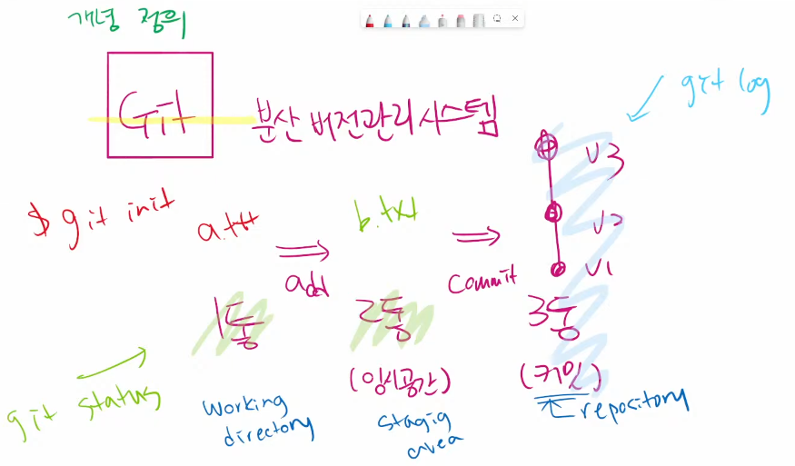
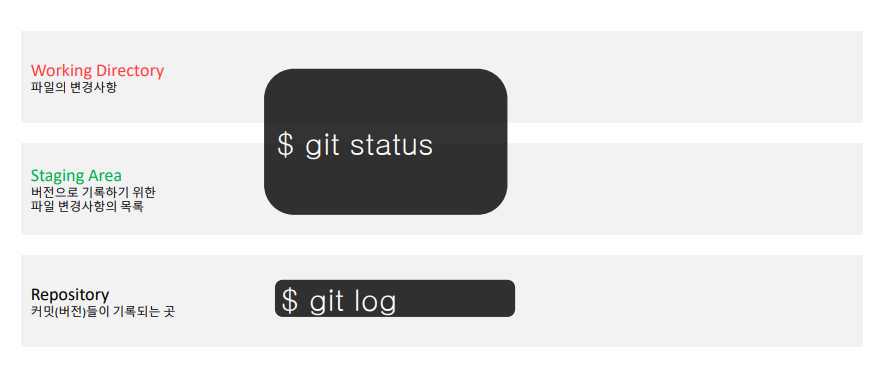
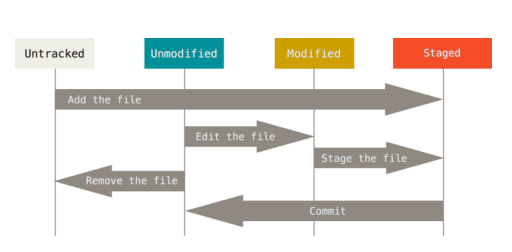

# GIT

> 분산버전관리 시스템

* Makrdown을 활용한 문서 작성
* Git을 활용한 버전 관리
  * 버전 관리 기본
  * Git branch
* GitHub를 활용한 포트폴리오 관리 및 개발 프로젝트 시나리오
  * 개인 포트폴리오 관리
    * TIL(Today I Learned)
    * 개인 개발 프로젝트
* 프로젝트(협업)
  * GitHub Flow를 활용한 개발 프로젝트 가이드라인
    * Shared repository model / Fork & Pull model => RP

## CLI (Command Line interface)

- 가상 터미널 또는 텍스트 터미널을 통해 사용자와 컴퓨터가 상호 작용하는 방식을 뜻한다. (검은화면에 흰글씨)

- 작업 명령은 사용자가 툴바 키보드 등을 통해 문자열의 형태로 입력하며, 컴퓨터로부터의 출력 역시 문자열의 형태로 주어진다.

- 이 같은 인터페이스를 제공하는 프로그램을 명령 줄 해석기 또는 셸이라고 부른다. 

  이를테면, 유닉스 셸(sh, ksh, csh, bash 등)과 CP/M, 도스의 command.com(CMD, 명령 프롬프트)


### 디렉토리 관리 (명령어)

- pwd(print working directory) : 현재 디렉토리 출력

* cd 디렉토리이름(change directory) : 디렉토리 이동
  * cd. : 현재 디렉토리
  * cd.. : 상위 디렉토리

* ls (list) : 목록

* mkdir (make directory) : 디렉토리(폴더) 생성

* touch : 파일 생성

* rm 파일명 : 파일 삭제하기
  * rm –r 폴더명 : 폴더 삭제하기 

* 기록삭제 ctrl+l


## Git

* Git은 분산버전관리시스템으로 코드의 버전을 관리하는 도구
  * 버전: 컴퓨터의 소프트웨어의 특정 상태

* 컴퓨터 파일의 변경사항을 추적하고 여러명의 사용자들 간에 해당 파일들의 작업을 조율


### 분산버전관리시스템 (DVCS)

* 중앙집중식버전관리시스템은 중앙에서 버전을 관리하고 파일을 받아서 사용
* 분산버전관리시스템은 원격 저장소(remote repository)를 통하여 협업하고, 모든 히스토리를 클라이언트들이 공유


## 버전은 어떻게 기록할까?

- 1)작업(수정)하면 2) add하여 staging area에 모아 3) commit으로 버전 기록

  작업(수정)한 파일`(working directory)` => `add` => 커밋할 목록`(staging area)` => `commit` => `버전(HEAD)`

1. **작업을 하고**
2. **변경된 파일을 모아(add)**
3. **버전으로 남긴다.(commit)**





### 기본 명령어

####  $ git init

* 저장소 처음 만들때
  * 특정 폴더를 git 저장소(repository)를 만들어 git으로 관리
    * .git 폴더가 생성되며 (숨긴파일)
    * git bash에서는 (master)라는 표기를 확인할 수 있음
      * 삭제할땐 rm -r .git

#### $git add . or file

* `working directory`상의 변경내용을 `staging area`에 추가하기 위해 사용
  * `untracked` 상태의 파일을 `staged`로 변경
  * `modified` 상태의 파일을 `staged`로 변경

#### $git commit -m '<커밋메시지>'

* `staged`상대의 파일들을 커밋을 통해 버전으로 기록
* SHA-1 해시를 사용하여 40자 길이의 체크섬을 생성하고, 이를 통해 고유한 커밋을 표기
* 커밋메시지("1.txt와 2.txt를 만들었음.")는 변경 사항을 나타낼 수 있도록 명확하게 작성해야함

##### `여기까지 기본 흐름`

* Git은 파일을 modified, staged, committed로 관리
  * modified : 파일이 수정된 상태 (add 명령어를 통하여 staging area로)
  * staged : 수정한 파일을 곧 커밋할 것이라고 표시한 상태 (commit 명령어로 저상소)
  * committed : 커밋이 된 상태

#### $git log

* 현재 저장소에 기록된 `commit(버전)`을 `조회`
* 다양한 옵션을 통해 로그를 조회할 수 있음
  * $ git log -1 : 직전의 로그
  * $ git log --oneline : 한줄로 보여줘
  * git log -1 --oneline : 직전의 로그를 한줄로 보여줘


#### $git status

* Git 저장소에 있는 `Working Directory, Staging Area` `상태를 확인`하기 위하여 활용

  * 파일의 상태를 알 수 있음
    * Untracked files
    * Changes not staged for commit
    * Changes to be committed


  * 커밋안된 파일이 있는지?
    * 커밋할것이 없다 -> staging area가 비어있다

- 결과값이 working tree clean -> 지금 새로 작업한게 없네 -> Working Directory가 비어있다
- status로 확인할 수 있는 파일의 상태
  - Tracked : 이전부터 버전으로 관리되고 있는 파일
    - unmodeified : git status에 나타나지 않음
    - modified : changes not staged for commit
    - staged : changes to be committed

  - untracked : 버전으로 관리된 적 없는 파일 (파일을 새로 만든 경우)







#### $mkdir

- 폴더 만들기 

#### $touch

- 파일생성


### Git 설정 파일(config)

* 사용자 정보 (commit author) : commit을 하기 위해 반드시 필요
  * git config —global user.name “username”
    * Github에서 설정한 username으로 설정
  * git config —global user.email “my@email.com
    * Github에서 설정한 email로 설정
* 설정 확인
  * git config -l
  * git config —global -l
  * git config user.name


버전을 기록할때

working Directory1)작업하면 staging area2)add하여 staging aree에 모아 Repository3)commit으로 버전기록

파일변경 -> git add(중간공간 혹은 임시공간, 테스트) -> git commit(버전기록)


## 1. (master)가 있는 곳에서는 git init을 하지 않는다.

## 2. git 명령어를 입력할 때에는 항상 경로를 잘보자

## 3. 명령어의 결과 영어를 잘 읽자


---


# Git Status 번역

## a.txt 파일을 만든 직후

> 빨간 글씨 => 1통

```bash
$ git status
On branch master

# 트래킹이 되고 있지 않은 파일?
# => 1통 (working directory)
# => 한번도 git으로 관리되고 있지 않은 파일!
Untracked files:
# git add 사용해봐...
# 포함시키기 위해서 / 커밋이 될 것 => 2통에 넣으려면
  (use "git add <file>..." to include in what will be committed)
        a.txt

# 커밋할 것은 없어 => 2통이 비어있어
# 하지만(but) 트래킹되지 않은 파일은 존재한다. 
# (git add 사용해서 트래킹해)
nothing added to commit but untracked files present (use "git add" to track)
```

## b.txt 파일을 만들고 add한 이후

> 초록 글씨 => 2통

```bash
$ git status
On branch master
# (커밋될) 변경사항들 => 2통
Changes to be committed:
  (use "git restore --staged <file>..." to unstage)
  		# 새로운 파일: b.txt
        new file:   b.txt

Untracked files:
  (use "git add <file>..." to include in what will be committed)
        a.txt

```

# a.txt 파일과 b.txt 파일을 모두 add한 이후 커밋까지

```bash
$ git status
On branch master
# 2통, 1통 모두 클린~!
nothing to commit, working tree clean
```


