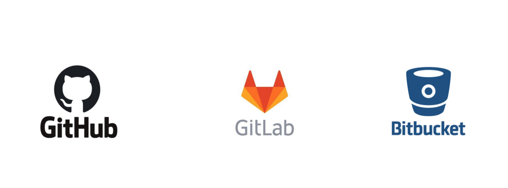
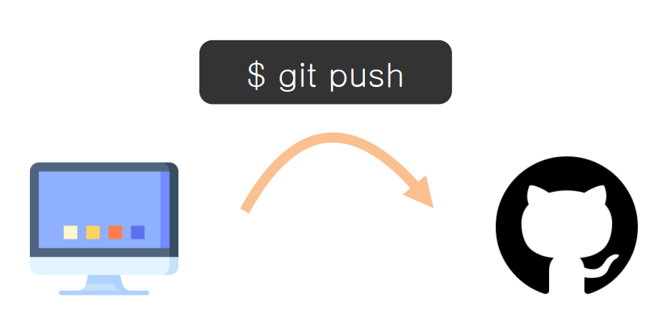
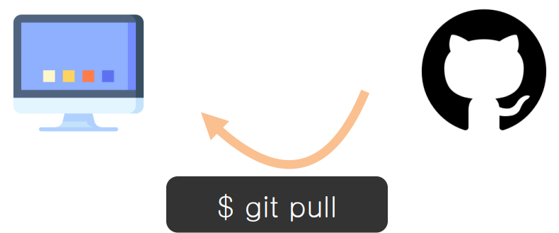

# 원격저장소 활용하기(GitHub)

## 분산버전관리시스템(DVCS)

* 중앙집중식버전관리시스템은 중앙에서 버전을 관리하고 파일을 받아서 사용
* 분산버전관리시스템은 원격 저장소(remote repository)를 통하여 협업하고, 모든 히스토리를 클라이언트들이 공유
* 네트워크를 활용한 저장소

### 원격 저장소(remote repository)의 기본 흐름

* 로컬 저장소의 버전을 원격저장소로 보낸다.

* 원격저장소의 버전을 로컬 저장소로 가져온다.

## 문법 정리

#### $ git remote add origin https://github.com/"Github Username"/"저장소이름"

> 원격 저장소 정보를 로컬 저장소에 추가

#### $ git remote -v

> 원격 저장소의 정보를 확인함

#### $ git remote rm origin(원격저장소)

> 원격저장소 삭제

#### $ git push origin master (원격저장소) (브랜치이름)

> 원격 저장소로 로컬 저장소 변경 사항(commit)을 올림(push)

#### $ git pull origin master (원격저장소) (브랜치이름)

> 원격 저장소로부터 변경된 내역을 받아와서 이력을 병합함

#### $ git clone https://github.com/"Github Username"/"저장소이름"(원격저장소주소)

> 원격 저장소를 복제하여 모든 버전을 가져옴

