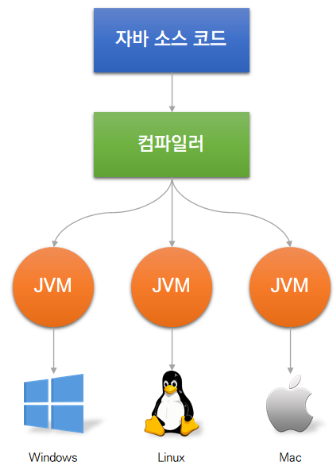
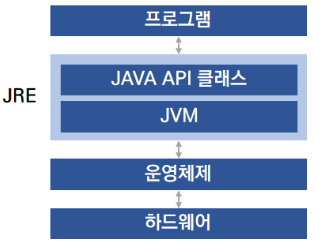
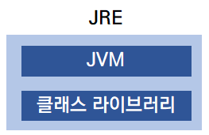
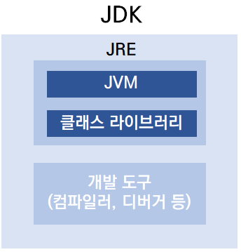
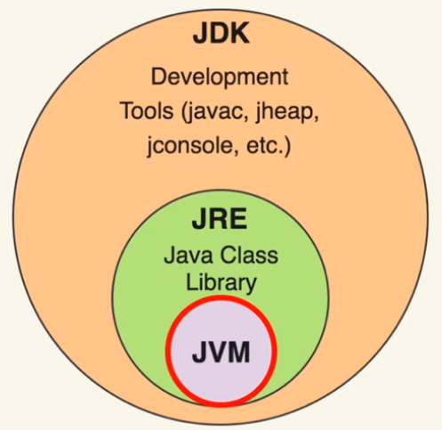
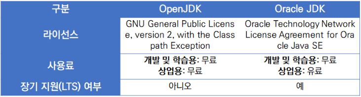
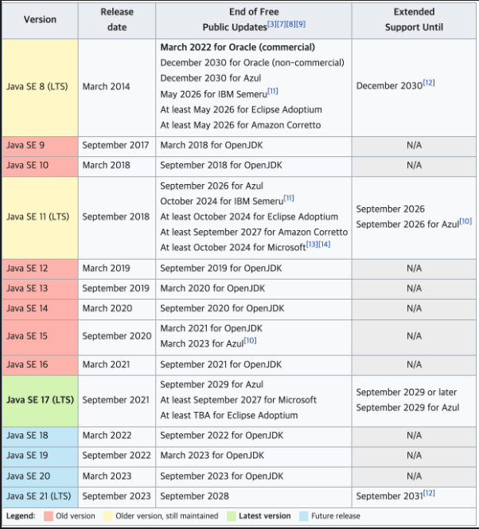

# Java

## 자바의 특징

1. 객체 지향 언어

   * 데이터나 정보의 표현에 중심을 둔 언어 

     (반대로 절차 지향 언어란, 프로세스 흐름에 중점을 둔 언어)

2. 자바는 단순합니다.

   * 다른 언어에서 논쟁의 여지가 있거나 복잡하고 지저분한 기능이 제외되었습니다.
   * ex ) 연산자 오버로딩

3. 자바는 이식성이 높습니다.

   * C나 C++ 같은 경우에는 플랫폼에 종속적입니다. 즉 다른 운영체제나 CPU에서 약간씩 코드가 달라집니다. 하지만 자바는 플랫폼에 독립적이어서 한번 작성하면 JVM이 설치된 모든 종류의 컴퓨터에서 프로그램을 실행할 수 있습니다.

4. 자바는 메모리 영역을 알아서 관리합니다.

이 밖에도 멀티스레드, 동적 로딩, 엄격한 타입 검사 등 많은 특징이 있습니다.

## JVM, JRE, JDK

### JVM (Java Virtual Machine)

> 자바 프로그램을 실행할 때, 자바 컴파일러는 우리가 작성한 자바 코드를 바이트 코드(.class 파일)로 컴파일하고 JVM은 자바 바이트 코드를 운영체제에 특화된 코드로 변환하는 역할을 합니다.
>
> JVM 덕분에 모든 플랫폼/운영체제에서 동일한 클래스 파일을 실행할 수 있습니다.
>
> 0과 1을 실행.

 

자바는 플랫폼에 독립적이지만 JVM은 플랫폼에 종속적입니다. 아래 그림과 같이 JVM이 운영체제와 프로그램 사이에서 중계하면서, 운영체제에 특화된 코드로 변환해야 하므로 운영체제마다 다른 JVM이 제공됩니다.

### JRE (Java Runtime Environment)

> JRE은 사용자의 컴퓨터에 자바 프로그램을 실행할 수 있는 환경을 제공하는 설치 패키지입니다.
>
> 자바 프로그램을 실행하기 위해서는 JRE를 설치해야 하지만, 개발 도구는 들어있지 않으므로 자바로 프로그래밍을 할 때는 JDK를 설치해야 합니다.

### JDK (Java Development Kit)

>JDK는 자바 프로그램을 개발하고 실행할 수 있는 환경을 제공하는 도구입니다. 
>
>JDK에는 JRE을 포함하여 컴파일러, 디버거, 자바독, 키툴 등과 같은 개발 도구가 들어가 있습니다.

* **JDK > JRE > JVM**

## Oracle JDK와 Open JDK의 차이

### Oracle JDK

OpenJDK는 **GPL(General Public License) v2**를 따르며, 6개월마다 새로운 버전을 배포합니다.

>**GPL(General Public License)**
자유 소프트웨어 재단(Free Software Foundation)에서 만든 오픈소스 라이선스입니다. 이 라이선스의 주요 특징을 살펴보면 다음과 같습니다. 아래와 같은 내용은 소프트웨어를 외부로 판매 혹은 배포할 때만 적용되며, 배포하지 않고 개인적인 목적으로 사용하고 있다면 소스 코드를 공개하지 않아도 됩니다.

1. GPL 라이선스 프로그램을 어떠한 목적으로든지 사용할 수 있다. 다만 법으로 제한하는 행위는 할 수 없다.
2. GPL 라이선스 프로그램의 실행 복사본은 언제나 프로그램의 소스 코드와 함께 판매하거나 소스 코드를 무료로 배포해야 한다.
3. GPL 라이선스 프로그램의 소스 코드를 용도에 따라 변경할 수 있다.
4. 변경된 컴퓨터  프로그램 역시 프로그램의 소스 코드를 반드시 공개 배포해야 한다.
5. 변경된 컴퓨터 프로그램 역시 반드시 똑같은 라이선스인 GPL 라이선스를 적용해야 한다.

### Open JDK

Oracle JDK은 **BCL(Binary Code License)**를 따랐지만, 2018년 9월에 출시한 **Oracle JDK 11 바이너리**부터는 BCL가 아닌 **OTNL(Oracle Technology Network License)**가 적용됩니다. 그리고 안정성을 중시하는 기업을 대상으로 하므로 자주 업데이트를 할 수 없기 때문에 OpenJDK와는 달리 3년간 사용할 수 있는 **장기 지원(LTS)**을 제공합니다.

>**BCL(Binary Code License)**
>BCL은 무료 사용 범위를 한정해 배포한 모델로, 서버 컴퓨터, PC, 태블릿, 스마트폰 등 일반적인 컴퓨팅 목적(General Purpose Computing)으로 사용 시에는 무료입니다. 반대로 임베디드 시스템 등처럼 특정 기능만을 위해 작동하는 시스템이나 솔루션과 같이 일반적이지 않은 컴퓨팅 목적으론 별도의 라이선스비를 지불해야 합니다.
>
>만약 일반적인 컴퓨팅 목적으로 사용했다고 하더라도 라이선스비를 지불해야 할 수도 있습니다. Oracle JDK에는 상업용 기능도 포함되어 있는데, 이 부분에 대해서 [오라클 BCL 계약](https://www.oracle.com/downloads/licenses/binary-code-license.html)에는 '귀하는 내부 비즈니스 운영에서 프로그램, 자바 애플릿 및 애플리케이션을 실행하거나 상업 및 생산 목적으로 상업용 기능을 사용할 수 없습니다.(You may not use the Commercial Features for running programs, Java applets or applications in your internal business operations or for any commercial or production purpose.)'라고 명시되어 있습니다.
>
>간단하게 상업용 기능을 사용하려면 상용 라이센스를 취득하면 되는거 아니냐라고 생각할 수 있는데, 상업용 기능이 위에서 말했듯이 Oracle JDK에 모두 포함되어 있기 때문에 실수로 상업용 기능을 사용하게 된다면 오라클의 라이선스 감사 대상이 될 수 있습니다.

## Java의 버전

* LTS(Long Time Support), 오래써도 되는 버전

## 빌드와 실행

### 빌드(build)

> 소스 코드 파일을 컴퓨터에서 실행할 수 있는 독립 SW 가공물로 변환시키는 과정
>
> 독립 SW 가공물 = Artifact

#### 과정

1. 소스 코드를 커파일 한다.
2. 테스트 코드를 컴파일 한다.
   * 테스트 코드 : 내가 작성한 코드를 자동 테스트 해주는 코드를 추가로 작성한 것
3. 테스트 코드를 실행한다.
4. 테스트 코드 리포트를 작성한다.
5. 기타 추가 설정한 작업들을 진행한다.
6. 패키징을 수행한다.
   * 오픈 소스 등을 하나로 묶어서 수행
7. 최종 SW 결과물(Artifact)을 만들어 낸다.

### 실행

> 내가 작성한 코드 (혹은 테스트 코드)를 컴파일을 거쳐, 작동시켜 보는 것
>
> 독립 SW 가공물이 나올 수도 있고, 나오지 않을 수도 있다.
>
> 주의 : 인터프리터 언어는 컴파일이 필요 없다.

### 빌드 툴(build tool)

> 소스코드의 빌드 과정을 자동으로 처리 해주는 프로그램
>
> 외부 소스 코드(외부 라이브러리) 자동 추가, 관리

* Ant
* maven
* gradle

 #### Ant

* 설정을 위해 XML을 사용한다.
* 간단하고 사용하기 쉽다.
* 복잡한 처리를 하려 하면 빌드 스크립트가 장황해져 관리가 어렵다.
* 외부 라이브러리를 관리하는 구조가 없다.

> 요즘 거의 사용하지 않는 것으로 보임

#### Maven

* 설정을 위해 xml을 사용한다.
* 외부 라이브러리를 관리할 수 있다.
* 장황한 빌드 스크립트 문제를 해결했다.
* 특정 경우에 xml이 복잡해진다.
* xml 자체의 한계가 있다.

> 요즘도 사용 하지만, 신규 PJ에는 지양하는 편

#### Gradle

* 설정을 위해 groovy언어를 사용한다.
* 외부 라이브러리를 관리할 수 있다.
* 유연하게 빌드 스크립트를 작성할 수 있다.
* 성능이 뛰어나다

> 가장 최신에 나온 Java 빌드 툴