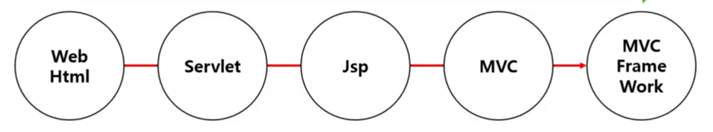
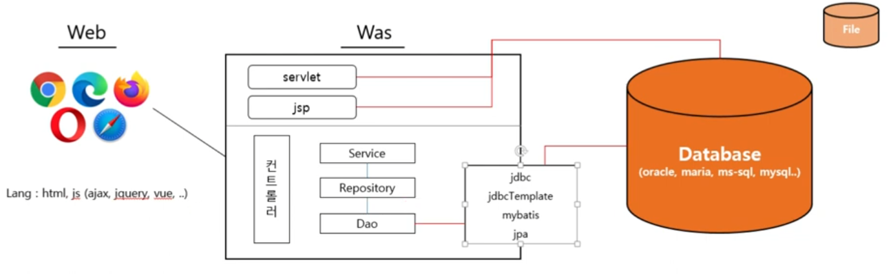

## Web Programming 변화과정

1. Web
   * Web의 Ui는 예전이나 지금이나 절대적으로 JTML로 구현
   * **Web의 대중화로 Web을 통한 데이터 입/출력의 필요성이 생긴다.(Dynamic Web)**
2. Servlet
   * Java 진영에서 Web Program을 지원
   * Web의 Ui는 예전이나 지금이나 절대적으로 HTML로 구현한다.
   * Web의 대중화로 Web을 통한 데이터 입/출력의 필요성이 생긴다.
     * 웹페이지의 동적생성 -Dynamic Web
   * **Servlet에 HTML을 구현한다. (자바 안에 HTML을 넣어버린다.)**
3. JSP
   * **Java진영에서 HTML에 java언어를 넣어버렸다.**
   * 초기 servlet에서 벗어난 개발자들이 환호..?
   * 시간이 지날 수록 JSP내의 자바 코드가 스파게티가 되어 개발자들의 흑역사가 시작..
4. MVC
   * HTML과 JAVA를 분리하자는 움직임이 생겨나다.(Front, Backend 분리)
   * Java내부에서도 받아들이는 입구와 비지니스 부분을 분리하는 움직임이 생겨나다.(MVC)
   * 표준 없이 개발자마다 MVC를 구현하는 상황이 발생하다.
5. MVC Frame Work
   * MVC개발 프레임워크를 만들어 배포
   * Spring이 개발자들에게 봄을 선사하기 위해 나타나다.
   * Spring이 더욱 간편해진 Springboot를 개발자들에게 선사하다.
   * **Spring이 봄을 선사해줄 걸로 기대했지만, 늦겨울이 오래가다.**

