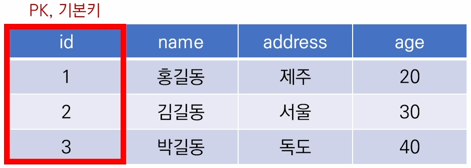

# DataBase

* 데이터베이스는 치계화된 데이터의 모임
* 여러 사람이 공유하고 사용할 목적


### 데이터베이스로 얻는 장점들

* 데이터 중복을 최소화
* 데이터 무결성 (정확한 정보를 보장)
* 데이터 일관성
* 데이터 독립성 (물리적 / 논리적)
* 데이터 표준화
* 데이터 보안 유지


# RDB

* 관계형 데이터 베이스
  * 서로 관련된 데이터를 저장하고 접근할 수 있는 데이터 베이스 유형
  * 키와 값들의 간단한 관계를 표 형태로 정리한 데이터베이스

|      |      |      |      |
| ---- | ---- | ---- | ---- |
|      |      |      |      |
|      |      |      |      |
|      |      |      |      |

* 스키마(schema)
  * 데이터베이스에서 자료의 구조, 표현방법, 관계 등 전반적인 명세를 기술한 것

| column  | datatype |
| ------- | -------- |
| id      | INT      |
| name    | TEXT     |
| address | TEXT     |
| age     | INT      |

* 테이블
  * 열(컬럼/필드)과 행(레코드/값)의 모델을 사용해 조직된 데이터의 요소들의 집함


* 행(row): 실제 데이터가 저장되는 형태
  * 아래의 예시에서는 총 3명의 고객정보가 저장되어 있음


* 기본키 (Primmary Key) : 각 행(레코드)의 고유 값
  * 반드시 설정해야 하며, 데이터베이스 관리 및 관계 설정 시 주요하게 활용 됨




## RDBMS

* 관계형 데이터베이스 관리 시스템(RDBMS)
  * 관계형 모델을 기반으로 하는 데이터베이스 관리시스템을 의미


* SQlite
  * 서버 형태가 아닌 파일 형식으로 응용 프로그램에 넣어서 사용하는 비교적 가벼운 데이터베이스
  * 구글 안드로이드 운영체제에 기본적으로 탑재된 데이터베이스이며, 임베디드 소프트웨어에도 많이 활용됨
  * 로컬에서 간단한 DB구성을 할 수 있으며, 오픈소스 프로젝트이기 때문에 자유롭게 사용가능

# SQL

* SQL (Structured Query Language)
  * 관계형 데이터베이스 관리시스템의 데이터 관리를 위해 설계된 특수 목적으로 프로그래밍 언어


| 분류                                                   | 개념 | 예시 |
| ------------------------------------------------------ | ---- | ---- |
| DDL - 데이터 정의 언어<br />(Date Definition Language) |      |      |
| DML - 데이터 조작 언어                                 |      |      |
| DCL - 데이터 제어 언어                                 |      |      |


## Hello World!

1. 데이터 베이스 생성하기

CREATE TABLE classmates(

​	id TNTEGER PRIMARY KEY,

​	name TEXT

);

```sqlite
--classmates라는 이름의 테이블 생성
CREATE TABLE classmates(
	name TEXT,
    age INT,
    address TEXT
);
-- 

```


* 필드 제약 조건
  * NOT NULL : NULL 값 입력 금지
  * UNIQUE : 중복 값 입력 금지 (NULL 값은 중복 입력 가능)
  * PRIMARY KEY : 테이블에서 반드시 하나. NOT NULL + UNIQUE
  * 


```sqlite
-- 제약조건의 테이블 생성
CREATE TABLE students(
	id INTEGER PRIMARY KEY,
	name TEXT NOT NULL,
    age INTEGER DEFAULT 1 CHECK (0 < age)
);

-- 1. id값은 유일하다.
-- 2. 이름은 비어서는 안된다.
-- 3. 나이는 기본값이 1이고 0보다는 커야한다.
-- # 필드이름, 타입, 제약조건으로 구성
```


# CRUD

## Create

* INSERT
  * 


## Read

* SELECT
  * 
  * 테이블에서 데이터를 조회
  * SELECT문은 SQLite에서 가장 기본이 되는 문
* LIMIT
* WHERE
* SELECT DISTINCT
* OFFSET


* 3번 id
  * SELECT rowid, name FROM classmates LIMIT 1 OFFSET 2;

* 서울사는사람
  * SELECT rowid, name FROM classmates WHERE address="서울";

* 30살 이상
  * SELECT * FROM classmates WHERE age >= 30;

* age값 전체를 중복 없이
  * SELECT DISTINCT age FROM classmates;

* 주소를 중복 없이
  * SELECT DISTINCT address FROM classmates;

## DELETE


* DELETE FROM classmates WHERE rowid=**;
*  
