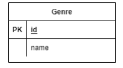
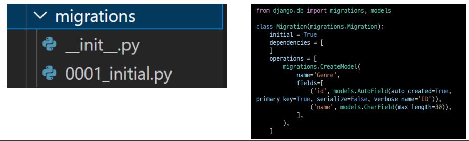
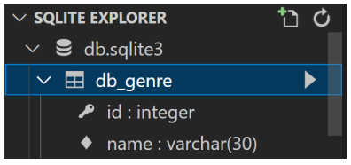
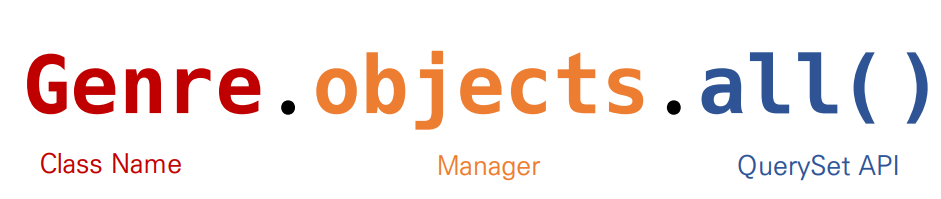

# ORM 

* 파이썬으로 데이터를 관리
* Object-Relational-mapping
* 객체 지향 프로그래밍 언어를 사용하여 호환되지 않는 유형의 시스템 간의 데이터를 변환하는 프로그래밍 기술
* 파이썬에서는 SQLAIchemy, peewee 등 라이브러리가 있으며 Django프레임워크에서는 내장 Django ORM을 활용
* 객체로 DB를 조작한다.

```python
Genre.objects.all() == SELECT * FROM genre;
```

* 모델 설계 및 반영

1. 클래스를 생성하여 내가 원하는 DB의 구조를 만든다.



```python
class Genre(models.model):
    name = models.CharField(max_length=30)
```

2. 클래스의 내용으로 데이터베이스에 반영하기 위한 마이그레이션 파일을 자동 생성한다.

```sql
$ python manage.py makemigrations
```



3. DB에 migrate한다.

```sql
$ python manage.py migrate
```



* Migration(마이그레이션)
  * model에 생긴 변화를 DB에 반영하기 위한 방법
  * 마이그레이션 파이을 만들어 DB스키마를 반영한다.
  * 명령어
    * makemigrations : 마이그레이션 파일 생성
    * migrate : 마이그레이션을 DB에 반영
      * 클래스생성 -> 테이블 생성
      * 필드 변경(수정, 삭제, 추가) -> 클래스 수정 -> makemigrations  -> migrate 

* Migrate *트랜잭션

```sql
BEGIN;
--
-- Create model Genre
--
CREATE TABLE "db_genre" (
"id" integer NOT NULL PRIMARY KEY AUTOINCREMENT,
"name" varchar(30) NOT NULL
);
COMMIT;
```

* 데이터베이스 조작(Database API)




* Create

```python
# 1. create 메서드 활용
Genre.objects.create(name='발라드')
# 2. 인스턴스 조작
genre = Genre()
genre.name = '인디밴드'
genre.save()
```

* Read

```python
# 1. 전체 데이터 조회
Genre.objects.all()
# <QuerySet [<Genre: Genre object (1)>, <Genre:
Genre object (2)>]>
# 2. 일부 데이터 조회(get)
Genre.objects.get(id=1)
# <Genre: Genre object (1)>
# 3. 일부 데이터 조회(filter)
Genre.objects.filter(id=1)
# <QuerySet [<Genre: Genre object (1)>]>
```


* Update

```python
# 1. genre 객체 활용
genre = Genre.objects.get(id=1)
# 2. genre 객체 속성 변경
genre.name = '트로트’
# 3. genre 객체 저장
genre.save()
```


* Delete

```python
# 1. genre 객체 활용
genre = Genre.objects.get(id=1)
# 2. genre 객체 삭제
genre.delete()
```


