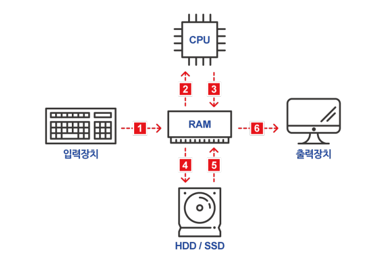
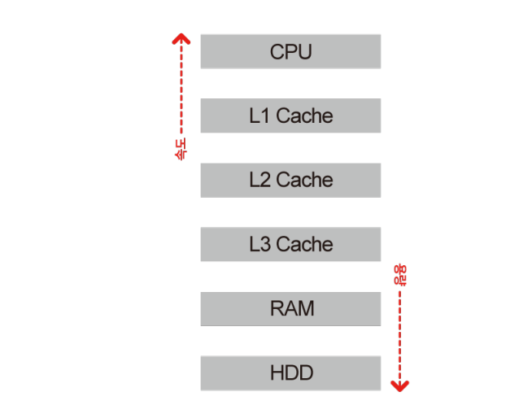

## **하드웨어**

> **하드웨어**는 컴퓨터를 물리적으로 구성하는 요소이며, 컴퓨터에 연결되어 추가적인 기능을 수행합니다.

### **중앙처리장치**(Central Processing Unit, CPU)

> 프로세서라고 불리기도 하는데, **입력장치에서 받은 명령을 실제로 처리**합니다. 

* CPU가 1초에 얼마나 많은 연산을 할 수 있는지 속도를 측정하는 단위는 기가헤르츠(GHz)입니다.

### **기억장치**

> 입력된 명령이나 데이터가 저장되는 공간

#### 주기억장치

* **RAM**
  * RAM은 기억된 정보를 읽어내기도 하고 다른 정보를 기억시킬 수 있는 메모리
  * 응용 프로그램을 일시적으로 불러오거나, 데이터를 일시적으로 저장하는데 사용되는 **임의 접근 기억 장치**
  * AM이 메모리에 얼마나 많은 양의 정보를 저장할 수 있는지 측정하는 단위는 보통 기가바이트(GB)

#### 보조기억장치

* **하드드라이브(C:)는영구적으로 데이터를 저장**
  * 판 모양의 플래터를 회전시켜 드라이브에 데이터를 읽고 쓰는 원리
* **SSD(Solid State Drive)**
  * 하드디스크와 달리 움직이는 부품 없이 더 빠른 속도로 데이터를 읽고 쓰는 대신 가격은 더 비쌉니다.

* 플래시 드라이브
  * USB 메모리 스틱 등
  * 이동식 저장공간 기기로 SSD와 마찬가지로 움직이는 부품이 없습니다

### **입출력장치**

* 컴퓨터에 자료를 입력장치로는 마우스, 키보드, 스캐너 등
* 컴퓨터의 출력장치로 대표적인 것은 모니터와 프린트

### **L1, L2, L3 캐시**

> **L1, L2, L3** **캐시**가 그것인데, L1 캐시가 이 셋 중에서 가장 작고 빠르며, 중앙처리장치가 재빨리 받아 처리할 수 있도록 몇 킬로바이트의 데이터만을 저장합니다. L2 캐시는 L1 캐시보다 조금 크지만, 그만큼 더 느립니다. L3 캐시는 보통 몇 메가바이트를 저장할 수 있어 셋 중 가장 크지만 가장 느립니다. 그래도 L3 캐시는 RAM보다는 빠릅니다.

## **CPU 캐시, 하드디스크, RAM**

> 데이터의 이동경로

