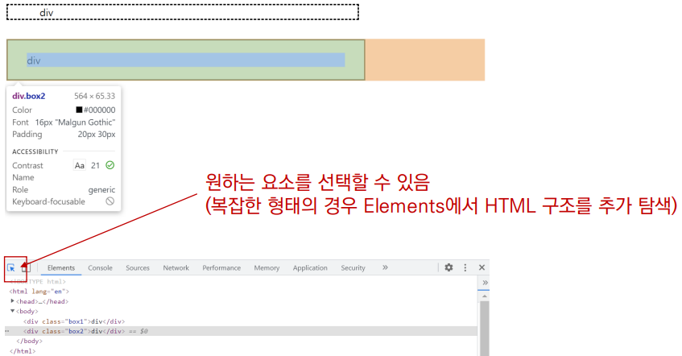
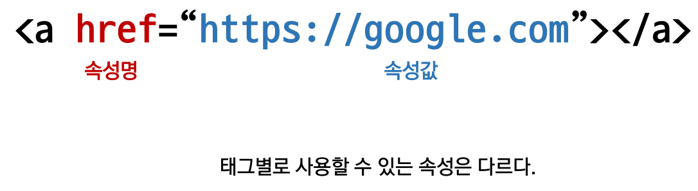
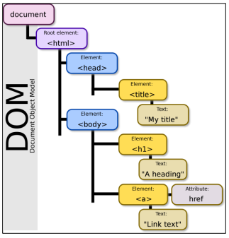
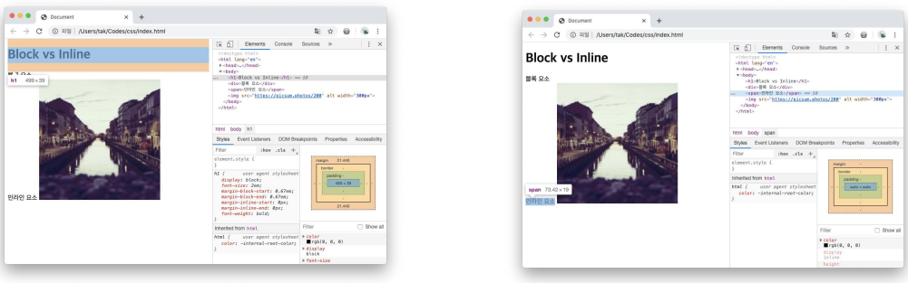
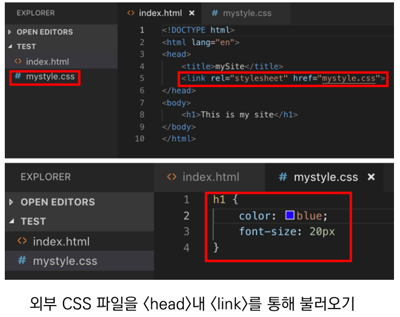
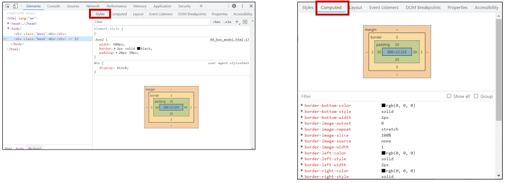

# HTML  (HTML Hyper Text Markup Language)

## HTML 기본 구조

* html : 문서의 최상위(root) 요소 
* head : 문서 메타데이터 요소 
  * 문서 제목, 인코딩, 스타일, 외부 파일 로딩 등 
  * 일반적으로 브라우저에 나타나지 않는 내용 
* body : 문서 본문 요소 
  * 실제 화면 구성과 관련된 내용

```html
<!DOCTYPE html>
<html lang="en">
<head>
	<meta charset="UTF-8">
	<title>Document</title>
</head>
<body>

</body>
</html>
```

* head 예시

  * <title\> : 브라우저 상단 타이틀
  * <meta\> : 문서 레벨 메타데이터 요소 
  * <link\> : 외부 리소스 연결 요소 (CSS 파일, favicon 등)
  * <script\> : 스크립트 요소(javaScript 파일/코드)
  * <style\> : CSS 직접 작성 

```html
<head>
	<title>HTML 수업</title>
	<meta charset="UTF-8">
	<link href="style.css" rel="stylesheet">
	<script src="javascript.js"></script>
	<style>
		p {
		color: black;
		}
	</style>
</head>
```

* head 예시 : open Graph Protocol
  * 메타 데이터를 표현하는 새로운 규약 
    * HTML 문서의 메타 데이터를 통해 문서의 정보를 전달 
    * 메타정보에 해당하는 제목, 설명 등을 쓸 수 있도록 정의

## 요소(element)

* HTML 요소는 시작 태그와 종료 태그 그리고 태그 사이에 위치한 내용으로 구성 
  * 요소는 태그로 컨텐츠(내용)를 감싸는 것으로 그 정보의 성격과 의미를 정의 
  * 내용이 없는 태그들도 존재(닫는 태그가 없음) 
    * br, hr, img, input, link, meta 
* 요소는 중첩(nested)될 수 있음 
  * 요소의 중첩을 통해 하나의 문서를 구조화 
  * 여는 태그와 닫는 태그의 쌍을 잘 확인해야함 
    * 오류를 반환하는 것이 아닌 그냥 레이아웃이 깨진 상태로 출력되기 때문에, 디버깅이 힘들어 질 수 있음

* elements : 해당 요소의 HTML 태그



* 속성(attribute)



* 속성을 통해 태그의 부가적인 정보를 설정할 수 있음 
* 요소는 속성을 가질 수 있으며, 경로나 크기와 같은 추가적인 정보를 제공 
* 요소의 시작 태그에 작성하며 보통 이름과 값이 하나의 쌍으로 존재 
* 태그와 상관없이 사용 가능한 속성(HTML Global Attribute)들도 있음

## HTML Global Attribute

* 모든 HTML 요소가 공통으로 사용할 수 있는 대표적인 속성 (몇몇 요소에는 아무 효과가 없을 수 있음) 
  * id : 문서 전체에서 유일한 고유 식별자 지정 
  * class : 공백으로 구분된 해당 요소의 클래스의 목록 (CSS, JS에서 요소를 선택하거나 접근) 
  * data-* : 페이지에 개인 사용자 정의 데이터를 저장하기 위해 사용 
  * style : inline 스타일 
  * title : 요소에 대한 추가 정보 지정 
  * tabindex : 요소의 탭 순서

```html
<!DOCTYPE html>
<html lang="en">
<head>
	<meta charset="UTF-8">
	<title>Document</title>
</head>
<body>
	<!-- 이것은 주석입니다. -->
	<h1>나의 첫번째 HTML</h1>
	<p>이것은 본문입니다.</p>
	<span>이것은 인라인요소</span>
	<a href="https://www.naver.com">네이버로 이동!!</a>
</body>
</html>
```


## DOM(Document Object Model) 트리

* 텍스트 파일인 HTML 문서를 브라우저에서 렌더링 하기 위한 구조 
  * HTML 문서에 대한 모델을 구성함 
  * HTML 문서 내의 각 요소에 접근 / 수정에 필요한 프로퍼티와 메서드를 제공함




## 인라인 / 블록 요소

* HTML 요소는 크게 인라인 / 블록 요소로 나눔 
* 인라인 요소는 글자처럼 취급 
* 블록 요소는 한 줄 모두 사용




### 개발자 도구

* Visual Studio Code
  * HTML/CSS 코드 작성을 위한 Visual Studio Code 추천 확장 프로그램 
    * Open in browser 
    * Auto Rename Tag 
    * Auto Close Tag 
    * Intellisense for CSS class names in HTML 
    * HTML CSS Support

* 크롬 개발자 도구
  * 웹 브라우저 크롬에서 제공하는 개발과 관련된 다양한 기능을 제공 
  * 주요 기능 
    * Elements – DOM 탐색 및 CSS 확인 및 변경 
    * Styles – 요소에 적용된 CSS 확인 
    * Computed – 스타일이 계산된 최종 결과 
    * Event Listeners – 해당 요소에 적용된 이벤트 (JS) 
  * Sources, Network, Performance, Application, Security, Audits 등

# CSS

* CSS 구문은 선택자를 통해 스타일을 지정할 HTML 요소를 선택 
* 중괄호 안에서는 속성과 값, 하나의 쌍으로 이루어진 선언을 진행 
* 각 쌍은 선택한 요소의 속성, 속성에 부여할 값을 의미 
  * 속성 (Property) : 어떤 스타일 기능을 변경할지 결정 
  * 값 (Value) : 어떻게 스타일 기능을 변경할지 결정


* 정의 방법
  * 인라인(inline) 
  * 내부 참조(embedding) - <style\>
  * 외부 참조(link file) - 분리된 CSS 파일


 ```html
 <!-- CSS 정의 방법 - 1 (인라인) -->
 <!DOCTYPE html>
 <html lang="en">
 <head>
 	<meta charset="UTF-8">
 	<meta name="viewport" content="width=device-width, initial-scale=1.0">
 	<title>Document</title>
 </head>
 <body>
 	<!-- 해당 태그에 직접 styel속성을 활용 -->
 	<h1 style="color: blue; font-size: 100px;">Hello</h1>
 </body>
 </html>
 
 
 <!-- CSS 정의 방법 - 2 (내부 참조) -->
 <!DOCTYPE html>
 <html lang="en">
 <head>
 	<meta charset="UTF-8">
 	<meta name="viewport" content="width=device-width, initial-scale=1.0">
 	<title>Document</title>
 <!-- head 태그 내에 style에 지정 -->
 <style>
 	h1 {
 		color: blue;
 		font-size: 100px;
 	}
 	</style>
 </head>
 <body>
 </body>
 </html>
 ```

* CSS 정의 방법 - 3 (외부 참조 )



* CSS 기초 선택자
  * 요소 선택자 
    * HTML 태그를 직접 선택 
  * 클래스(class) 선택자 
    * 마침표(.)문자로 시작하며, 해당 클래스가 적용된 항목을 선택 
  * 아이디(id) 선택자 
    * \# 문자로 시작하며, 해당 아이디가 적용된 항목을 선택 
    * 일반적으로 하나의 문서에 1번만 사용 
    * 여러 번 사용해도 동작하지만, 단일 id를 사용하는 것을 권장

### 개발자 도구

* styles : 해당 요소에 선언된 모든 CSS
* computed : 해당 요소에 최종 계산된 CSS

