## CSS Position

*  문서 상에서 요소의 위치를 지정 
* static : 모든 태그의 기본 값(기준 위치) 
  * 일반적인 요소의 배치 순서에 따름(좌측 상단) 
  * 부모 요소 내에서 배치될 때는 부모 요소의 위치를 기준으로 배치 됨 

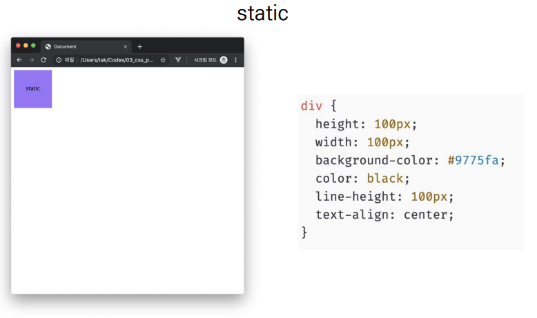

* 아래는 좌표 프로퍼티(top, bottom, left, right)를 사용하여 이동 가능 
  1. relative 
  2. absolute 
  3. fixed 
  4. sticky

1. relative : 상대 위치 
   * 자기 자신의 static 위치를 기준으로 이동 (normal flow 유지) 
   * 레이아웃에서 요소가 차지하는 공간은 static일 때와 같음 (normal position 대비 offset) 
   * 
2. absolute : 절대 위치 
   * 요소를 일반적인 문서 흐름에서 제거 후 레이아웃에 공간을 차지하지 않음 (normal flow에서 벗어남) 
   * static이 아닌 가장 가까이 있는 부모/조상 요소를 기준으로 이동 (없는 경우 브라우저 화면 기준으로 이동) 
   * 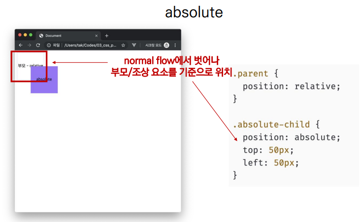
3. fixed : 고정 위치 
   * 요소를 일반적인 문서 흐름에서 제거 후 레이아웃에 공간을 차지하지 않음 (normal flow에서 벗어남) 
   * 부모 요소와 관계없이 viewport를 기준으로 이동 
   * 스크롤 시에도 항상 같은 곳에 위치함
   * 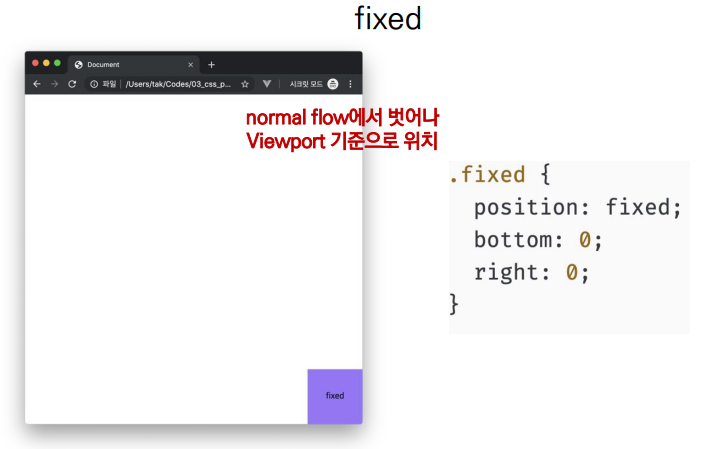
4. sticky: 스크롤에 따라 static -> fixed로 변경 
   * 속성을 적용한 박스는 평소에 문서 안에서 position: static 상태와 같이 일반적인 흐름에 따르지만 스크롤 위치가 임계점에 이르면 position: fixed와 같이 박스를 화면에 고정할 수 있는 속성
   * 일반적으로 Navigation Bar에서 사용됨
   * 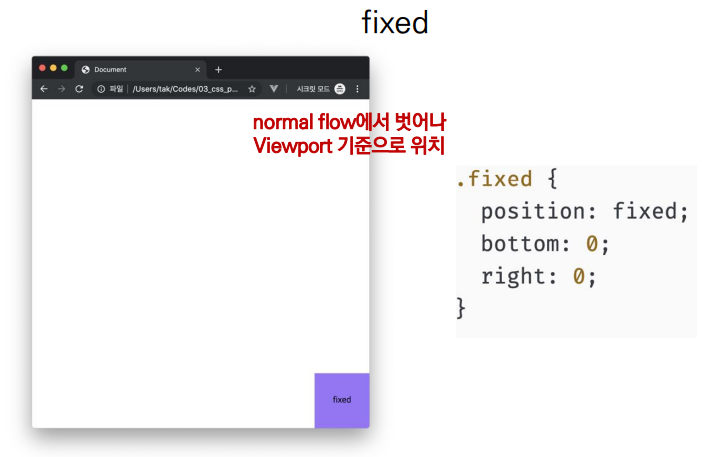

* CSS 원칙 I, II : Normal flow 
  * 모든 요소는 네모(박스모델), 좌측상단에 배치 
  * display에 따라 크기와 배치가 달라짐 
* CSS 원칙 III 
  * position으로 위치의 기준을 변경 
    * relative : 본인의 원래 위치 
    * absolute : 특정 부모의 위치 
    * fixed : 화면의 위치 
    * sticky: 기본적으로 static이나 스크롤 이동에 따라 fixed로 변경

## CSS Layout

* Display 
* Position 
* Float (CSS1, 1996) 
* Flexbox (2012) 
* Grid (2017) 
* 기타 
  * Responsive Web Design(2010), Media Queries (2012)

### Float

* 박스를 왼쪽 혹은 오른쪽으로 이동시켜 텍스트를 포함 인라인요소들이 주변을 wrapping 하도록 함 
* 요소가 Normal flow를 벗어나도록 함

```html
<body>
	<div class="box left">float left</div>
	<p>lorem300 자동 완성으로 길~게</p>
</body>

```

```css
.box {
	width: 150px;
	height: 150px;
	border: 1px solid black;
	background-color: crimson;
	color: white;
	margin-right: 30px;
}
.left {
	float: left;
}
```


### Flexbox

* CSS Flexible Box Layout
  * 행과 열 형태로 아이템들을 배치하는 1차원 레이아웃 모델 
  * 축 
    * main axis (메인 축) 
    * cross axis (교차 축) 
  * 구성 요소 
    * Flex Container (부모 요소) 
    * Flex Item (자식 요소)

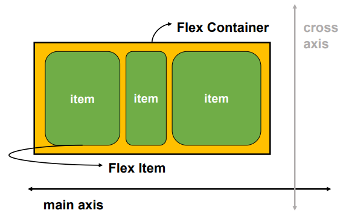

* flex-direction : row 

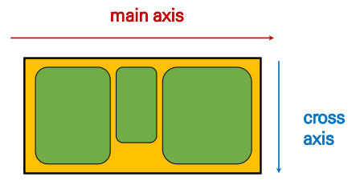

* Flex Container (부모 요소) 
  * flexbox 레이아웃을 형성하는 가장 기본적인 모델 
  * Flex Item들이 놓여있는 영역 
  * display 속성을 flex 혹은 inline-flex로 지정 
* Flex Item (자식 요소) 
  * 컨테이너에 속해 있는 컨텐츠(박스)


* flexbox 시작 (부모 요소에 display: flex 혹은 inline-flex)

```css
.flex-container {
	display: flex;
}
```

* 배치 설정 
  * flex-direction 
  * flex-wrap 
* 공간 나누기 
  * justify-content (main axis) 
  * align-content (cross axis) 
* 정렬 
  * align-items (모든 아이템을 cross axis 기준으로) 
  * align-self (개별 아이템)

#### flex-direction

* Main axis 기준 방향 설정 
* 역방향의 경우 HTML 태그 선언 순서와 시각적으로 다르니 유의 (웹 접근성에 영향)


#### flex-wrap

* 아이템이 컨테이너를 벗어나는 경우 해당 영역 내에 배치되도록 설정 
* 즉, 기본적으로 컨테이너 영역을 벗어나지 않도록 함


#### flex-direction & flex-wrap

* flex-direction : Main axis의 방향을 설정 
* flex-wrap : 요소들이 강제로 한 줄에 배치 되게 할 것인지 여부 설정 
  * nowrap (기본 값) : 한 줄에 배치 
  * wrap : 넘치면 그 다음 줄로 배치 
* flex-flow 
  * flex-direction 과 flex-wrap 의 shorthand 
  * flex-direction과 flex-wrap에 대한 설정 값을 차례로 작성 
  * 예시) flex-flow: row nowrap;

####  justify-content

* Main axis를 기준으로 공간 배분

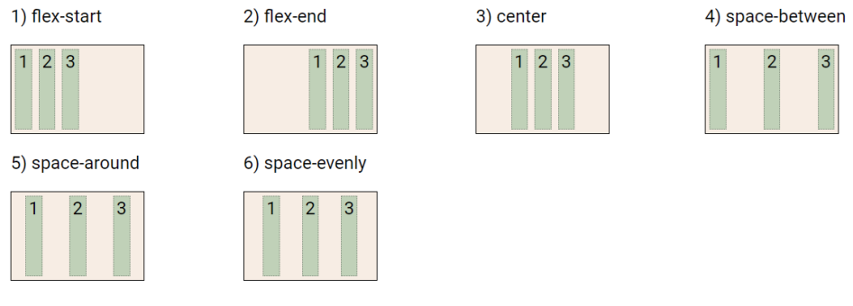

#### align-content

* Cross axis를 기준으로 공간 배분 (아이템이 한 줄로 배치되는 경우 확인할 수 없음)


#### justify-content & align-content

* 공간 배분 
  * flex-start (기본 값) : 아이템들을 axis 시작점으로 
  * flex-end : 아이템들을 axis 끝 쪽으로 
  * center : 아이템들을 axis 중앙으로 
  * space-between : 아이템 사이의 간격을 균일하게 분배 
  * space-around : 아이템을 둘러싼 영역을 균일하게 분배 (가질 수 있는 영역을 반으로 나눠서 양쪽에)
  * space-evenly : 전체 영역에서 아이템 간 간격을 균일하게 분배

#### align-items

* 모든 아이템을 Cross axis를 기준으로 정렬

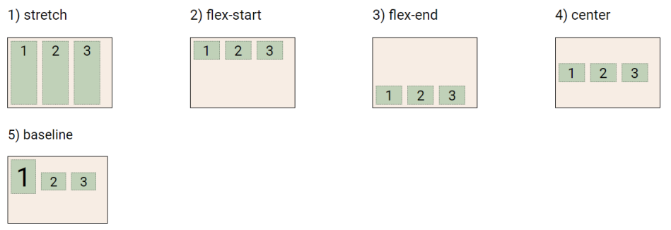

#### align-self

* 개별 아이템을 Cross axis 기준으로 정렬 
  * 주의! 해당 속성은 컨테이너에 적용하는 것이 아니라 개별 아이템에 적용


#### align-items & align-self

* Cross axis를 중심으로 
  * stretch (기본 값) : 컨테이너를 가득 채움 
  * flex-start : 위 
  * flex-end : 아래 
  * center : 가운데 
  * baseline : 텍스트 baseline에 기준선을 맞춤

#### 활용 레이아웃 – 수직 수평 가운데 정렬

```css
/* 방법 1
컨테이너 설정
*/
.container {
	display: flex;
	justify-content: center;
	align-items: center;
}
/* 방법 2
아이템 설정
*/
.container {
	display: flex;
}
.item {
	margin: auto;
}
```

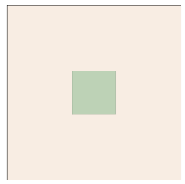

#### 활용 레이아웃 – 카드 배치

```css
#layout_03 {
    display: flex;
    flex-direction: column;
    flex-wrap: wrap;
    justify-content: space-around;
    align-content: space-around;
}

```

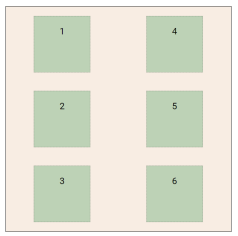


```css
#layout_03 {
    display: flex;
    flex-direction: row;
    flex-wrap: wrap;
    justify-content: space-around;
    align-content: space-around;
}
```

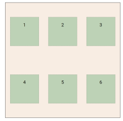