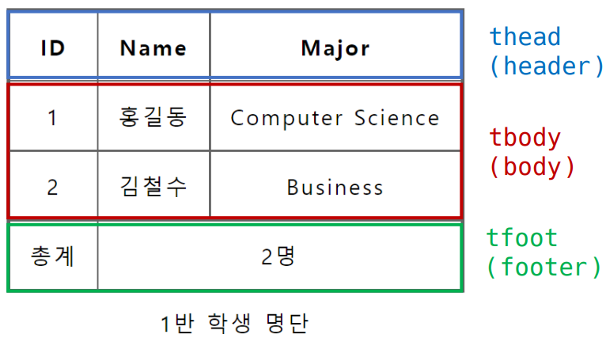
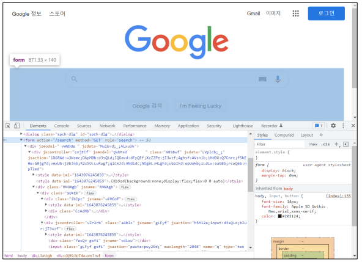
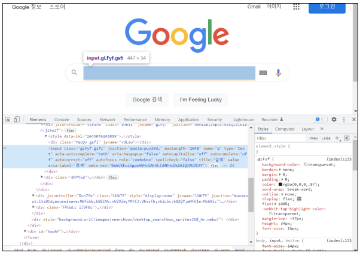
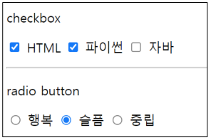
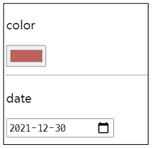

## HTML

* table의 각 영역을 명시하기 위해    <thead\>, <tbody\>, <tfoot\>요소를 활용



* <tr\>으로 가로 줄을 구성하고 내부에는  혹은 로 셀을 구성


* colspan, rowspan 속성을 활용하여 셀 병합


* <caption\>을 통해 표 설명 또는 제목을 나타냄


* table 태그 기본 구성 
  * thead 
    * tr > th 
  * tbody 
    * tr > td 
  * tfoot 
    * tr > td
  * caption

```html
<body>
    <table>
        <thead>
          <tr>
            <th>ID</th>
            <th>Name</th>
            <th>Major</th>
          </tr>
        </thead>
        <tbody>
            <tr>
                <th>1</th>
                <th>홍길동</th>
                <th>Computer Science</th>
            </tr>
        </tbody>
        <tfoot>
            <tr>
                <td>총계</td>
                <td colspan="2">2명</td>
            </tr>
        <</tfoot>
        <caption>1반 학생 명단</caption>
    </table>
</body>
```

### form

* <from\> 은 정보(데이터)를 서버에 제출하기 위해 사용하는 태그 
* <form\>기본 속성 
  * action : form을 처리할 서버의 URL(데이터를 보낼 곳) 
  * method : form을 제출할 때 사용할 HTTP 메서드 (GET 혹은 POST) 
  * enctype : method가 post인 경우 데이터의 유형 
    * application/x-www-form-urlencoded : 기본값 
    * multipart/form-data : 파일 전송시 (input type이 file인 경우) 
    * text/plain : HTML5 디버깅 용 (잘 사용되지 않음)

```html
<form action="/search" method="GET">
</form>
```



### input

* 다양한 타입을 가지는 입력 데이터 유형과 위젯이 제공됨 
*  <input\>대표적인 속성 
  * name : form control에 적용되는 이름 (이름/값 페어로 전송됨) 
  * value : form control에 적용되는 값 (이름/값 페어로 전송됨) 
  * required, readonly, autofocus, autocomplete, disabled 등

```html
<from action="/search" method="GET">
    <input type="text" name="q"
</from>      
```



### input label

* label을 클릭하여 input 자체의 초점을 맞추거나 활성화 시킬 수 있음 
  * 사용자는 선택할 수 있는 영역이 늘어나 웹 / 모바일(터치) 환경에서 편하게 사용할 수 있음 
  * label과 input 입력의 관계가 시각적 뿐만 아니라 화면리더기에서도 label을 읽어 쉽게 내용을 확인 할 수 있도록 함 
  * <input\>에 id 속성을, <label\>에는 for 속성을 활용하여 상호 연관을 시킴

```html
<label for="agreement">개인정보 수집에 동의합니다.</label>
<input type="checkbox" name="agreement" id="agreement">
```

### input 유형 - 일반

* 일반적으로 입력을 받기 위하여 제공되며 타입별로 HTML기본 검증 혹은 추가 속성을 활용할 수 있음 
  * text : 일반 텍스트 입력 
  * password : 입력 시 값이 보이지 않고 문자를 특수기호(*)로 표현 
  * email : 이메일 형식이 아닌 경우 form 제출 불가 
  * number : min, max, step 속성을 활용하여 숫자 범위 설정 가능 
  * file : accept 속성을 활용하여 파일 타입 지정 가능

### input 유형 – 항목 중 선택

* 일반적으로 label 태그와 함께 사용하여 선택 항목을 작성함 
* 동일 항목에 대하여는 name을 지정하고 선택된 항목에 대한 value를 지정해야 함 
  * checkbox : 다중 선택 
  * radio : 단일 선택

```html
<div>
	<p>checkbox</p>
	<input id="html" type="checkbox" name="language" value="html">
	<label for="html">HTML</label>
	<input id="python" type="checkbox" name="language" value="python">
	<label for="python">파이썬</label>
	<input id="python" type="checkbox" name="language" value="java">
	<label for="java">자바</label>
</div>
```



### input 유형 – 기타

* 다양한 종류의 input을 위한 picker를 제공 
  * color : color picker 
  * date : date picker 
* hidden input을 활용하여 사용자 입력을 받지 않고 서버에 전송되어야 하는 값을 설정 
  * hidden : 사용자에게 보이지 않는 input



