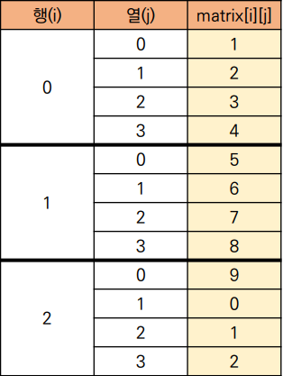
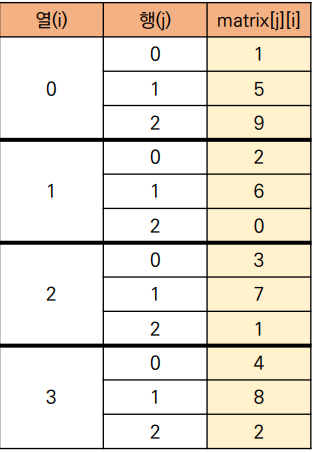
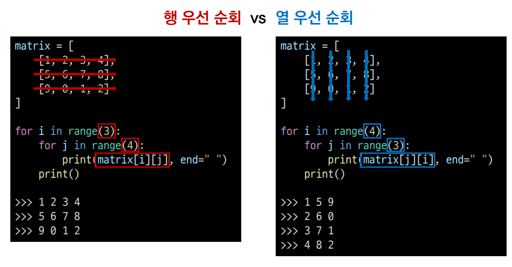
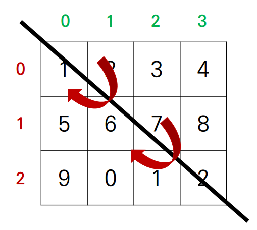
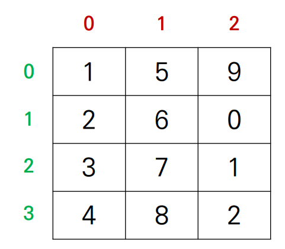
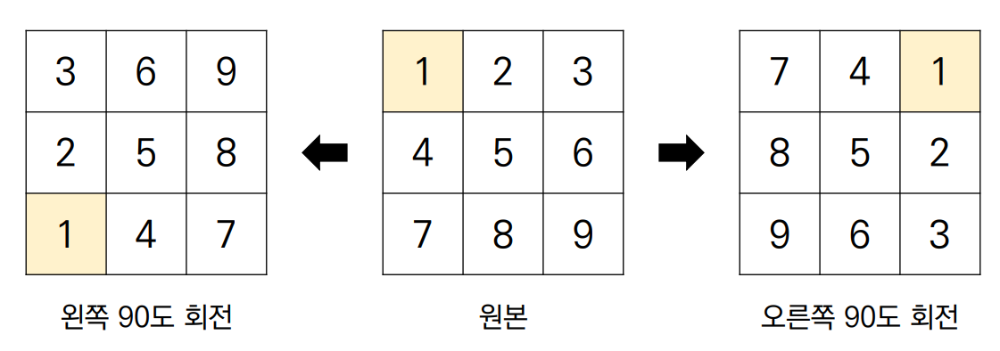

# 순회

* 이차원 리스트를 단순히 출력하면 아래와 같이 나온다.

```python
matrix = [
	[1, 2, 3, 4],
	[5, 6, 7, 8],
	[9, 0, 1, 2]
]

print(matrix)
>>> [[1, 2, 3, 4], [5, 6, 7, 8], [9, 0, 1, 2]]

```


## 이차원 리스트에 담긴 모든 원소를 출력하고 싶으면 어떻게 해야 할까?

1. 이중 for문을 이용한 행 우선 순회

```python
matrix = [
	[1, 2, 3, 4],
	[5, 6, 7, 8],
	[9, 0, 1, 2]
]

for i in range(3):
    for j in range(4):    # 하나의 행을 출력
        print(matrix[i][j], end=" ")
    print()
    
>>> 1 2 3 4
>>> 5 6 7 8
>>> 9 0 1 2

```




2. 이중 for문을 이용한 열 우선 순회

```python
matrix = [
	[1, 2, 3, 4],
	[5, 6, 7, 8],
	[9, 0, 1, 2]
]

for i in range(4):
    for j in range(3):	# 하나의 열을 출력
        print(mattrix[j][i], end=" ")
    print()

>>> 1 5 9
>>> 2 6 0
>>> 3 7 1
>>> 4 8 2
```






3. 행 우선 순회를 이용해 이차원 리스트의 총합 구하기

```python
matrix = [
	[1, 1, 1, 1],
	[1, 1, 1, 1],
	[1, 1, 1, 1]
]

total = 0

for i in range(3):
    for j in range(4):
        total += matrix[i][j]
    
print(total)
>>> 12

# Pythonic한 방법으로 이차원 리스트의 총합 구하기
matrix = [
	[1, 1, 1, 1],
	[1, 1, 1, 1],
	[1, 1, 1, 1]
]

total = sum(map(sum, matrix))

print(total)
>>> 12
```


4. 행 우선 순회를 이용해 이차원 리스트의 최대값, 최소값 구하기

```python
# 최대값
matrix = [
    [0, 5, 3, 1],
    [4, 6, 10, 8],
    [9, -1, 1, 5]
]
max_value = 0

for i in range(3):
    for j in range(4):
        if matrix[i][j] > max_value:
            max_value = matrix[i][j]

print(max_value)
>>> 10

# 최소값
min_value = 10e9

for i in range(3):
    for j in range(4):
        if matrix[i][j] < min_value:
            min_value = matrix[i][j]

print(min_value)
>>> -1


# Pythonic한 방법으로 이차원 리스트의 최대값, 최소값 구하기
matrix = [
	[0, 5, 3, 1],
	[4, 6, 10, 8],
	[9, -1, 1, 5]
]

max_value = max(map(max, matrix))
min_value = min(map(min, matrix))

print(max_value)
>>> 10

print(min_value)
>>> -1
```


# 전치

* 전치(transpose)란 행렬의 행과 열을 서로 맞바꾸는 것을 의미한다.





* 코드로는 아래와 같이 나타낸다.

```python
matrix = [
    [1, 2, 3, 4],
    [5, 6, 7, 8],
    [9, 0, 1, 2]
]
# 전치행렬을 담을 이차원 리스트 초기와 (행과 열의 크기가 반대)
transposed_matrix = [[0] * 3 for _ in range(4)]

for i in range(4):
    for j in range(3):
        transposed_matrix[i][j] = matrix[j][i] # 행, 열 맞바꾸기

print(transposed_matrix)
>>>[1, 5, 9],
>>>[2, 6, 0],
>>>[3, 7, 1],
>>>[4, 8, 2]

```


# 회전

* 문제에서 이차원 리스트를 왼쪽, 오른쪽으로 90도 회전하는 경우가 존재한다.



```python
# 왼쪽으로 90도 회전하기
matrix = [
    [1, 2, 3],
    [4, 5, 6],
    [7, 8, 9]
]

n = 3
# 회전행렬을 담을 이차원 리스트를 초기화
rotated_matrix = [[0] * n for _ in range(n)]

for i in range(n):
    for j in range(n):
        # 바꿀 이차원의 [0,0]공간에 기존의 [0,2]가 채워짐 
        rotated_matrix[i][j] = matrix[j][n-i-1]

pprint(rotated_matrix)
>>>[[3, 6, 9], 
>>> [2, 5, 8], 
>>> [1, 4, 7]]

# 오른쪽으로 90도 회전하기
matrix = [
    [1, 2, 3],
    [4, 5, 6],
    [7, 8, 9]
]

n = 3
# 회전행렬을 담을 이차원 리스트를 초기화
rotated_matrix = [[0] * n for _ in range(n)]

for i in range(n):
    for j in range(n):
        # 바꿀 이차원의 [0,0]공간에 기존의 [0,2]가 채워짐 
        rotated_matrix[i][j] = matrix[n-j-1][i]

pprint(rotated_matrix)
>>>[[7, 4, 1], 
>>> [8, 5, 2], 
>>> [9, 6, 3]]
```

