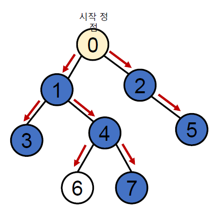
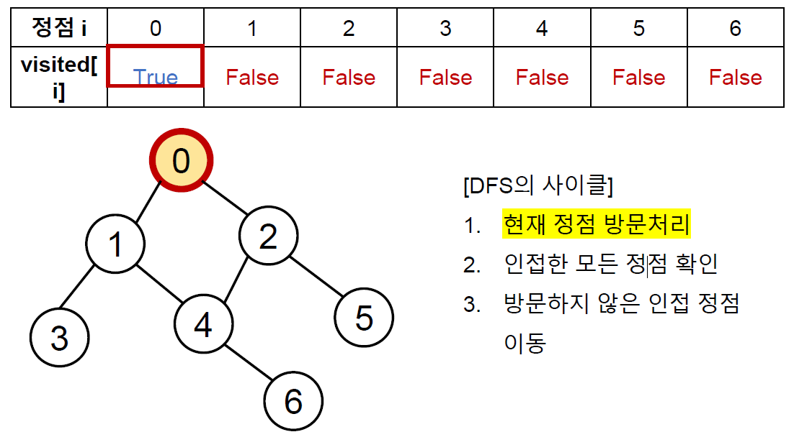
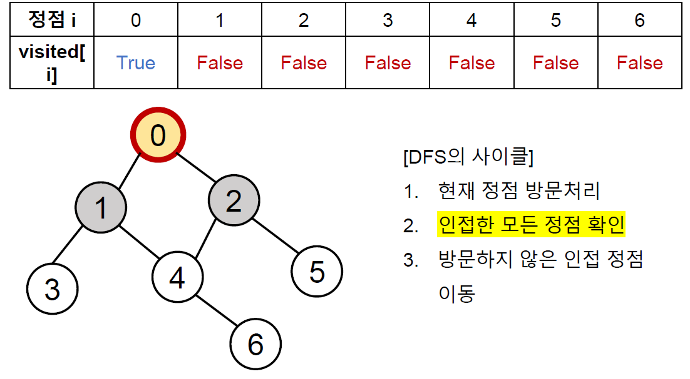
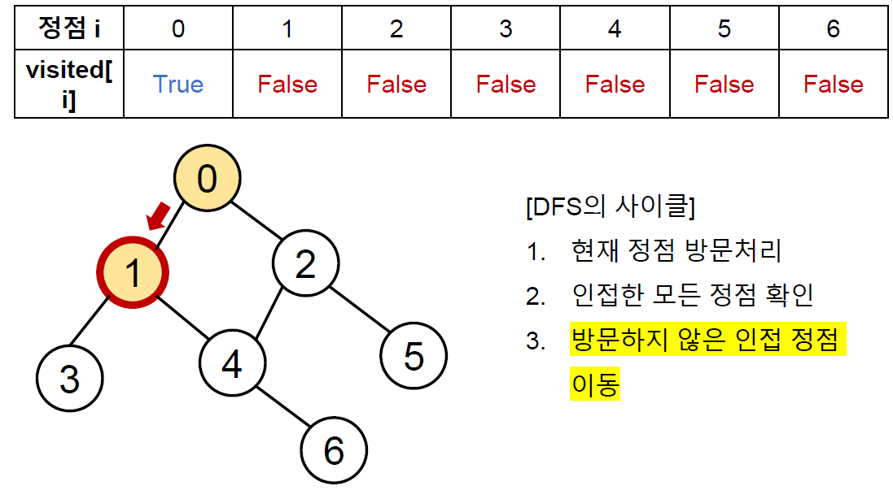
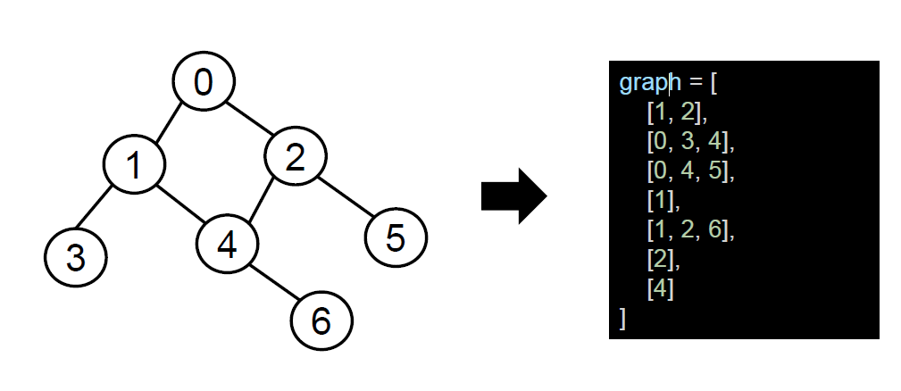

# 깊이우선탐색(DFS)

## 그래프 탐색 알고리즘

* 시작 정점에서 간선을 타고 이동할 수 있는 모든 정점을 찾는 알고리즘



* 스택 + 그래프
  * 깊이우선탐색 (Depth First Search,DFS)
    * 그래프의 깊이를 우선으로 탐색하기 위해 스택 의 개념을 활용한다.

* 큐 + 그래프
  * 너비우선탐색 (Breadth-First Search, BFS)
    * 그래프의 너비를 우선으로 탐색하기 위해 큐의 개념을 활용한다.

## 깊이우선탐색(DFS)

* 시작 정점으로부터 갈 수 있는 하위 정점까지 가장 깊게 탐색하고, 더 이상 갈 곳이 없다면 마지막 갈림길로 돌아와서 다른 정점을 탐색하며 결국 모든 정점을 방문하는 순회 방법

### 특징

* 모든 정점을 방문 할 때 유리하다 . 따라서 경우의 수 순열과 조합 문제에서 많이 사용
* 너비우선탐색(BFS)에 비해 코드 구현이 간단하다
* 단, 모든 정점을 방문할 필요가 없거나 최단 거리를 구하는 경우에는 너비우선탐색 (BFS)이 유리하다

## DFS의 동작 과정

* DFS를 하기 전에 , 일단 탐색을 진행할 그래프가 필요하다
* 그래프는 인접 행렬 혹은 인접 리스트 방식으로 표현할 수 있다


```python
graph = [
	[0 , 1 , 1 , 0 , 0 , 0 , 0],
	[1 , 0 , 0 , 1 , 1 , 0 , 0],
	[1 , 0 , 0 , 0 , 1 , 1 , 0],
	[0 , 1 , 0 , 0 , 0 , 0 , 0],
	[0 , 1 , 1 , 0 , 0 , 0 , 1],
	[0 , 0 , 1 , 0 , 0 , 0 , 0],
	[0 , 0 , 0 , 0 , 1 , 0 , 0],
]

graph = [
	[1 , 2],
	[0 , 3 , 4],
	[0 , 4 , 5],
	[1],
	[1 , 2 , 6],
	[2],
	[4]
]
```

* 각 정점을 방문했는지 여부를 판별할 방문 체크 리스트가 필요하다.
* 사람과 달리 컴퓨터는 각 정점에 방문했는지 여부를 알 수 없다.
* 따라서 visited리스트를 따로 선언하여 각 정점을 방문했는지 체크한다.

```python
visited = [False] * n # n은 정점의 개수
```

| 정점 i     | 0     | 1     | 2     | 3     | 4     | 5     | 6     |
| ---------- | ----- | ----- | ----- | ----- | ----- | ----- | ----- |
| visited[i] | False | False | False | False | False | False | False |

* 인덕스는 각 정점의 번호
* 방문한 정점은 True, 방문하지 않은 정점은 False








## DFS의 구현 방식




* 인접 리스트로 표현한 그래프

```python
# 인접 리스트 만들기
# 입력
0 1
0 2
1 3
1 4
2 4
2 5
4 6

n = 7
m = 7

graph = [[] for _ in range(n)]

for _ in gange(m):
    v1, v2 = map(int, input().splist())
    graph[v1].append(v2)
    graph[v2].append(v1)
```

* 반복문을 이용한 DFS
  * DFS는 직전에 방문한 정점으로 차례로 돌아가야 하므로, 후입선출(LIFO)구조의 스택을 사용한다.

```python
visited = [False] * n # 방문 처리 리스트 만들기

def dfs(start):
	stack = [start] # 돌아갈 곳을 기록
	visited[start] = True # 시작 정점 방문 처리

    while stack: # 스택이 빌 때까지(돌아갈 곳이 없을때까지) 반복
		cur = stack.pop() # 현재 방문 정점(후입선출)

        for adj in graph[cur]: # 인접한 모든 정점에 대해
			if not visited[adj]: # 아직 방문하지 않았다면
				visited[adj] = True # 방문 처리
				stack.append(adj) # 스택에 넣기
                
dfs(0) # 0번 정점에서 시작

```

