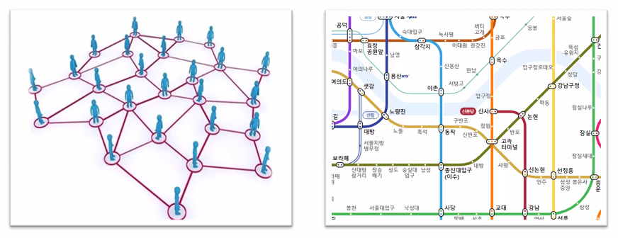

# 그래프

## 그래프에 대한 이해

* **정점(vertex)**과 이를 연결하는 **간선(Edge)**들의 집합으로 이루어진 비선형 자료구조
  * 소셜 네트워크와 지하철 노선도 같이, 현실에 있는 개체 간의 관계를 나타내기 위해 사용한다.

### 그래프 관련 용어

정점 : 간선으로 연결되는 객체이며, 노드(Node)라고도 한다.

간선 : 정점 간의 관계(연결)를 표현하는 선을 의미한다.

경로 : 시작 정점부터 도착 정점까지 거치는 정점을 나열한 것을 의미한다.

인접 : 두 개의 정점이 하나의 간선으로 직접 연결된 상태를 의미한다.

## 그래프의 종류

1. 무방향 그래프
   * 간선의 방향이 없는 가장 일반적인 그래프
   * 간선을 통해 양방향의 정점 이동 가능
   * 차수 : 하나의 정점에 연결된 간선의 개수
   * 모든 정점의 차수의 합 = 간선 수 x 2

2. 유방향 그래프
   * 간선의 방향이 있는 그래프
   * 간선의 방향이 가리키는 정점으로 이동 가능
   * 차수 : 진입 차수와 진출 차수로 나누어짐
     * 진입 차수 : 외부 정점에서 한 정점으로 들어오는 간선의 수
     * 진출 차수 : 한 정저에서 외부 정점으로 나가는 간선의 수

## 그래프의 표현

