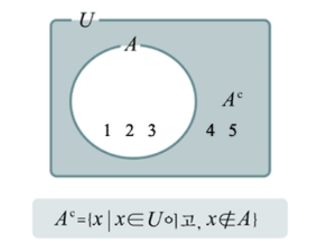
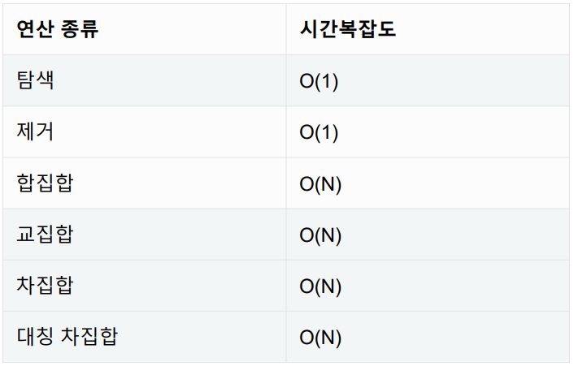

# 셋(Set)

* 셋(set)은 수학에서의 ‘집합’을 나타내는 데이터 구조로 Python에서는 기본적으로 제공되는 데이터 구조이다.

### 셋의 연산

1) .add( ) 
2) .remove( ) 
3) | ( 합 ) 
4) -( 차 ) 
5) & ( 교 ) 
6) ^ (대칭차)

### Set은 언제 사용해야할까?

1. 데이터의 중복이 없어야 할 때 (고유값들로 이루어진 데이터가 필요할 때)
2. 정수가 아닌 데이터의 삽입/삭제/탐색이 빈번히 필요할때

### 셋의 시간 복잡도

