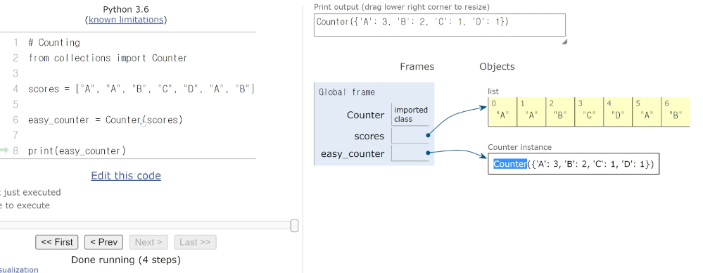

# 딕셔너리

## 해시 테이블

* 파이썬에는 딕셔너리 자료 구조가 내장 되어 있다.
* Key는 immutalble(변경 불가능)
* Non-sequence & Key - Value

```python
{
    "name" : "kyle",
    "gender" : "male",
    "address" : "seoul"
}
```


#### 파이썬의 딕셔너리 특징

* 해시 함수와 해시 테이블을 이용하기 때문에, 삽입, 삭제 수정, 조회 연산의 속도가 리스트보다 빠르다.

* Hash Function을 이용

#### 딕셔너리는 언제 사용해야할까?

1. 리스트를 사용하기 힘든 경우
2. 데이터에 대한 빠른 접근 탐색이 필요한 경우
3. ( 현실 세계의 대부분의 데이터를 다룰 경우)

#### 딕셔너리 연산과 리스트 연산의 비교

|      |      |      |
| ---- | ---- | ---- |
|      |      |      |
|      |      |      |
|      |      |      |
|      |      |      |
|      |      |      |
|      |      |      |
|      |      |      |


## 딕셔너리 기본 문법

### 1. 선언

변수 = {key1:value1, key2:value2 ...}

```python
a = {
    "name" : "kyle",
    "gender" : "male",
    "address" : "seoul"
}
print(a)
# {'name': "kyle", "gender": "male", "address": "seoul"}
```

### 2. 삽입/수정

* 딕셔너리[key] = value 
* 내부에 해당 key가 없으면 삽입, 있으면 수정

```python
# 삽입
a = {
    "name" : "kyle",
    "gender" : "male",
    "address" : "seoul"
}

a["job"] = "coach"
print(a)
# {'name':'kyle', 'gender': 'male', 'address': 'seoul', 'job': 'coach'}

# 수정
a = {
    "name" : "kyle",
    "gender" : "male",
    "address" : "seoul"
}

a["name"] = "justin"
print(a)
# {'name':'justin', 'gender': 'male', 'address': 'seoul'}
```

### 3. 삭제

* 딕셔너리.pop(key)
* 내부에 존재하는 key에 대한 value 삭제 및 반환, 존재하지 않는 key에 대해서는 KeyError 발생

```python
# 정상적인 삭제
a = {
    "name" : "kyle",
    "gender" : "male",
    "address" : "seoul"
}

gender = a.pop("gender")
print(a)
print(gender)
# {'name':'justin', 'address': 'seoul'}
# male

# 존재하지 않는 것 삭제
a = {
    "name" : "kyle",
    "gender" : "male",
    "address" : "seoul"
}

phone = a.pop("phone")
print(a)
print(phone)
# KeyError
```


* 딕셔너리.pop(key, default)
* 두 번째 인자로 default(기본)값을 지정하여 KeyError 방지 가능

```python
a = {
    "name" : "kyle",
    "gender" : "male",
    "address" : "seoul"
}

phone = a.pop("phone", "010-1234-5678")
print(a)
print(phone)
# {'name':'justin', 'address': 'seoul'}
# 010-1234-5678
```

### 4. 조회

* key에 해당하는 value 반환

```python
# 딕셔너리[key]
a = {
    "name" : "kyle",
    "gender" : "male",
    "address" : "seoul"
}

print(a["name"])
# kyle

# 딕셔너리.get(key)
a = {
    "name" : "kyle",
    "gender" : "male",
    "address" : "seoul"
}

print(a.get("name"))
# kyle
```


## 딕셔너리 메서드

### 1. .keys()

* 딕셔너리의 key 목록이 담긴 dict_keys 객체 반환

```python
a = {
    "name" : "kyle",
    "gender" : "male",
    "address" : "seoul"
}

print(a.keys())
# dict_keys(['name', 'gender', 'address'])

a = {
    "name" : "kyle",
    "gender" : "male",
    "address" : "seoul"
}

for key in a.keys():
    print(key)
# name
# gender
# address

a = {
    "name" : "kyle",
    "gender" : "male",
    "address" : "seoul"
}

for key in a:
    print(key)
# name
# gender
# address    

```


### 2. .values()

* 딕셔너리의 value 목록이 담긴 dict_values 객체 반환

```python
a = {
    "name" : "kyle",
    "gender" : "male",
    "address" : "seoul"
}

print(a.values())
# dict_values(['kyle', 'male', 'seoul'])

a = {
    "name" : "kyle",
    "gender" : "male",
    "address" : "seoul"
}
for value in a.values():
    print(value)
# kyle
# male
# seoul
```


### 3. .items()

* 딕셔너리의 (key, value) 쌍 목록이 담긴 dict_items 객체 반환

```python
# 1
a = {
    "name" : "kyle",
    "gender" : "male",
    "address" : "seoul"
}

print(a.items())
# dict_ltems(['name', 'kyle', 'gender', 'male', 'address', 'seoul'])

# 2
a = {
    "name" : "kyle",
    "gender" : "male",
    "address" : "seoul"
}
for item in a.items():
    print(item)
# ('name', 'kyle')
# ('gender', 'male')
# ('address', 'seoul')

# 3
a = {
    "name" : "kyle",
    "gender" : "male",
    "address" : "seoul"
}
for key, value in a.items():
    print(key, value)
# name kyle
# gender male
# address seoul
```


#### 딕셔너리로 카운터 하는 법


#### 더 쉬운 카운팅하는법..




