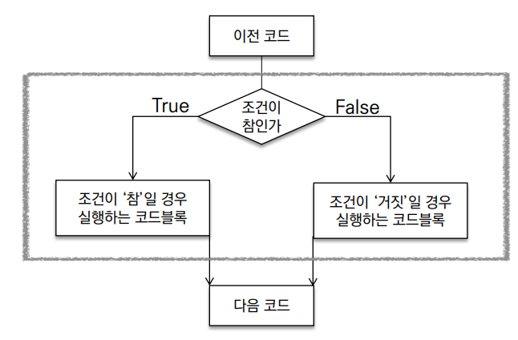
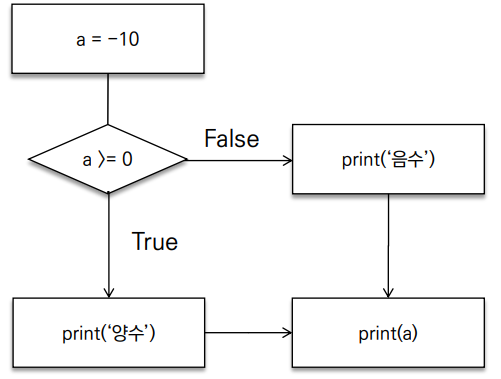
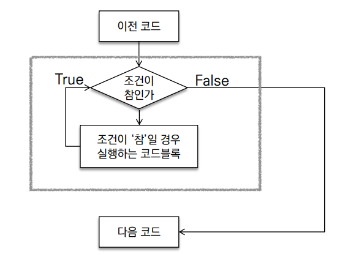
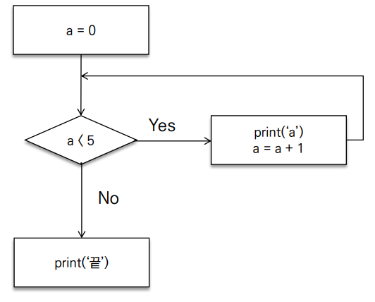
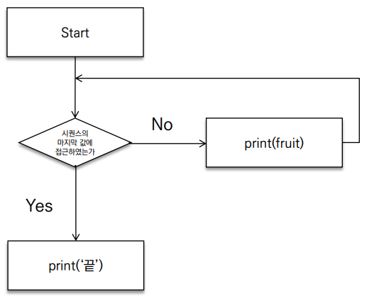
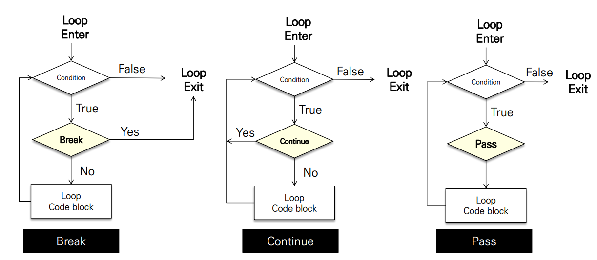

# 조건문

* 조건문은 참/거짓을 판단할 수 있는 조건식과 함께 사용



* expression에는 참/거짓에 대한 조건식
  * 조건이 참인 경우 이후 들여쓰기 되어있는 코드 블럭을 실행
  * 이외의 경우 else 이후 들여쓰기 되어있는 코드 블럭을 실행
    * else는 선택적으로 활용 가능함

```python
if < expression >:
    # run this code block
else:
    # run this code block
```

* 아래의 순서도를 코드로 나타내세요



```python
a = -10
if a >= 0:
    print('양수')
else:
    print('음수')
print(a)
```

* 조건문을 통해 변수 num의 값의 홀수/짝수 여부를 출력하시오.
  * 이때 num은 input을 통해 사용자로부터 입력을 받으시오.

```python
num = int(input())
if num % 2 == 1:
    print('홀')
else:
    print('짝')
```

#### 복수 조건문

```python
if <expression>:
    # Code block
elif <expression>:
    # Code block
elif <expression>:
    # Code block
else:
	# Code block
```

#### 중첩 조건문

```python
if <expression>
	# Code block
    if <expression>
    	# Code block
else:
    # Code block
```

#### 조건 표현식

* 조건 표현식을 일반적으로 조건에 따라 값을 할당 할 때 활용

```python
<true인 경우 값> if <expression> else <false인 경우 값>
```


# 반복문

* 특정 조건을 도달할 때까지, 계속 반복되는 일련의 문장




##### 종류

* while 문
  * 종료조건에 해당하는 코드를 통해 반복문을 종료시켜야 함
* for 문
  * 반복가능한 객체를 모두 순회하면 종료 (별도의 종료조건이 필요 없음)
* 반복 제어
  * break, continue, for-else

#### while

* while문은 조건식이 참인 경우 반복적으로 코드를 실행
  * 조건이 참인 경우 들여쓰기 되어 있는 코드 블록이 실행됨
  * 코드 블록이 모두 실행되고, 다시 조건식을 검사하며 반복적으로 실행됨
  * while문은 무한 루프를 하지 않도록 종료조건이 반드시 필요

```python
while <expression>
	# Code block
```

* 예시



```python
a = 0
while a < 5
	print(a)
    a += 1
print('끝')
```


#### for문

* for문은 시퀀스(string, tuple, list, range)를 포함한 순회가능한 객체(iterable) 요소를 모두 순회함
  * 처음부터 끝까지 모두 순회하므로 별도의 종료조건이 필요하지 않음

```python
for <변수> in <iterable>
	# code block
```

* 예시



```python
for fruit in ['apple', 'mango', 'banana']:
	print(fruit)
print('끝')

# apple
# mango
# banana
```

#### 반복문 제어

* break
  * 반복문을 종료
* continue
  * continue 이후의 코드 블록은 수행하지 않고, 다음 반복을 수행
* for-else
  * 끝까지 반복문을 실행한 이후에 else문 실행
    * break를 통해 중간에 종료되는 경우 else 문은 실행되지 않음



##### break

* break문을 만나면 반복문은 종료됨

```python
for i in range(10):
	if i > 1:
		print('0과 1만 필요해!')
		break
print(i)

# 0
# 1
# 0과 1만 필요해!
```

##### continue

* continue 이후의 코드 블록은 수행하지 않고, 다음 반복을 수행

```python
for i in range(6):
	if i % 2 == 0:
		continue
	print(i)
    
# 1
# 3
# 5
```

##### for-else

* else 문은 break로 중단되었는지 여부에 따라 실행

```python
for char in 'apple':
	if char == 'b':
		print('b!')
		break
else:
	print('b가 없습니다.')
    
# b가 없습니다.
```

