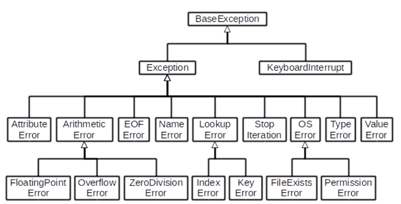
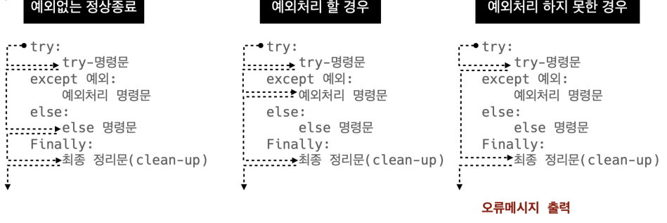
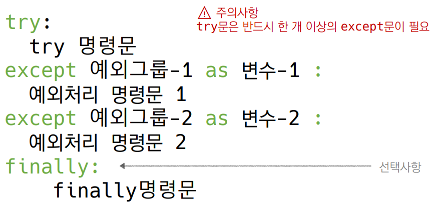
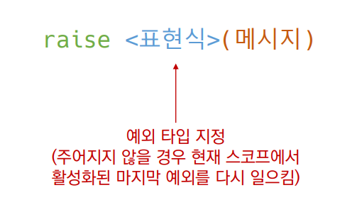

# 에러/예외 처리

## 디버깅 

* branches
  * 모든 조건이 원하는대로 동작하는지 
* for loops 
  * 반복문에 진입하는지, 원하는 횟수만큼 실행되는지 
* while loops  
  * for loops와 동일, 종료조건이 제대로 동작하는지 
* function  
  * 함수 호출시, 함수 파라미터, 함수 결과


-----------------

* print 함수 활용 
  * 특정 함수 결과, 반복/조건 결과 등 나눠서 생각, 코드를 bisection으로 나눠서 생각 
* • 개발 환경(text editor, IDE) 등에서 제공하는 기능 활용 
  * breakpoint, 변수 조회 등 
* Python tutor 활용 (단순 파이썬 코드인 경우) 
* 뇌컴파일, 눈디버깅

## 에러와 예외 

### 문법 에러(Syntax Error)

* SyntaxError가 발생하면, 파이썬 프로그램은 실행이 되지 않음 
* 파일이름, 줄번호, ^ 문자를 통해 파이썬이 코드를 읽어 나갈 때(parser) 문제가 발생한 위치를 표현 
* 줄에서 에러가 감지된 가장 앞의 위치를 가리키는 캐럿(caret)기호(^)를 표시

### 예외

* 실행 도중 예상치 못한 상황을 맞이하면, 프로그램 실행을 멈춤 
  * 문장이나 표현식이 문법적으로 올바르더라도 발생하는 에러 
* 실행 중에 감지되는 에러들을 예외(Exception)라고 부름 
* 예외는 여러 타입(type)으로 나타나고, 타입이 메시지의 일부로 출력됨 
  * NameError, TypeError 등은 발생한 예외 타입의 종류(이름) 
* 모든 내장 예외는 Exception Class를 상속받아 이뤄짐 
* 사용자 정의 예외를 만들어 관리할 수 있음
* 파이썬 내장 예외 (built-in-exceptions)



## 예외 처리 

* try 문(statement) / except 절(clause)을 이용하여 예외 처리를 할 수 있음 
* try문 
  * 오류가 발생할 가능성이 있는 코드를 실행 
  * 예외가 발생되지 않으면, except 없이 실행 종료 
* except 문 
  * 예외가 발생하면, except 절이 실행 
  * 예외 상황을 처리하는 코드를 받아서 적절한 조치를 취함



* 작성방법



#### 정리

1. try
   * 코드를 실행함 

2. except
   * try 문에서 예외가 발생 시 실행함 

3. else 
   * try 문에서 예외가 발생하지 않으면 실행함 
4. finally 
   * 예외 발생 여부와 관계없이 항상 실행함


## 예외 발생 시키기

* raise를 통해 예외를 강제로 발생



• raise를 통해 예외를 강제로 발생

```python
raise
# -------
# RuntimeError Traceback (most recent call last)
# ----> 1 raise
# RuntimeError: No active exception to reraise
```

