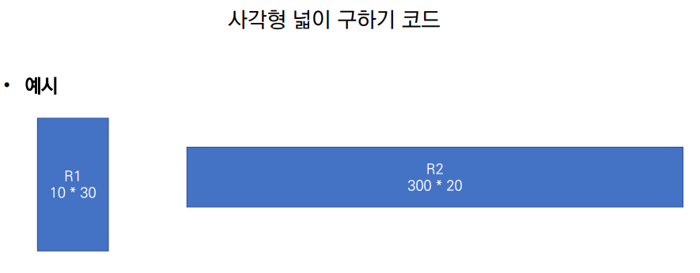
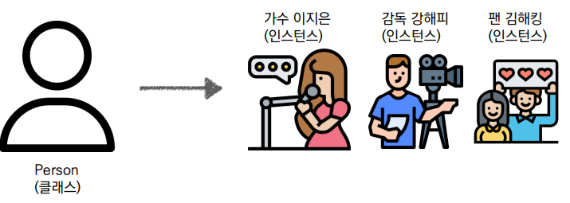
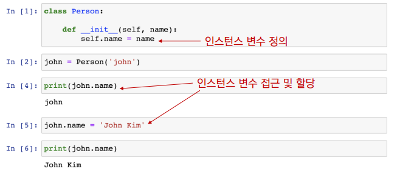
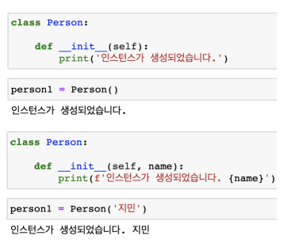
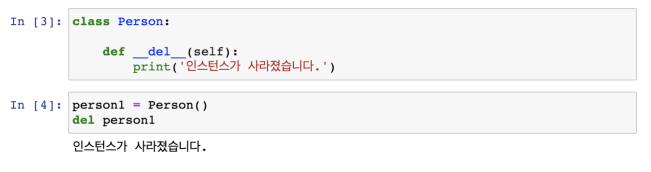

# 객체지향 프로그래밍

* 파이썬은 모두 객체(object)로 이뤄져 있다.
  * 123, 900, 5는 모두 int의 인스턴스
  * 'hello', 'bye'는 모두 string의 인스턴스
  * [232, 89, 1], []은 모두 list의 인스턴스

### 객체

* 객체(object)의 특징
  * 타입(type) : 어떤 연산자(operator)와 조작(method)이 가능한가? 
  * 속성(attribute) : 어떤 상태(데이터)를 가지는가? 
  * 조작법(method) : 어떤 행위(함수)를 할 수 있는가? 
* 객체지향 프로그래밍이란? 
  * 프로그램을 여러 개의 독립된 객체들과 그 객체들 간의 상호작용으로 파악하는 프로그래밍 방법



* 사각형 - **클래스(class)** 
* 각 사각형 (R1,R2) – **인스턴스(instance)** 
* 사각형의 정보 - **속성(attribute)**
  * 가로 길이, 세로 길이 
* 사각형의 행동/기능 – **메소드(method)** 
  * 넓이를 구한다. 높이를 구한다.

## OOP 기초

#### 기본 문법

```python
# 클래스 정의
class MyClass:
pass
# 인스턴스 생성
my_instance = MyClass()
# 메서드 호출
my_instance.my_method()
# 속성
my_instance.my_attribute
```

* 객체의 틀(클래스)을 가지고, 객체(인스턴스)를 생성한다.



* 클래스와 인스턴스 
  * 클래스 : 객체들의 분류(class)
  * 인스턴스 : 하나하나의 실체/예(instance)

```python
class Person:
pass
print(type(Person))
# type
p1 = Person()
type(p1)
# __main__.Person
isinstance(p
```

* 속성
  * 특정 데이터 타입/클래스의 객체들이 가지게 될 상태/데이터를 의미

* 메소드
  * 특정 데이터 타입/클래스의 객체에 공통적으로 적용 가능한 행위(함수)

* 객체 비교하기 
* == 
  * 동등한(equal) 
  * 변수가 참조하는 객체가 동등한(내용이 같은) 경우 True 
  * 두 객체가 같아 보이지만 실제로 동일한 대상을 가리키고 있다고 확인해 준 것은 아님 
* is
  * 동일한(identical) 
  * 두 변수가 동일한 객체를 가리키는 경우 True 

```python
a = [1, 2, 3]
b = [1, 2, 3]

print(a == b, a is b)
# True False
----------------------------
a = [1, 2, 3]
b = a

print (a == b, a is b)
True True
```

* 인스턴스 변수
  * 인스턴스가 개인적으로 가지고 있는 속성(attribute) 
  * 각 인스턴스들의 고유한 변수 
* 생성자 메소드에서 self.으로 정의 
* 인스턴스가 생성된 이후 .으로 접근 및 할당

​	

* 인스턴스 메소드 
  * 인스턴스 변수를 사용하거나, 인스턴스 변수에 값을 설정하는 메소드 
  * 클래스 내부에 정의되는 메소드의 기본 
  * 호출 시, 첫번째 인자로 인스턴스 자기자신(self)이 전달됨

```python
class MyClass:
def instance_method(self, arg1, …):
```

* self
  * 인스턴스 자기자신 
  * 파이썬에서 인스턴스 메소드는 호출 시 첫번째 인자로 인스턴스 자신이 전달되게 설계 
    * 매개변수 이름으로 self를 첫번째 인자로 정의 
    * 다른 단어로 써도 작동하지만, 파이썬의 암묵적인 규칙

* 생성자(constructor) 메소드 
  * 인스턴스 객체가 생성될 때 자동으로 호출되는 메소드 
  * 인스턴스 변수들의 초기값을 설정 
    * 인스턴스 생성 
    * __init__메소드 자동 호출



* 소멸자(destructor) 메소드 
  * 인스턴스 객체가 소멸(파괴)되기 직전에 호출되는 메소드

