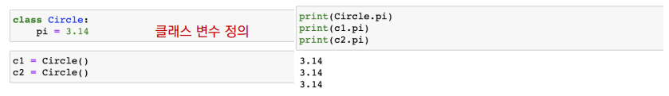
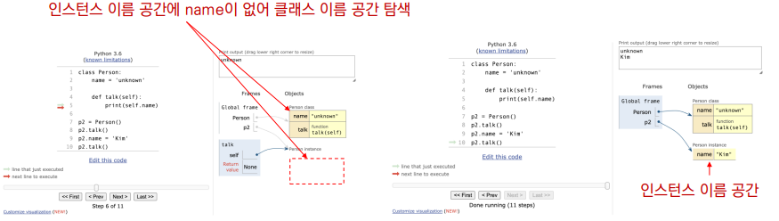
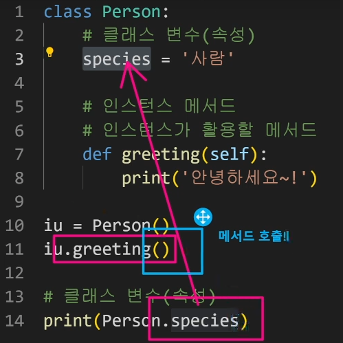
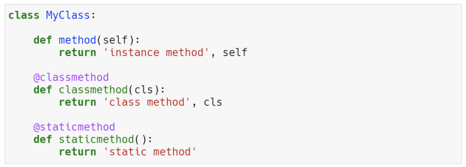
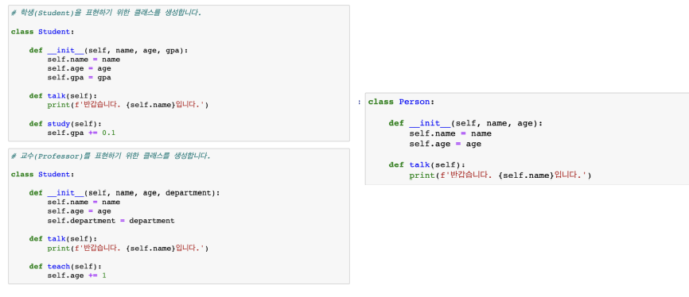
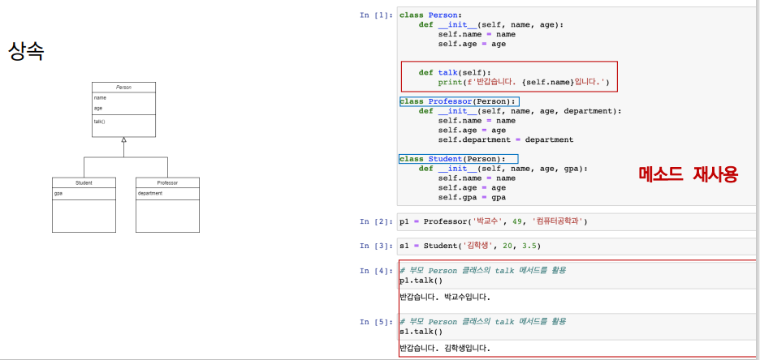

## 클래스

* 클래스 속성(attribute) 
  * 한 클래스의 모든 인스턴스라도 똑같은 값을 가지고 있는 속성 
  * 클래스 선언 내부에서 정의 
  * .으로 접근 및 할당



* 인스턴스와 클래스 간의 이름 공간(namespace) 
  * 클래스를 정의하면, 클래스와 해당하는 이름 공간 생성 
  * 인스턴스를 만들면, 인스턴스 객체가 생성되고 이름 공간 생성 
  * 인스턴스에서 특정 속성에 접근하면, 인스턴스-클래스 순으로 탐색




* 클래스 메소드 
  * 클래스가 사용할 메소드 
  * @classmethod 데코레이터를 사용하여 정의 
    * 데코레이터 : 함수를 어떤 함수로 꾸며서 새로운 기능을 부여 
  * 호출 시, 첫번째 인자로 클래스(cls)가 전달됨

```python
class MyClass:

    @classmethod
	def class_method(cls, arg1, …):
```


* 스태틱 메소드 
  * 인스턴스 변수, 클래스 변수를 전혀 다루지 않는 메소드 
* 언제 사용하는가? 
  * 속성을 다루지 않고 단지 기능(행동)만을 하는 메소드를 정의할 때, 사용 
  * @staticmethod 데코레이터를 사용하여 정의 
  * 호출 시, 어떠한 인자도 전달되지 않음 (클래스 정보에 접근/수정 불가)


* 정리 
  * 클래스 구현 
    * 클래스 정의 
    * 데이터 속성 정의 (객체의 정보는 무엇인지) 
    * 메소드 정의 (객체를 어떻게 사용할 것인지) 
  * 클래스 활용 
    * 해당 객체 타입의 인스턴스 생성 및 조작
* 메소드 정리 
  * 인스턴스 메소드 
    * 호출한 인스턴스를 의미하는 self 매개 변수를 통해 인스턴스를 조작 
  * 클래스 메소드 
    * 클래스를 의미하는 cls 매개 변수를 통해 클래스를 조작 
  * 스태틱 메소드 
    * 인스턴스나 클래스를 의미하는 매개변수는 사용하지 않음 
      * 즉, 객체 상태나 클래스 상태를 수정할 수 없음 
    * 일반 함수처럼 동작하지만 클래스의 이름공간에 귀속 됨 
      * 주로 해당 클래스로 한정하는 용도로 사용






## 객체 지향의 핵심개념

* 객체지향의 핵심 4가지 
  * 추상화 
  * 상속 
  * 다형성 
  * 캡슐화


#### 추상화




#### 상속

* 두 클래스 사이 부모 – 자식 관계를 정립하는 것 
* 클래스는 상속이 가능함 
  * 모든 파이썬 클래스는 object를 상속 받음

* 하위 클래스는 상위 클래스에 정의된 속성, 행동, 관계 및 제약 조건을 모두 상속 받음 
* 부모클래스의 속성, 메소드가 자식 클래스에 상속되므로, 코드 재사용성이 높아짐




* 상속 정리 
  * 파이썬의 모든 클래스는 object로부터 상속됨 
  * 부모 클래스의 모든 요소(속성, 메소드)가 상속됨 
  * super()를 통해 부모 클래스의 요소를 호출할 수 있음 
  * 메소드 오버라이딩을 통해 자식 클래스에서 재정의 가능함 
  * 상속관계에서의 이름 공간은 인스턴스, 자식 클래스, 부모 클래스 순으로 탐색


* 다중 상속 
  * 두개 이상의 클래스를 상속 받는 경우 
  * 상속 받은 모든 클래스의 요소를 활용 가능함 
  * 중복된 속성이나 메서드가 있는 경우 상속 순서에 의해 결정됨

#### 다형성

* 다형성(Polymorphism) 이란? 
  * 여러 모양을 뜻하는 그리스어 
  * 동일한 메소드가 클래스에 따라 다르게 행동할 수 있음을 의미 
  * 즉, 서로 다른 클래스에 속해있는 객체들이 동일한 메시지에 대해 다른 방식으로 응답될 수 있음

* 메소드 오버라이딩 
  * 상속 받은 메소드를 재정의 
  * 클래스 상속 시, 부모 클래스에서 정의한 메소드를 자식 클래스에서 변경 
  * 부모 클래스의 메소드 이름과 기본 기능은 그대로 사용하지만, 특정 기능을 바꾸고 싶을 때 사용

#### 캡슐화

* 객체의 일부 구현 내용에 대해 외부로부터의 직접적인 액세스를 차단 
* 파이썬에서 기능상으로 존재하지 않지만, 관용적으로 사용되는 표현이 있음

* 접근제어자 종류 
  * Public Access Modifier 
    * 언더바 없이 시작하는 메소드나 속성 
    * 어디서나 호출이 가능, 하위 클래스 override 허용 
  * Protected Access Modifier 
    * 언더바 1개로 시작하는 메소드나 속성 
    * 암묵적 규칙에 의해 부모 클래스 내부와 자식 클래스에서만 호출 가능 
  * Private Access Modifier 
    * 언더바 2개로 시작하는 메소드나 속성
    * 본 클래스 내부에서만 사용이 가능