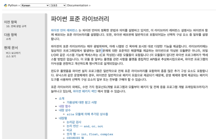
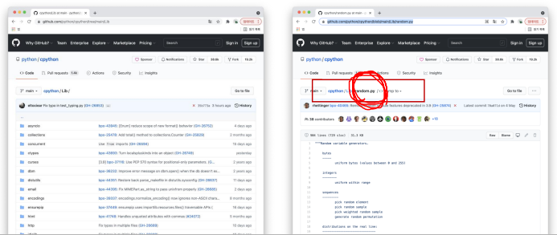
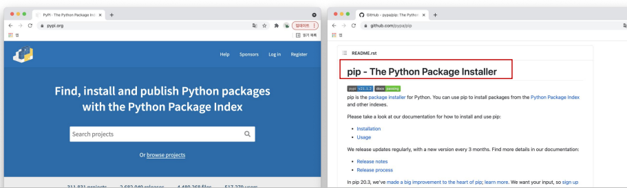

# 파이썬 응용/심화

## 추가 문법

* 표현식과 제어문을 통해 특정한 값을 가진 리스트를 간결하게 생성하는 방법

[<expressin\> for <변수> in <iterable\> ]

[<expressin\> for <변수> in <iterable\> if <조건식>]


* 1~3의 세제곱의 결과가 담긴 리스트를 만드시오.

```python
cubic_list = []
for number in range(1, 4):
cubic_list.append(number**3)
print(cubic_list)


[number**3 for number in range(1, 4)]
```


*  표현식과 제어문을 통해 특정한 값을 가진 리스트를 간결하게 생성하는 방법

{key: value for <변수> in <iterable\>}

{key: value for <변수> in <iterable\> if <조건식>}

* 1~3의 세제곱의 결과가 담긴 딕셔너리를 만드시오.

```python
cubic_dict = {}
for number in range(1, 4):
cubic_dict[number] = number ** 3
print(cubic_dict
      
{number: number**3 for number in range(1, 4)}
```

#### lambda [parameter] : 표현식

* 람다함수 
  * 표현식을 계산한 결과값을 반환하는 함수로, 이름이 없는 함수여서 익명함수라고도 불림 
* 특징 
  * return문을 가질 수 없음 
  * 간편 조건문 외 조건문이나 반복문을 가질 수 없음 
* 장점 
  * 함수를 정의해서 사용하는 것보다 간결하게 사용 가능 
  * def를 사용할 수 없는 곳에서도 사용가능

#### filter

* filter(function, iterable) 
  * 순회 가능한 데이터구조(iterable)의 모든 요소에 함수(function)적용하고, 그 결과가 True인 것들을 filter object로 반환

## 파이썬 표준 라이브러리(Python Standard Library, PSL)

* 파이썬에 기본적으로 설치된 모듈과 내장 함수
  * https://docs.python.org/ko/3/library/index.html



* 파이썬에 기본적으로 설치된 모듈과 내장 함수
  * 예시 – random.py



* PyPI(Python Package Index)에 저장된 외부 패키지들을 설치하도록 도와주는 패키지 관리 시스템



* 파이썬 패키지 관리자(pip) 명령어

* 패키지 설치 
  * 최신 버전 / 특정 버전 / 최소 버전을 명시하여 설치 할 수 있음 
  * 이미 설치되어 있는 경우 이미 설치되어 있음을 알리고 아무것도 하지 않음 
    * $ pip install SomePackage 
    * $ pip install SomePackage==1.0.5 
    * $ pip install 'SomePackage>=1.0.4' 

## 가상환경

* 파이썬 표준 라이브러리가 아닌 외부 패키지와 모듈을 사용하는 경우 모두 pip를 통해 설치를 해야함 
* 복수의 프로젝트를 하는 경우 버전이 상이할 수 있음 
  * 과거 외주 프로젝트 – django 버전 2.x 
  * 신규 회사 프로젝트 – django 버전 3.x 
* • 이러한 경우 가상환경을 만들어 프로젝트별로 독립적인 패키지를 관리 할 수 있음


#### venv

* 가상 환경을 만들고 관리하는데 사용되는 모듈 (Python 버전 3.5부터) 
* 특정 디렉토리에 가상 환경을 만들고, 고유한 파이썬 패키지 집합을 가질 수 있음 
  * 특정 폴더에 가상 환경이(패키지 집합 폴더 등) 있고 • 실행 환경(예 – bash)에서 가상환경을 활성화 시켜 
  * 해당 폴더에 있는 패키지를 관리/사용함