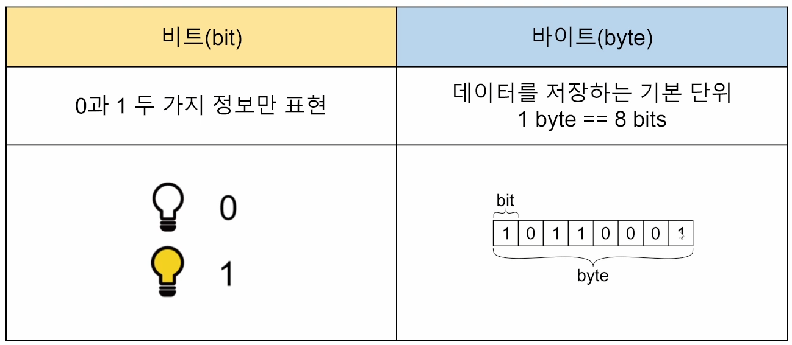
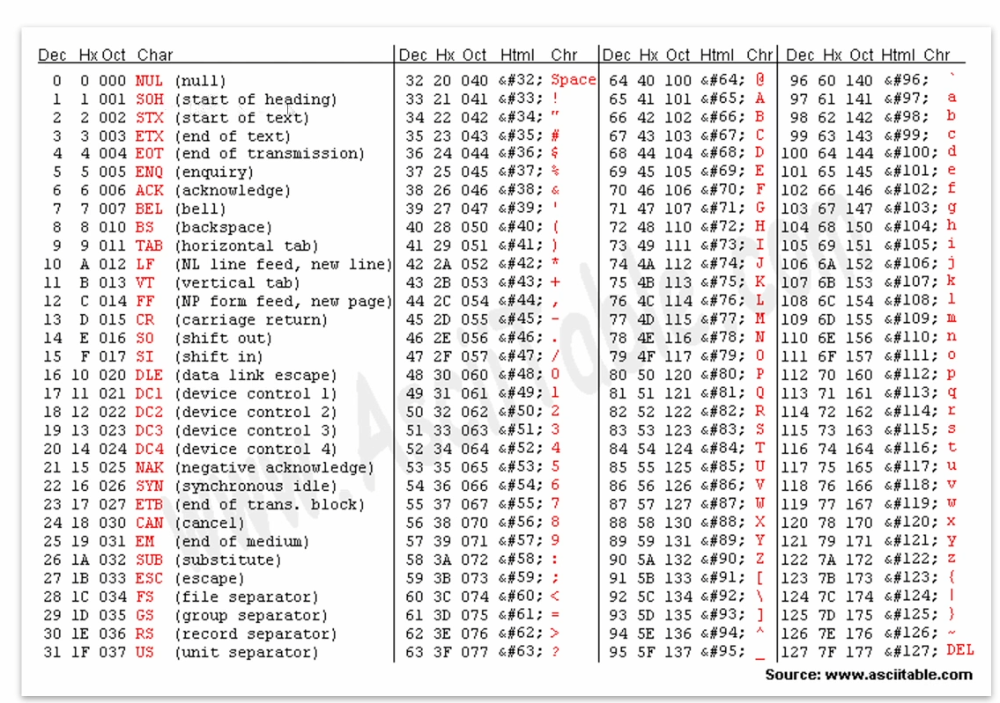

# 문자열

* 문자열은 immutable(변경 불가능한) 자료형
  * 시퀀스형 자료형

```python
word = "apple"
print(word)
print(id(word))
>>> apple
>>> 1352749370800

word += " banana"
print(word)
print(id(word))
>>> apple banana
>>> 1352749417520
```


## 문자열의 슬라이싱

s = ‘abcdefghi’

* s[2:5] 🡪 ‘cde’
* s[-6:-2] 🡪 ‘defg’
* s[2:-4] 🡪 ‘cde’
* s[2:5:2] 🡪 ‘ce’
* s[-6-1:3] 🡪 ‘dg’
* s[2:5:-1] 🡪 ‘ ’
* s[5:2:-1] 🡪 ‘fed’
* s[:3] 🡪 ‘abc’ 
* s[5:] 🡪 ‘fghi’
* s[:] 🡪 ‘abcdefghi’
* s[::-1] 🡪 ‘ihgfedcba’
* s[10:20] 🡪 ‘ ’


## 문자열 메서드

1. .split()

* 문자열을 일정 기준으로 나누어 리스트로 반환
* 괄호안에 아무것도 넣지 않으면 자동으로 공백을 기준으로 설정


2. .strip()

* 문자열의 양쪽 끝에 있는 특정 문자를 모두 제거한 새로운 문자열 반환
* 괄호안에 아무것도 넣지 않으면 자동으로 공백을 제거 문자로 설정
* 제거할 문자를 여러 개 넣으면 해당하는 모든 문자들을 제거
* 원본은 변하지 않는다.


3. .find()

* 특정 문자가 처음으로 나타나는 위치(인덱스)를 반환
* 찾는 문자가 없다면 -1을 반환


4. .index()

* 특정 문자가 처음으로 나타나는 위치(인덱스)를 반환
* 찾는 문자가 없다면 **오류** 발생

5. .count()

* 문자열에서 특정 문자가 몇 개인지 반환
* 문자 뿐만 아니라, 문자열의 개수도 확인 가능


6. .replace(기존 문자, 새로운 문자)

* 문자열에서 기존 문자를 새로운 문자로 수정한 새로운 문자열 반환
* 특정 문자를 빈 문자열("")로 수정하여 마치 해당 문자를 삭제한 것 같은 효과 가능


7. 삽입할 문자.join(iterable)

* iterable의 각각 원소 사이에 특정 문자를 삽입한 새로운 문자열 반환
* 공백 출력, 콤마 출력 등 원하는 출력 형태를 위해 사용


## 아스키(ASCII) 코드

컴퓨터는 숫자만 이해할 수 있다!




ASCII(American Standard Code for Information Internet)



알파벳을 표현하는 대표 인코딩 방식

각 문자를 표현하는데 1byte(8bits)사용

* 1bit : 통신 에러 검출용
* 7bit : 문자 정보 저장(총 128개)


1. chr()
   * 문자를 아스키코드로 변환하는 내장 함수


2. ord()
   * 아스키코드를 문자로 변환하는 내장 함수

