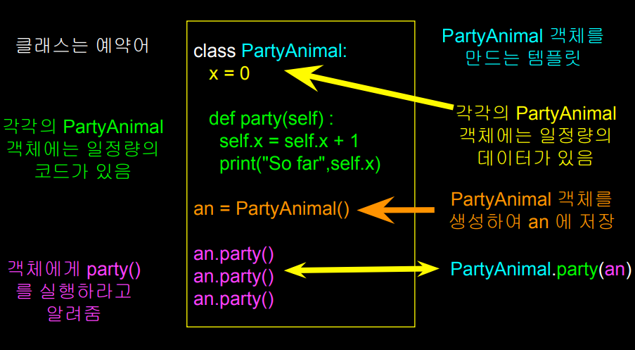
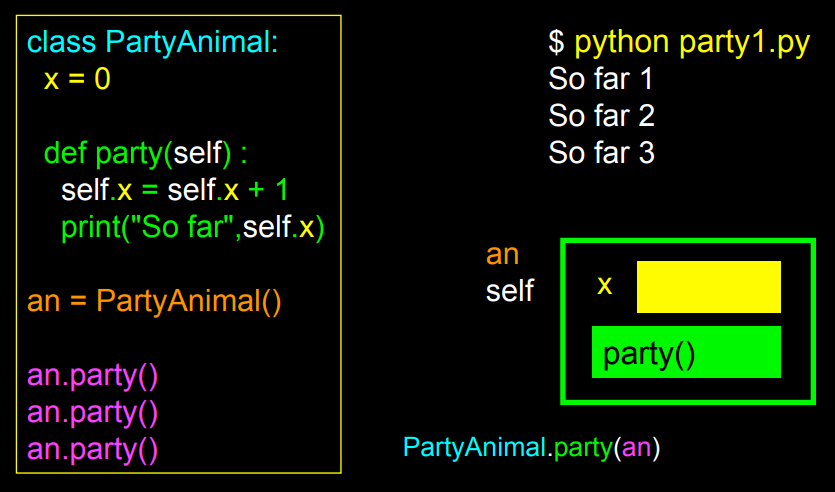

# 객체 지향

* 프로그램은 서로 협력하는 여러 개의 객체로 구성 
* “전체 프로그램”이 아닌 각각의 객체가 마치 프로그램 안의 “섬”같이 서로 협력하여 작동 
* 프로그램은 함께 실행되는 여러 개의 객체로 구성 
  * 객체는 서로의 기능들을 활용

## 객체

* 객체는 하나의 자족적인 코드와 데이터
* 객체 지향 접근의 요점은 문제를 이해 가능한 작은 문제로 분할하여 접근(분할 정복 divide-and-conquer) 
* 객체는 우리가 필요없는 세부사항들을 무시할 수 있도록 경계를 제공 
* 우리는 객체를 계속 사용해 왔음
  * 문자열 객체, 정수형 객체, 딕셔너리 객체, 리스트 객체..

## 정의

* 클래스 Class - 하나의 형식, 템플릿 
* 메소드 Method or Message - 클래스 내에 정의된 기능 
* 필드/속성 Field or attribute- 클래스 내의 데이터 
* 객체/인스턴스 Object or Instance - 클래스의 한 인스턴스
* 생성자 Constructor – 객체가 생성될 때 실행되는 코드 
* 상속 Inheritance - 기존의 클래스를 확장하여 새로운 클래스를 만드는 것

### 클래스 Class

> 어떤 물체(객체)의 특징(필드 또는 속성)과 행동(메소드, 연산 등의 기능) 등 추상적인 특성을 정의. 
>
> 클래스를 어떤 것의 특성을 설명하는 설계도 혹은 공장이라고도 이야기함. 
>
> 예를 들어, 개 라는 클래스는 품종 또는 털색깔(특성), 혹은 짖거나 앉는 행위(행동) 등 개들이 가지는 특성을 가짐

### 인스턴스 Instance

> 클래스 안에서 인스턴스 혹은 특정 객체를 가질 수 있음. 
>
> 인스턴스란 실행 중 실제로 생성된 객체를 의미.
>
> 특정 객체의 특성들을 모아놓은 것을 상태라고 함. 객체는 클래스 안에서 정의된 상태와 행동으로 구성됨.

### 메소드 Method

> 객체의 능력. 언어로 따지만 메소드는 동사임. 
>
> 프로그램 내에서는 메소드는 하나의 객체에만 영향을 줄 수 있음. 





### 기능을 찾는 한 방법

* dir() 명령은 여러 기능들을 나열한다 
* __ 표시되어있는 것들은 무시해도 된다 
  *  파이썬이 자체적을 사용 
* 나머지는 객체가 실제로 수행할 수 있는 작업이다 
* type() 과 유사함 
  * 어떤 변수에 “대해서” 말해준다

```python
class PartyAnimal:
    x = 0

    def party(self) :
        self.x = self.x + 1
        print("So far",self.x)

an = PartyAnimal()

print("Type", type(an))
print("Dir ", dir(an))

# Type <class '__main__.PartyAnimal'>
# Dir  ['__class__', '__delattr__', '__dict__', '__dir__', '__doc__', '__eq__', '__format__', '__ge__', '__getattribute__', '__gt__', 
# '__hash__', '__init__', '__init_subclass__', '__le__', '__lt__', '__module__', '__ne__', '__new__', '__reduce__', '__reduce_ex__', 
# '__repr__', '__setattr__', '__sizeof__', '__str__', '__subclasshook__', '__weakref__', 
# 'party', 'x']
```

## 객체 생명주기

* 객체는 생성되고, 사용되어지고, 없어짐 
* 객체를 불러올 때 특별한 코드 (메소드) 가 존재 
  * 생성되어 질 때 (생성자) 
  * 소멸되어 질 때 (소멸자) 
* 생성자는 자주 사용 
* 소멸자는 거의 사용되지 않음
* 파이썬의 생성자는 __init__, 소멸자는 __del__로 정의합니다.

### 생성자

>생성자의 주된 목적은 인스턴스 변수가 객체가 생성될 때 적절한 초기값을 가지게 하는 것
>
>객체 지향 프로그래밍에서, 클래스의 생성자는 객체가 생성 되어질 때 불러오는 문장

### 다중 인스턴스

* 다수의 객체를 만들 수 있음 
  * 클래스가 그 형식의 틀을 제공 
* 별개의 객체들을 각자의 변수에 저장할 수 있음 
* 이것을 동일 클래스의 다중 인스턴스 라고 함 
* 각각의 인스턴스는 자신만의 인스턴스 변수를 가지고 있음

```python
class PartyAnimal:
    x = 0
    name = ""
    
    # 생성자는 추가적인 매개변수를 가질 수 있음.
    # 이것이 클래스의 특정 인스턴스의 인스턴스 변수를 설정하는데 사용.
    def __init__(self, z):
        self.name = z
        print(self.name,"constructed")

    def party(self) :
        self.x = self.x + 1
        print(self.name,"party count",self.x)

s = PartyAnimal("Sally")
j = PartyAnimal("Jim")

s.party()
j.party()
s.party()

# Sally constructed
# Jim constructed
# Sally party count 1
# Jim party count 1
# Sally party count 2
```

## 상속

>‘하위 클래스’란 클래스의 특수한 버전이며, 상위 클래스의 속성과 행동을 상속하고, 자신의 것도 추가

* 새로운 클래스를 만들 때 기존에 있던 클래스를 재사용하여 그 모든 기능을 상속받고 조금 추가하여 새로운 클래스를 만들 수 있음 
* 저장하고 재사용하는 또 다른 형태 
* 한 번 작성하고 여러번 재사용 
* 새로운 클래스는 (child) 이전 클래스 (parent) 의 모든 기능을 가지고 있음 
  * 그리고 더 추가할 수 있음

```python
class PartyAnimal:
    x = 0
    name = ""
    def __init__(self, nam):
        self.name = nam
        print(self.name,"constructed")

    def party(self) :
        self.x = self.x + 1
        print(self.name,"party count",self.x)

class FootballFan(PartyAnimal):
    points = 0
    def touchdown(self):
        self.points = self.points + 7
        self.party()
        print(self.name,"points",self.points)
            
s = PartyAnimal("Sally")
s.party()

j = FootballFan("Jim")
j.party()
j.touchdown()

# Sally constructed
# Sally party count 1
# Jim constructed
# Jim party count 1
# Jim party count 2
# Jim points 7
```


### 정리

* 사실 여태까지 사용했던 모든 것은 객체였다... 이미 파이썬이 클래스로 list,sort 등을 정의해놨기 때문에 그것을 사용해왔던것!

