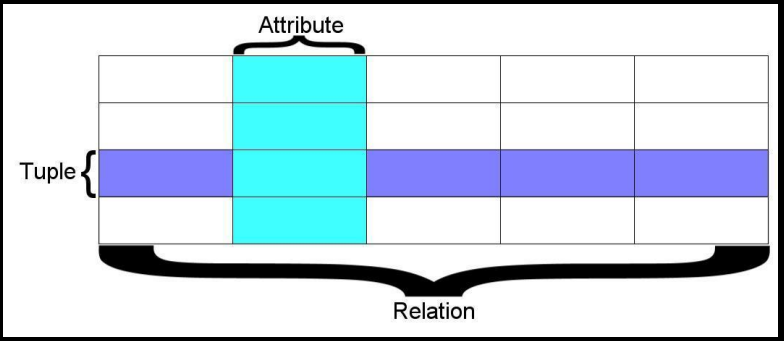
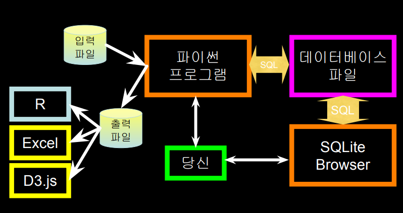
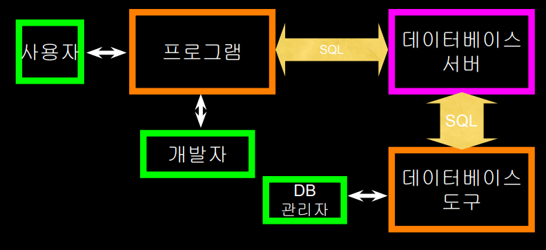

# 데이터베이스

## 관계형 데이터베이스

* 테이블에서의 행과 열을 이용하여 데이터를 모델링 
* 관계형 데이터베이스를 이용하면 단일 테이블이나 복잡하게 얽혀있는 다중 테이블에서 데이터를 효율적으로 추출해낼 수 있음

### 용어

* 데이터베이스 - 여러 개의 테이블을 포함 
* 관계(또는 테이블) - 튜플과 속성을 포함 
* 튜플(또는 로우) - 사람/노래처럼 객체를 표현할 수 있는 필드의 집합 
* 속성(또는 칼럼/필드) - 객체를 나타내는 로우에 있는 데이터 중 하나

>관계는 같은 속성을 갖고 있는 튜플의 집합으로 정의. 튜플은 주로 객체와 그 객체에 관한 정보를 담고 있다. 객체는 일반적으로 물리적인 물체나 개념. 관계는 주로 테이블을 이용해 나타내며 로우와 칼럼으로 이뤄져 있음. 하나의 속성이 참조하는 모든 데이터는 같은 도메인에 속하며 동일한 제약 조건을 따름.

### SQL

> 구조화된 쿼리 언어는 데이터베이스에 명령을 내리기 위해 우리가 사용할 언어 

- 데이터 형성 (또는 삽입) Create
- 데이터 추출 Read
- 데이터 업데이트(갱신) Update
- 데이터 삭제 Delete

### 데이터베이스를 이용한 웹 프로그램

* 프로그램 개발자 
  * 프로그램의 논리를 세우고 외형, 느낌을 관리 
  * 프로그램의 문제점 모니터링 
* 데이터베이스 관리자 
  * 프로그램이 서비스 환경에서 실행되는 동안 데이터베이스를 모니터링 및 수정 
  * 두 사람 모두 데이터 모델링에 관여

### 데이터베이스 모델

>데이터베이스 모델 또는 데이터베이스 스키마는 데이터베이스 시스템이 지원하는 형식 언어로 표현된 데이터베이스의 구조를 지칭 다시 말해서, “데이터베이스 모델”은 데이터베이스 관리 시스템과 결합을 위해 데이터 모델을 응용한 것

## 데이터베이스 디자인

* 데이터베이스 디자인은 특정 능력과 경험이 빚어내는 예술 
* 우리의 목표는 치명적인 실수를 피하고 깔끔하며 알아보기 쉬운 데이터베이스를 디자인하는 것 
* 성능 조정 등은 차후의 일 
* 데이터베이스 디자인은 그림을 그리며 시작

## 데이터베이스 모델 만들기

* 프로그램을 위한 데이터 객체의 그림을 그린 뒤, 개체와 관계를 어떻게 나타낼 것인지 고민 
* 기본 규칙: 동일한 문자열을 중복으로 넣지 말 것 
  * 관계를 대신 이용 
* “실제”로 무언가가 존재한다면 데이터베이스에는 반드시 복사본 하나만 있어야 함

## 데이터베이스 정규화 (3NF)

* “수많은” 데이터베이스 이론이 있음. 
  * 서술 논리(predicate calculus)를 모르면 이해하기 어려움 
* 데이터 중복 불가 
  * 데이터 참조 
  * 데이터 가리키기 
* 정수를 사용하여 키 값 및 참조 표현 
* 참조하기 쉽도록 각 테이블에 특별한 “키” 칼럼을 추가. 관례에 따라, 많은 개발자들이 이 칼럼을 “id”라고 함

### 세 종류의 키

* Primary Key : 일반적으로 정수이며 자동으로 증가 
* Logical Key : 외부에서 검색 시 사용 
* Foreign Key : 일반적으로 정수이며 다른 테이블의 로우를 가리킴

### 

