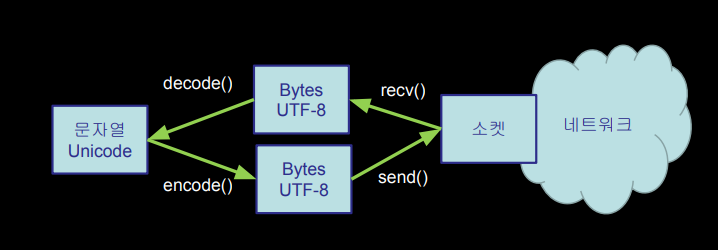

# 스크래핑

## http

### TCP 연결 / 소켓

> “컴퓨터 네트워킹에서 인터넷 소켓, 또는 네트워크 소켓은 인터넷 프로토콜을 기반으로 한 인터넷 등의 컴퓨터 네트워킹에서 양방향 커뮤니케이션의 끝점입니다”

### TCP 포트 번호

* 포트는 애플리케이션에 대응되거나 프로세스에 대응되는 소프트웨어 커뮤니케이션의 말단 
* 한 서버에 여러 네트워크 애플리케이션이 존재할 수 있게 해줌 
* 잘 알려진 포트 번호는 다음을 참고
  * https://ko.wikipedia.org/wiki/TCP/UDP%EC%9D%98_%ED%8F%AC%ED%8A%B8_%EB%AA%A9%EB%A1%9D

### **파이썬에서 소켓**

```python
import socket
mysock = socket.socket(socket.AF_INET, socket.SOCK_STREAM)
mysock.connect( ('data.pr4e.org', 80) )

# 인터넷에 연결되는 소켓을 연속된 문자의 흐름인 스트림 방식으로 생성
# data.pr4e.org라는 호스트에 80이라는 포트로 연결
```


### **간단한 웹 브라우저**

```python
import socket

mysock = socket.socket(socket.AF_INET, socket.SOCK_STREAM)
mysock.connect(('data.pr4e.org', 80))
cmd = 'GET http://data.pr4e.org/romeo.txt HTTP/1.0\r\n\r\n'.encode()
mysock.send(cmd)

while True:
    data = mysock.recv(512)
    if (len(data) < 1):
        break
    print(data.decode(),end='')
mysock.close()
```

* https://soooprmx.com/%ED%8C%8C%EC%9D%B4%EC%8D%AC-%EC%86%8C%EC%BC%93-%EC%97%B0%EA%B2%B0-%EC%82%AC%EC%9A%A9%EB%B2%95/

### 여러 바이트로 된 문자

> 보다 다양한 문자를 나타내기 위해서는 더 많은 바이트를 쓸 필요가 있음 

* UTF-16 – 길이 고정됨 - 2 바이트 
* UTF-32 – 길이 고정됨 - 4 바이트 
* UTF-8 – 1-4 bytes 
  * ASCII를 포함하며, 호환 
  * ASCII를 자동으로 감지 가능 
  * UTF-8 은 시스템 간에 데이터를 교환할 때 가장 실용적으로 추천되는 인코딩 형식입니다

### 파이썬3과 유니코드

* 파이썬3에서 모든 문자열은 유니코드 형식 
* 그러므로 파일에서 데이터를 가져와 파이썬에서 작업하는 경우 거의 대부분 “그냥 작동” 
* 그러나 소켓을 통해 네트워크로 데이터를 전송하거나 DB와 연결하는 경우 데이터를 인코딩/디코딩해야 함 (UTF-8이 많이 쓰임)

### 파이썬 문자열에서 Byte로

* 네트워크 소켓 등 외부 자원과 통신하는 경우, 문자열이 아니라 Byte 형식을 사용해야 함. 
  * 파이썬 3에서는 문자열을 Byte로 인코딩 필요. 
* 외부에서 데이터를 가져오는 경우 해당 문자셋에 대하여 디코딩을 해야 파이썬3에서 정상적인 문자열으로 사용할 수 있다

```python
while True:
    data = mysock.recv(512)
    if ( len(data) < 1 ) :
        break
    mystring = data.decode()
    print(mystring)
```



### 정리

```python
import socket

# 아직 아무 데이터하고도 연결되지 않은 파일 핸들
mysock = socket.socket(socket.AF_INET, socket.SOCK_STREAM)
# 인터넷을 통해 소켓을 대상에 연결 (대상은 data.pr4e.org, 80번째 포트)
mysock.connect(("data.pr4e.org", 80))
# Request-Line = Method SP Request-URI SP HTTP-Version CRLF
# 'GET http://data.pr4e.org/romeo.txt HTTP/1.0\n\n' 문자열은 유니코드
# encode() = 파이썬 코드가 유니코드로 되어있고 전송할 때 UTF-8형식으로 전송해야 하기 때문
# 데이터를 전송하기 전에 UTF-8 byte 방식으로 인코딩를 해주어야함
cmd = "GET http://data.pr4e.org/romeo.txt HTTP/1.0\n\n".encode()
# 데이터(cmd, byte)를 네트워크로 전송
mysock.send(cmd)

while True:
    # 그리고 돌려받은 데이터는 byte
    data = mysock.recv(512)
    if len(data) < 1:
        break
    # decode = UTF-8에서 유니코드로 변경
    print(data.decode(), end="")
# 모든 데이터가 처리되면 종료
mysock.close()


# 결국 이 코드는 소켓을 열고 명령을 보내고 데이터를 받은것
```

## urllib를 이용해 웹 데이터 읽어오기

> HTTP는 굉장히 많이 쓰이기 때문에 소켓을 다루고 웹 페이지를 불러오는 라이브러리가 있음

```python
import urllib.request, urllib.parse, urllib.error


# urlopen으로 암묵적으로 처리해서 <head>가 없음
# urllib.request.urlopen라는 핸들을 사용
fhand = urllib.request.urlopen("http://data.pr4e.org/romeo.txt")
for line in fhand:
    print(line.decode().strip())

import urllib.request, urllib.parse, urllib.error

fhand = urllib.request.urlopen("http://data.pr4e.org/romeo.txt")

# 단어의 출현 빈도에 대한 코드
counts = dict()
for line in fhand:
    words = line.decode().split()
    for word in words:
        counts[word] = counts.get(word, 0) + 1
print(counts)
```

## 웹 스크래핑이란?

* 프로그램이나 스크립트가 브라우저처럼 행동하며 페이지를 살펴보고 정보를 추출하고 조사하는 것을 지칭 
* 검색엔진은 웹 페이지를 스크래핑함 - 이걸 스파이더링 또는 크롤링이라고도 함

### 스크래핑을 하는 이유

* 데이터를 가져오기  (특히 소셜 데이터, 누가 연결돼 있는지) 
* 외부로 내보내는 기능이 없는 시스템에서 데이터 가져오기 
* 사이트를 모니터링하며 새로운 정보 감지 
* 검색엔진의 데이터베이스를 구축하기 위한 스크래핑

### 웹 페이지 스크래핑 주의사항

* 웹 페이지 스크래핑은 웹 페이지 내용을 마음대로 빼간다는 점에서 논란의 여지가 있음 
* copyright된 정보를 다시 출판하는 것은 허용되지 않음 
* 이용약관을 위배하지 않도록 유의

### BeautifulSoup

* 문자열 탐색으로 어렵게 접근하는 것도 가능하긴 함 
* 무료 소프트웨어 라이브러리 BeautifulSoup 을 사용하는 방법도 있음 (www.crummy.com)

```bash
$ pip install beautifulsoup4
```

## 정리

* TCP/IP는 애플리케이션 사이에 파이프/소켓을 구축
* 애플리케이션 프로토콜로 이 파이프를 사용 
* HyperText Transfer Protocol(HTTP)는 간단하지만 굉장히 강력한 프로토콜 
* 파이썬은 소켓, HTTP, and HTML 파싱을 충실히 지원

## 에러

```bash
Traceback (most recent call last):
  File "c:\Users\rkdtj\Desktop\TIL\python\Urllib\urllinks.py", line 20, in <module>
    soup = BeautifulSoup(html, "html.parser")
  File "c:\Users\rkdtj\Desktop\TIL\python\Urllib\bs4\__init__.py", line 215, in __init__
  ...
  ...
    File "c:\Users\rkdtj\Desktop\TIL\python\Urllib\bs4\element.py", line 1565, in _normalize_search_value
    if (isinstance(value, str) or isinstance(value, collections.Callable) or hasattr(value, 'match')
AttributeError: module 'collections' has no attribute 'Callable'
```

* AttributeError: module 'collections' has no attribute 'Callable' 위와 같은 에러가 떠서 구글링 결과...

```python
import collections
collections.Callable = collections.abc.Callable
```

* 해당 코드로 바로 해결