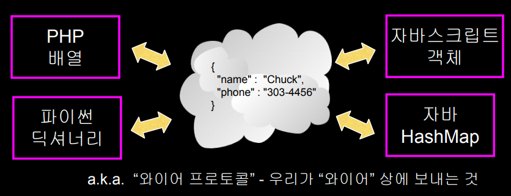
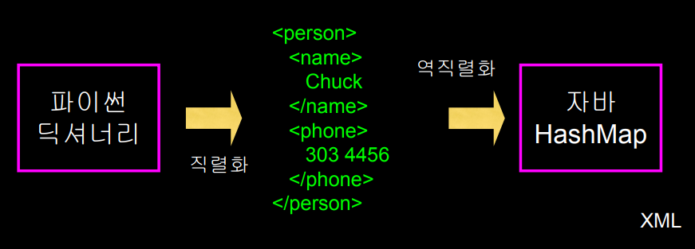
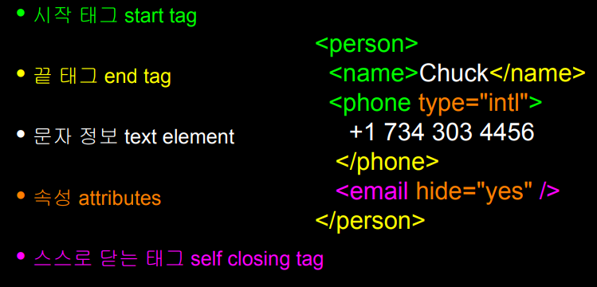
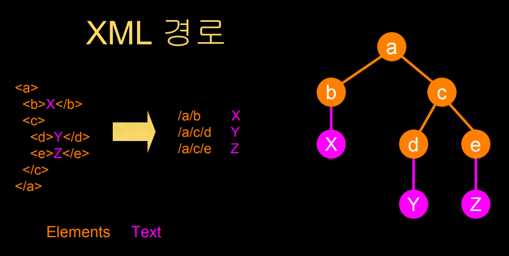
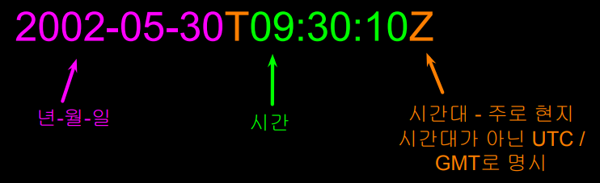
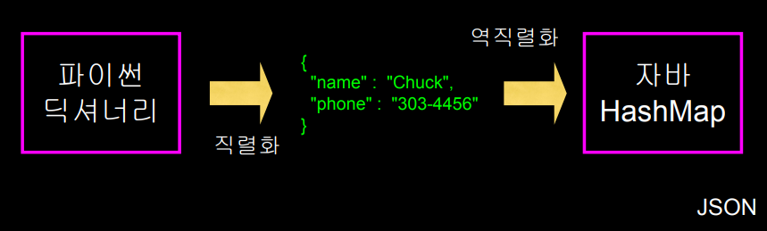

## 마크업

### 웹 상의 데이터

* HTTP 요청과 응답에 대한 이해와 지원을 바탕으로, 이 프로토콜을 이용한 프로그램 간의 정보 교환의 추세 
* 네트워크와 응용프로그램 간의 데이터 표현 방식에 있어서 합의가 필요 
* 가장 널리 사용되는 두 가지 포맷
  *  XML
  * JSON

### 네트워크를 통한 정보 전송



### XML (eXtensible Markup Language)

* 정보 시스템이 구조화된 데이터를 공유하는 것이 초기 목적 
* 표준 범용 교정 용어 (SGML) 의 간소화된 버전으로 시작하였고, 조금 더 인간에게 친숙한 방향으로 디자인
* HTML과 비슷하지만 원하는 이름의 태그를 만들 수 있다는 특징이 있고, HTML보다 문법 오류를 더 엄격하게 다룹니다.

#### XML용어

* 태그 Tags 
  * 요소의 시작과 끝을 알려줌 
* 속성 Attributes
  * XML의 여는 태그에 위치한 키-값 쌍 
* 직렬화 Serialize / 역직렬화 De-Serialize 
  * 한 프로그램의 데이터를 특정 프로그램 언어에 제한되지 않은 채로 시스템 내에서 저장되고 전달되어질 수 있는 형식으로 변환하는 것

* XML 예시







```xml
<person>
  <name>Chuck</name>
  <phone type="intl">
     +1 734 303 4456
   </phone>
   <email hide="yes" />
</person>
```

### XML 스키마

*  XML 문서의 올바른 형식에 대한 설명 
* 문서의 구조와 내용에 대한 제한의 형식으로 표현됨 
* 시스템 간의 “약속”을 표현할 때 주로 사용됨 
  * “내 시스템은 이 스키마에 맞는 XML만 수용할 거야.” 
* 특정 XML이 스키마의 사항들을 만족할 때 우리는 그것을 “타당하다 (validate)” 라고 한다

### 여러 XML 스키마 언어

* 문서 타입 정의 Document Type Definition (DTD) 
  *  http://en.wikipedia.org/wiki/Document_Type_Definition 
* 표준 범용 교정 용어 (ISO 8879:1986 SGML) 
  * http://en.wikipedia.org/wiki/SGML 
* **XML 스키마 W3C - (XSD)** 
  * http://en.wikipedia.org/wiki/XML_Schema_(W3C)

#### XSD XML 스키마 (W3C spec)

* 우리는 World Wide Web Consortium (W3C) 버전에 집중
* 때로 “W3C 스키마”라고 불리는 이유는 “스키마”가 포괄적인 표현이기 때문
* 흔히 XSD 라 불리는 이유는 파일 확장명이 .xsd 이기 때문

#### ISO 8601 날짜/시간 형식



```python
import xml.etree.ElementTree as ET

data = """
<person>
    <name>Chuck</name>
    <phone type="intl">
    010-2377-4624
    </phone>
    <email hide="yes"/>
</person>"""

# 문자열을 읽고
tree = ET.fromstring(data)
# tree.find("name")은 name이라는 태그를 찾는것
# .text는 문자 정보(Chuck)를 받는 것
print("Name:", tree.find("name").text)
# get("hide")는 hide라는 속성의 내용을 요청
print("Attr:", tree.find("email").get("hide"))

# ----------------------------------------

import xml.etree.ElementTree as ET

input = """
<stuff>
    <users>
        <user x="2">
            <id>001</id>
            <name>Chuck</name>
        </user>
        <user x="7">
            <id>009</id>
            <name>Brent</name>
        </user>
    </users>
</stuff>"""

stuff = ET.fromstring(input)
# findall을 이용해 users아래에 있는 user태그를 불러옴
lst = stuff.findall("users/user")
# 그럼 len(lst)는 2개의 수를 얻게 됨
print("User count:", len(lst))

for item in lst:
    print("Name", item.find("name").text)
    print("Id", item.find("id").text)
    print("Attribute", item.get("x"))
```


## JSON

> 자바스크립트의 객체 표현 방식

* JSON은 XML보다 더 자주 사용되는 데이터 포맷
* JSON은 파이썬에서의 딕셔너리와 굉장히 비슷하기 때문에 데이터를 읽어온 후 딕셔너리로 접근

```python
import json
data = '''{
  "name" : "Chuck",
  "phone" : {
    "type" : "intl",
    "number" : "+1 734 303 4456"
   },
   "email" : {
     "hide" : "yes"
   }
}'''

info = json.loads(data)
print('Name:',info["name"])
print('Hide:',info["email"]["hide"])

#Name: Chuck
#Hide: yes

# ---------------------------
import json
input = '''[
  { "id" : "001",
    "x" : "2",
    "name" : "Chuck"
  } ,
  { "id" : "009",
    "x" : "7",
    "name" : "Chuck"
  }
]'''

info = json.loads(input)
print(info)
print('User count:', len(info))
for item in info:
    print('Name', item['name'])
    print('Id', item['id'])
    print('Attribute', item['x'])

# [{'id': '001', 'x': '2', 'name': 'Chuck'}, {'id': '009', 'x': '7', 'name': 'Chuck'}]
# User count: 2
# Name Chuck
# Id 001
# Attribute 2
# Name Chuck
# Id 009
# Attribute 7
```

* JSON 예시




## **서비스 지향 아키텍처(Service Oriented Architecture, SOA )**

>대규모 컴퓨터 시스템을 구축할 때의 개념으로 업무상에 일 처리에 해당하는 소프트웨어 기능을 서비스로 판단하여 그 서비스를 네트워크상에 연동하여 시스템 전체를 구축해 나가는 방법론

### 서비스 지향적 접근

* 대부분의 대형 웹 애플리케이션은 서비스를 이용 
* 다른 애플리케이션으로부터 서비스를 사용 
  * 신용카드 청구 
  * 호텔 예약 시스템 
* 서비스는 애플리케이션이 서비스를 이용하기 위해 따라야하는 “규칙”을 만듦 (API)

## 응용 프로그램 인터페이스(API)

>API는 인터페이스를 지정하고 그 인터페이스의 객체의 행동을 제어한다는 점에서 매우 추상적. API에 명시된 기능을 제공하는 소프트웨어를 API 의 “실행”이라고 하며, API는 대체로 애플리케이션을 구성하게 되는 언어로 정의됨.

### API 보안과 비율 제한

* API를 실행하기 위한 계산 자원은 “무료”가 아님 
* API를 통해 제공된 데이터는 대체로 매우 가치가 높음 
* 데이터의 제공자는 하루 요청량을 제한하여서 API 의 “키”를 요구하거나, 사용료를 부과하기도 함 
* 발전을 거치면서 여러 규칙들이 바뀌기도 함

### 정리

* 서비스 지향 아키텍쳐 
  * 애플리케이션이 부분적으로 나뉘어 네트워크 상에 퍼질 수 있게 함
* 응용 프로그램 인터페이스(API) 상호 작용에 대한 계약/약속 
* 웹서비스는 애플리케이션끼리 네트워크 상에서 협력할 기반을 제공함 
  * SOAP와 REST는 웹서비스의 두 가지 형태 
* XML과 JSON은 직렬화 형식