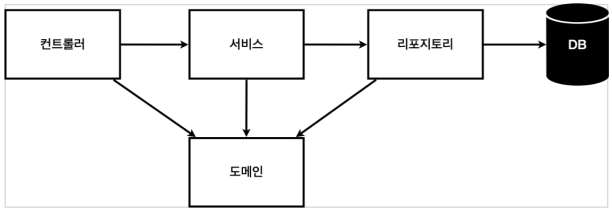

## 라이브러리

> Gradle 은 의존관계가 있는 라이브러리를 함께 다운로드 한다.

### 스프링 부트 라이브러리

* spring-boot-starter-web
  * spring-boot-starter-tomcat: 톰캣 (웹서버)
  * spring-webmvc: 스프링 웹 MVC
* spring-boot-starter-thymeleaf: 타임리프 템플릿 엔진(View -> HTML)
* spring-boot-starter(공통) : 스프링부트 + 스프링 코어 + 로깅
  * spring-boot
    * spring-core
  * spring-boot-starter-logging
    * logback, slf4j : loging와 관련된 궁금증은 logback, slf4j 검색

### 테스트 라이브러리

* spring-boot-stater-test
  * junit: 테스트 프레임워크
  * mockito: 목 라이브러리
  * assertj: 테스트 코드를 좀 더 편하게 작성하게 도와주는 라이브러리
  * spring-test: 스프링 통합 테스트 지원


## MVC와 템플릿 엔진

> Model, View, Controller

### Controller

```java
package hello.hellospring.controller;


import org.springframework.stereotype.Controller;
import org.springframework.ui.Model;
import org.springframework.web.bind.annotation.GetMapping;

// 컨트롤러는 어노테이션을 꼭 해줘야함
@Controller
public class HelloController {
    @GetMapping("hello") // HTTP 의 GET
    public String hello(Model model) {
        model.addAttribute("data", "Spring!!"); // Key = 데이터, Value = 값
        return "hello"; // templates 의 하위 폴더에 hello.html 을 찾아감
    }
}
```

### View

```html
<!DOCTYPE HTML>
<html xmlns:th="http://www.thymeleaf.org">
<head>
  <title>Hello</title>
  <meta http-equiv="Content-Type" content="text/html; charset=UTF-8" />
</head>
<body>
<p th:text="'안녕하세요. ' + ${data}" >안녕하세요.</p><!-- {}안에 있는 data 가 Controller 에 있는 value -->
</body>
</html> 
```

### 회원 관리 예제



* 컨트롤러: 웹 MVC의 컨트롤러 역할 
* 서비스: 핵심 비즈니스 로직 구현 
* 리포지토리: 데이터베이스에 접근, 도메인 객체를 DB에 저장하고 관리 
* 도메인: 비즈니스 도메인 객체, 
  * 예) 회원, 주문, 쿠폰 등등 주로 데이터베이스에 저장하고 관리됨
